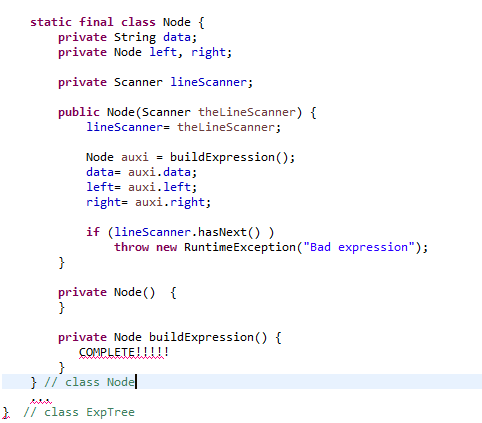

# Estructura de Datos y Algoritmos

# ITBA     2025-Q2

__Árbol Binario \(__  __Binary__  __ __  __Tree__  __ o BT\)__

Estructura de datos formada por nodos\, donde cada nodo o está vacío o  tiene 3 componentes: datos\, subárbol izquierdo y subárbol derecho\. Existe un nodo distinguido llamado raíz\.

# Aplicaciones

__Ejemplo__  __ 1: __  __una__  __ __  __vez__  __ __  __más__  __ __  __los__  __ __  __compiladores__

Las expresiones formadas por operadores unarios/binarios pueden representarse con BT\, donde las expresiones más anidadas se deberán evaluar primero\.

2 \* \(3 \+ 5\)

__Ejemplo__  __ 2: __  __una__  __ __  __vez__  __ __  __más__  __ __  __los__  __ __  __compiladores__

Pueden usar estrategias para optimizar las expresiones a la hora de evaluarlas \(re estructurar el BT\)\.

__Ejemplo__  __ 3: __

__	__ Cualquier cosa que tenga una representación jerárquica\. Ej:  jefe\_de en una organización

__Ejemplo__  __ 4: __

__	__ Si el  BT estuviera ordenado\, podría usarse como soporte para índices \(a este tipo de BT lo veremos más adelante\)

__Árbol__  __ __  __Binario__  __ de __  __Expresiones__

__	__ Se utiliza para representar expresiones algebraicas\. Los nodos internos representan operadores binarios o unarios\. Las hojas representan los operandos\, es decir\, constantes y variables\.

Según cómo se recorra el árbol \(traversal\) in\-order\, pre\-order o post\-order\, se obtiene una expresión infija\, prefija o postfija\, respectivamente\.

__Características__

Permite representar expresiones en notación infija \(no es un árbol ordenado por el contenido\)

Así como usábamos una  __pila y una tabla de precedencia de operadores__  para pasar de una expresión en notación  infija a postfija \(para eliminar ambigüedad\) y luego  __con una pila __ evaluábamos la expresión\, ahora también a partir de una expresión\, por ejemplo infija\,  __construiremos el árbol de expresiones__  asociado y lo evaluaremos para devolver el valor de la expresión\.

Ej: Este árbol representa la expresión infija \( 2 \+ \(3 \* 5\) \)

Ej: este árbol representa la expresión infija \( \(2 \+ 3\) \* 5\)

¡No se representan los paréntesis\!

__Aclaración__

Para evitar la discusión sobre la precedencia de operadores\, vamos a aceptar solo expresiones infijas que tengan paréntesis\. Los operadores son todos binarios: \+\, \-\, \*\, /\, ^  y es obligatorio usar paréntesis para toda expresión\.

Para el input vamos a pedir que finalice en \\n\. Los espacios serán los separadores de tokens\.

__Formalmente__

Una expresión aritmética E está dada por las siguientes reglas de derivación:

E \-> \( E \+ E \)

E \-> \( E – E \)

E \-> \( E \* E \)

E \-> \( E / E \)

E \-> \( E ^ E \)

E \-> cte

__Casos__  __ de __  __Uso__  __ A__

new ExpTree\("\( 2 \+ 3 \) \\n"\);

E \-> \( E \+ E \)

E \-> \( E – E \)

E \-> \( E \* E \)

E \-> \( E / E \)

E \-> \( E ^ E \)

E \-> cte

__Casos__  __ de __  __Uso__  __ A__

new ExpTree\("\( 2 \+ 3 \) \\n"\);

E \-> \( E op E \)

E \-> cte

Con op: \+ \- \* / ^

__Casos__  __ de __  __Uso__  __ A__

new ExpTree\("\( 2 \+ 3 \) \\n"\);

Aplico

E \-> \( E op E \)

E \-> \( E op E \)

E \-> cte

Con op: \+ \- \* / ^

__Casos__  __ de __  __Uso__  __ A__

new ExpTree\("\( 2 \+ 3 \) \\n"\);

Aplico

E \-> \( E op E \)

Y cada E \-> cte

E \-> \( E op E \)

E \-> cte

Con op: \+ \- \* / ^

__Casos__  __ de __  __Uso__  __ B__

new ExpTree\("\( 2 \+ 3 \)  \)\\n"\);

E \-> \( E op E \)

E \-> cte

Con op: \+ \- \* / ^

Aplico

E \-> \( E op E \)

Y cada E \-> cte

__Casos__  __ de __  __Uso__  __ C__

new ExpTree\("\(  \( 2 \+ 3 \)  \) \\n"\);

E \-> \( E op E \)

E \-> cte

Con op: \+ \- \* / ^

Aplico

E \-> \( E op E \)

primer E \-> \( E op E \)

__Casos__  __ de __  __Uso__  __ D__

new ExpTree\(“\( \( 2 \+ 3\.5 \) \* \( \-5 / \-1\) \)\\n"\);

E \-> \( E op E \)

E \-> cte

Con op: \+ \- \* / ^

__Casos__  __ de __  __Uso__  __ D__

new ExpTree\(“\( \( 2 \+ 3\.5 \) \* \( \-5 / \-1\) \)\\n"\);

Aplico

E \-> \( E op E \)

E \-> \( E op E \)

E \-> cte

Con op: \+ \- \* / ^

__Casos__  __ de __  __Uso__  __ D__

new ExpTree\(“\( \( 2 \+ 3\.5 \) \* \( \-5 / \-1\) \)\\n"\);

Aplico

E \-> \( E op E \)

El primer E se expande

E\-> \( E op E \)

E \-> \( E op E \)

E \-> cte

Con op: \+ \- \* / ^

__Casos__  __ de __  __Uso__  __ D__

new ExpTree\(“\( \( 2 \+ 3\.5 \) \* \( \-5 / \-1\) \)\\n"\);

Aplico

E \-> \( E op E \)

El primer E se expande

E\-> \( E op E \)

Ambos 2 aplican

E \-> Cte

E \-> \( E op E \)

E \-> cte

Con op: \+ \- \* / ^

__Casos__  __ de __  __Uso__  __ D__

new ExpTree\(“\( \( 2 \+ 3\.5 \) \* \( \-5 / \-1\) \)\\n"\);

Aplico

E \-> \( E op E \)

El primer E se expande

E\-> \( E op E \)

Ambos 2 aplican

E \-> Cte

E \-> \( E op E \)

E \-> cte

Con op: \+ \- \* / ^

__Casos__  __ de __  __Uso__  __ D__

new ExpTree\(“\( \( 2 \+ 3\.5 \) \* \( \-5 / \-1\) \)\\n"\);

Aplico

E \-> \( E op E \)

El primer E se expande

E\-> \( E op E \)

Ambos 2 aplican

E \-> Cte

E \-> \( E op E \)

E \-> cte

Con op: \+ \- \* / ^

__Casos__  __ de __  __Uso__  __ D__

new ExpTree\(“\( \( 2 \+ 3\.5 \) \* \( \-5 / \-1\) \)\\n"\);

Idem en la otra parte con

E \-> \( E op E \)

Y ambos 2 por

E \-> cte

E \-> \( E op E \)

E \-> cte

Con op: \+ \- \* / ^

__Casos__  __ de __  __Uso__  __ E__

new ExpTree\("\( \( 2 \+ 3\.5 \) \* \-10 \)\\n"\);

E \-> \( E op E \)

E \-> cte

Con op: \+ \- \* / ^

__Ejercicio__

Queremos que se construya el árbol de expresiones\.

myExp= new ExpTree\("\( \( 2 \+ 3\.5 \) \* \-10 \)\\n"\);

O que lance exception si no es correcta la expresión infija\.

Generar una aplicación que genere el árbol de expresiones correctas e incorrectas

\(bajar de campus los templates\)

# TP 5 – Ejer 2

__Expresiones__  __ __  __correctas__  __:__

myExp= new ExpTree\("\( \-2\.5 \+ 3 \)    \\n"\);

myExp= new ExpTree\("\(  \(  2 \+ 3\.5  \) \* \-10 \)\\n"\);

new ExpTree\(“\(  \(  2 \+ 3\.5 \) \* \( \-5 / \-1\)  \)\\n"\);

__Expresiones__  __ __  __incorrectas__  __:__

new ExpTree\("\(  2 \+ 3  \)  \)\\n"\);

new ExpTree\("\(  \( 2 \+  3 \)  \) \\n"\);

new ExpTree\(" \( 2 & 3 \)   \\n"\);

E \-> \( E op E \)

E \-> cte

Con op: \+ \- \* / ^

Tip\. Es recursivo\.

Además de hasNext\(\)

Y

next\(\)

Usar: hasNext\(“ __\\\\\(__ “\)

