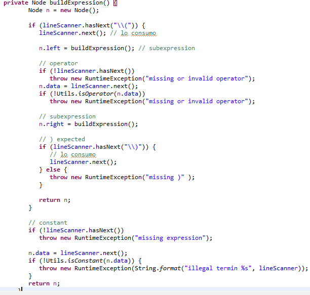

# Estructura de Datos y Algoritmos

# ITBA     2025-Q2

__Seguimiento__  __ del __  __método__  __ __  __recursivo__  __ __  __buildExpression__  __\(\)__

__para “__ \( \( 3 \*  \(    5  \-  10\.2 \)  \) \-  2  \)”

E \-> \( E op E \)

E \-> cte

E \-> \( E op E \)

E \-> cte

Con op: \+ \- \* / ^

E \-> \( E op E \)

E \-> cte

Con op: \+ \- \* / ^

E \-> \( E op E \)

E \-> cte

Con op: \+ \- \* / ^

\(  \( 3 \*  \(    5  \-  10\.2  \) \)  \-  2  \)

\(  \( 3 \*  \(    5  \-  10\.2  \) \)  \-  2  \)

\(  \( 3 \*  \(    5  \-  10\.2  \) \)  \-  2  \)

\( 3 \*  \(    5  \-  10\.2  \) \)  \-  2  \)

\( 3 \*  \(    5  \-  10\.2  \) \)  \-  2  \)

\( 3 \*  \(    5  \-  10\.2  \) \)  \-  2  \)

\( 3 \*  \(    5  \-  10\.2  \) \)  \-  2  \)

3 \*  \(    5  \-  10\.2  \) \)  \-  2  \)

3 \*  \(    5  \-  10\.2  \) \)  \-  2  \)

3 \*  \(    5  \-  10\.2  \) \)  \-  2  \)

3 \*  \(    5  \-  10\.2  \) \)  \-  2  \)

3 \*  \(    5  \-  10\.2  \) \)  \-  2  \)

\*  \(    5  \-  10\.2  \) \)  \-  2  \)

\*  \(    5  \-  10\.2  \) \)  \-  2  \)

\*  \(    5  \-  10\.2  \) \)  \-  2  \)

\*  \(    5  \-  10\.2  \) \)  \-  2  \)

\*  \(    5  \-  10\.2  \) \)  \-  2  \)

\(    5  \-  10\.2  \) \)  \-  2  \)

\(    5  \-  10\.2  \) \)  \-  2  \)

\(    5  \-  10\.2  \) \)  \-  2  \)

\(    5  \-  10\.2  \) \)  \-  2  \)

\(    5  \-  10\.2  \) \)  \-  2  \)

5  \-  10\.2  \) \)  \-  2  \)

5  \-  10\.2  \) \)  \-  2  \)

5  \-  10\.2  \) \)  \-  2  \)

5  \-  10\.2  \) \)  \-  2  \)

5  \-  10\.2  \) \)  \-  2  \)

5  \-  10\.2  \) \)  \-  2  \)

\-  10\.2  \) \)  \-  2  \)

\-  10\.2  \) \)  \-  2  \)

\-  10\.2  \) \)  \-  2  \)

\-  10\.2  \) \)  \-  2  \)

\-  10\.2  \) \)  \-  2  \)

10\.2  \) \)  \-  2  \)

10\.2  \) \)  \-  2  \)

10\.2  \) \)  \-  2  \)

10\.2  \) \)  \-  2  \)

10\.2  \) \)  \-  2  \)

10\.2  \) \)  \-  2  \)

10\.2  \) \)  \-  2  \)

\) \)  \-  2  \)

\) \)  \-  2  \)

\) \)  \-  2  \)

\) \)  \-  2  \)

\) \)  \-  2  \)

\)  \-  2  \)

\)  \-  2  \)

\)  \-  2  \)

\)  \-  2  \)

\-  2  \)

\-  2  \)

\-  2  \)

\-  2  \)

\-  2  \)

\-  2  \)

\-  2  \)

2  \)

2  \)

2  \)

2  \)

2  \)

2  \)

2  \)

2  \)

\)

\)

\)

\)

__Seguimiento__  __ del __  __método__  __ __  __recursivo__  __ __  __buildExpression__  __\(\)__

__para “__ \( \( 3 \*  \(    5  \-  10\.2 \)  \) \-  2  \)”

E \-> \( E op E \)

E \-> cte

