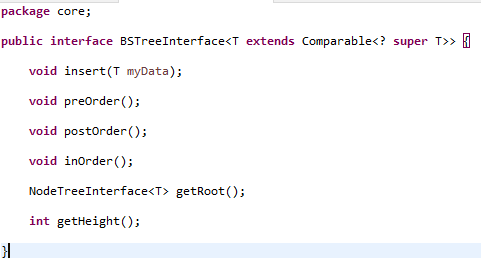
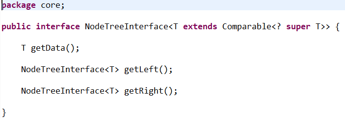
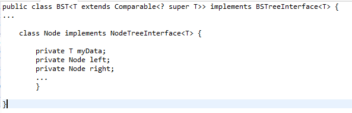

# Estructura de Datos y Algoritmos

# ITBA     2025-Q2

Los usos de árboles son multiples\. Además de los árboles de expresiones\, usar una estructura de árbol ordenada para buscar elementos suena interesante:

De la  __lista__  toma lo mejor:  __encadenar__  los elementos con punteros y no tener que alocar zona contigua\.

De los  __arreglos ordenados __ toma lo mejor: la posibilidad de aplicar  __búsqueda binaria __ \(es un árbol binario…\)

__Árbol Binario de Búsqueda u árbol binario ordenado \(Binary Search Tree o BST\)__

Es un árbol binario donde cada nodo no vacío cumple la siguiente condición: todos los datos de su  __subárbol izquierdo __ son menores o iguales que su dato\, y todos los datos de su  __subárbol derecho __ son mayores que su dato\.

# BST

Ej:

Ej:

Ej:

Ej:

Ej:

Ej:

Ej:

Ej:

Ej:

Ej:

Ej:

_Operaciones sobre un BST_

__Insertar: un BST crece desde las hojas\.__

Ej:

BST\<Integer> myTree =  __new BST<>\(\);  // root null__

myTree\.insert\(10\);    // apareció el root\.

myTree\.insert\(50\);

myTree\.insert\(25\);

myTree\.insert\(5\);

myTree\.insert\(8\);

__Mostrar gráficamente\, paso a paso\, cómo quedaría la inserción en un BST si los datos se insertan en el siguiente orden: 50  60  80  20  70  40  44  10  40__

# TP 5C – Ejer 1

# BST

_Ejercicio 1_

Mostrar gráficamente\, paso a paso\, cómo quedaría la inserción en un BST si los datos se insertan en el siguiente orden: 50  60  80  20  70  40  44  10  40

Rta final

__Armar un Proyecto Maven con las interfaces \(Campus\):__

__BSTreeInterface__

__NodeTreeInterface__

__Y la clase BST que implementa BSTreeInterface y la clase Node inner que implementa NodeTreeInterface\.__

__Implementar la clase BST\<T>__

# TP 5C – Ejer 2

# (bajar de campus)

Como mínimo\, tendría el siguiente contrato que ofrecer:

Y para el nodo interno también vamos a generar un contrato \(getters\) para luego ofrecer su graficación

Implementar y chequear estas 2 técnicas para el método insert en el BST:

Insert se lo resuelve desde BST \(sin precisar métodos de Node\)

Insert se resuelve invocando desde BST al insert del Node

# BST

Caso de uso:

__public static void main\(String\[\] args\) \{__

BST\<Integer> myTree =  __new BST<>\(\);__

myTree\.insert\(50\);

myTree\.insert\(60\);

myTree\.insert\(80\);

myTree\.insert\(20\);

myTree\.insert\(70\);

myTree\.insert\(40\);

myTree\.insert\(44\);

myTree\.insert\(10\);

myTree\.insert\(40\);

myTree\.inOrder\(\);

_myTree\.preOrder\(\);_

_myTree\.postOrder\(\);_

__10  20  40  40  44  50  60  70  80 __

__50  20  10  40  40  44  60  80  70 __

__10  40  44  40  20  70  80  60  50__

