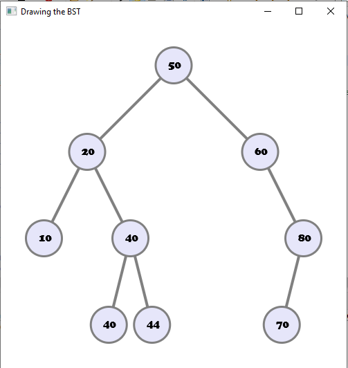
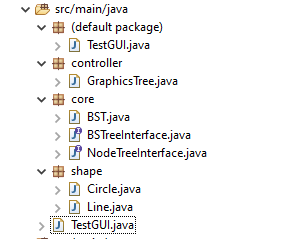
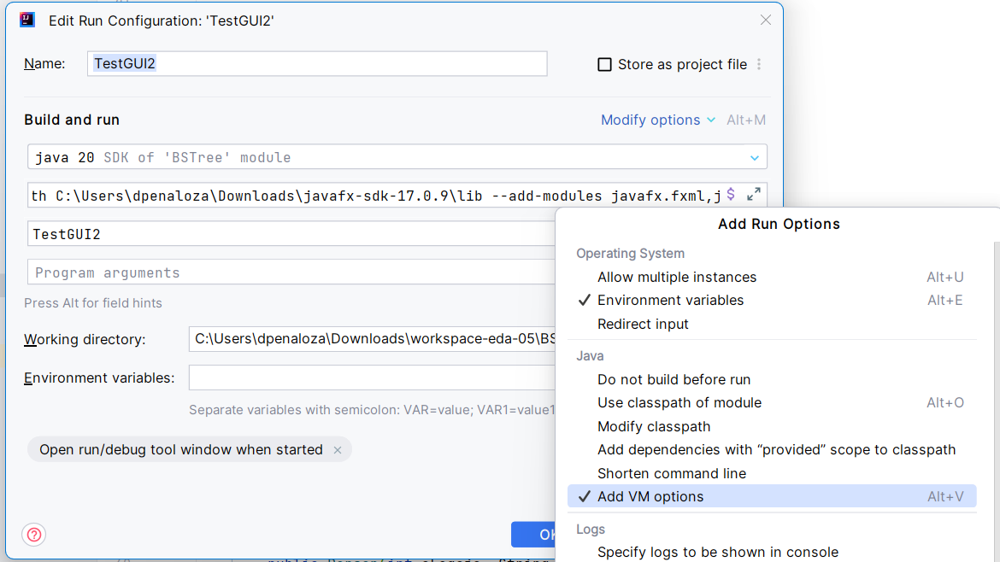
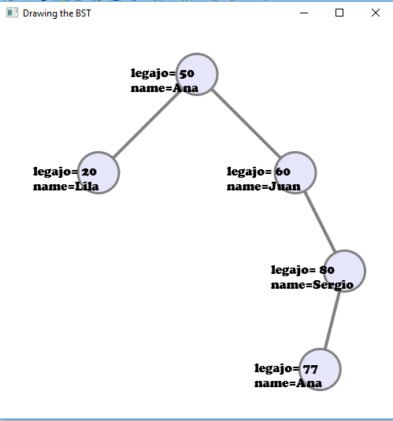

# Estructura de Datos y Algoritmos

# ITBA     2025-Q2

__Visualización __  __javafx con __  __MVC__

# TP 5C – Ejer 3

# BST

Asegurarse que tiene implementado los métodos \(insert\) y

@Override

__public__  NodeTreeInterface\<T> getRoot\(\) \{

__…__

\}

@Override

__public__   __int__  getHeight\(\) \{

__…__

\}

Agregar al pom las dependencias:

\<dependencies>

\<dependency>

<groupId>org\.openjfx</groupId>

<artifactId>javafx\-fxml</artifactId>

<version>17</version>

\</dependency>

\<dependency>

<groupId>org\.openjfx</groupId>

<artifactId>javafx\-base</artifactId>

<version>17</version>

\</dependency>

\<dependency>

<groupId>org\.openjfx</groupId>

<artifactId>javafx\-controls</artifactId>

<version>17</version>

\</dependency>

\<dependency>

<groupId>org\.openjfx</groupId>

<artifactId>javafx\-graphics</artifactId>

<version>17</version>

\</dependency>

\</dependencies>

Las interfaces deben estar dentro del package core

Ahora agregar al proyecto \(Bajar de Campus\):

GraphicsTree\.java  \(en package controller\)

Circle\.java y Line\.java \(en package shape\)

TestGUI\.java   \(podría estar en package default\)\. Es la aplicación de ejemplo javafx\.

Bajar  _https://gluonhq\.com/products/javafx/_     versión 17\.0\.2

Descompactar\, por ejemplo en

C:\\Users\\lgomez\\Downloads\\ javafx\-sdk\-17\.0\.2 

O para Linux/Mac:

/Users/jabu/Downloads/ javafx\-sdk\-17\.0\.2

Setear VM options la ejecutar  \(a donde está el lib\):

__\-\-module\-path__  C:\\Users\\lgomez\\Downloads\\ javafx\-sdk\-17\.0\.2 \\lib  __\-\-add\-modules__  javafx\.fxml\,javafx\.controls

Ejecutarlo\.

__El método createModel\(\) nos permite cambiar lo que queremos visualizar\.__

# TP 5C – Ejer 4

Crear un TAD  Person: legajo\, nombre\.  Participará del BST ordenado por legajo

# BST

__Caso de uso\. Se crea el modelo y se lo invoca desde el GUI__

private BST\<Person>  __createModel__ \(\) \{

BST\<Person> myTree = new BST<>\(\);

myTree\.insert\(new Person\(50\, "Ana"\)\);

myTree\.insert\(new Person\(60\, "Juan"\)\);

myTree\.insert\(new Person\(80\, "Sergio"\)\);

myTree\.insert\(new Person\(20\, "Lila"\)\);

myTree\.insert\(new Person\(77\, "Ana"\)\);

return myTree;

\}

