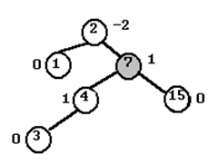

# Estructura de Datos y Algoritmos

# ITBA     2025-Q2

# TP 5D – Ejer 1

# AVL

__	__ Mostrar paso a paso\, gráficamente\, cómo queda el árbol AVL luego de realizar cada una de las siguientes operaciones de inserción: 1\, 2\, 4\, 7\, 15\, 3\, 10\, 17\, 19  y  16

Insertar 1

Insertar 2

Insertar 7

Insertar 15

Insertar 10

Insertar 17

Insertar 19

Insertar 16

# Consideraciones sobre la implementación

Como en inserciones/borrados tenemos que calcular la diferencia  entre la altura del subarbol izq y la altura del subarbol derecho => esta operación es MUY FRECUENTE\.

Puede convenir almacenar en Node dicha información\.

* __public class AVL\<T extends Comparable<? super T>> implements BSTreeInterface\<T> __  __\{__
* __\.\.\.__
  * __class__  __ __  __Node__  __ __  __implements__  __ __  __NodeTreeInterface__  __\<T> \{__
  * __	__  __private__  __ __  __T data;__
  * __	__  __private__  __ __  __Node__  __ __  __left__  __;__
  * __	__  __private__  __ __  __Node__  __ __  __right__  __;__
  * //  _para AVL_
  *  __	__    __private__    __ __    __int__    __ __    __height__    __;__ 
  * __	…__
  * __  \}__
* __\}__

Idea de cómo implementar la inserción \(idea a completar…\)

esta es la típica inserción en BST

para AVL: actualizo altura

esta es la típica inserción en BST

esta es la típica inserción en BST

para AVL: actualizo altura

para AVL: calculo balance

para AVL: actualizo altura

esta es la típica inserción en BST

esta es la típica inserción en BST

para AVL: actualizo altura

para AVL: calculo balance

esta es la típica inserción en BST

esta es la típica inserción en BST

para AVL: actualizo altura

para AVL: calculo balance

esta es la típica inserción en BST

Idea de cómo implementar la rotación\.

Ej  a izquierda con

Pivote en 12

