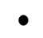
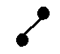
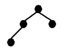
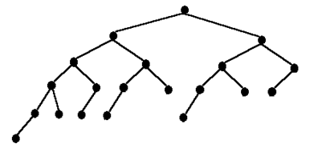
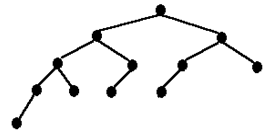
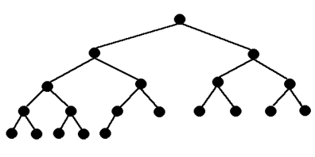
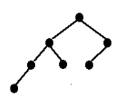
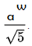
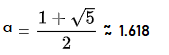

# Estructura de Datos y Algoritmos

# ITBA     2025-Q2

# AVL

Toda la eficiencia de un árbol BST está en su altura…

¿Cuál es la altura de un AVL? ¿Cuál es su peor caso?

Rta: el árbol de Fibonacci\. Es el AVL que presenta el peor desbalanceo posible\.

# Árbol de Fibonacci

* El Árbol de Fibonacci se define así:
* Fibonacci de orden  __0__   es el  __ÁRBOL NULO__
* Fibonacci de orden  __1__  es un  __NODO__
* Fibonacci de orden  __h__  __2__  es un árbol que tiene:
  * como hijo izquierdo un Fibonacci de orden  __h \-1__
  * como hijo derecho un Fibonacci de orden  __h \- 2__ \.

Dibujar el Arbol de Fibonacci  de orden 6

Cuántos nodos tiene?

Cuál es su altura?

# TP 5D – Ejer 5.1

Rta:   Fibo\(0\)    null

Fibo\(1\)

Fibo\(2\)

Fibo\(3\)

Fibo\(4\)

Fibo\(5\)

¿Cuántos nodos tiene el Fibonacci de orden 6? ¿Qué altura tiene?

Rta: 20 nodos y tiene altura 5

Cual sería la altura de uno completo \(perfectamente balanceado\) con esa misma cantidad de nodos?

Comparar con fibo

Rta: con 20 nodos este es el árbol perfectamente balanceado\. Tiene altura 4\.

Solo un valor menos de altura\!

Formalizando…

Sea un AVL de altura h   __con la __    __menor__    __ __    __cantidad__    __ de __    __nodos__    __ __    __posibles__    __ __    __en__    __ __    __esa__    __ __    __altura__ 

Avl de altura 0 tiene 1 nodo

Avl de altura 1 tiene 2 nodos

Avl de altura 2 tiene 4 nodos

AVL de altura 3 tiene 7 nodos

AVL de altura 4 tiene 12 nodos

AVL de altura H tendrá

1 nodo \+ cantnodos avl altura h\-1 \+ cantnodos avl altura h\-2

AVL de altura h tendrá

1 nodo \+ cantnodos avl altura h\-1 \+ cantnodos avl altura h\-2

¿Qué relación tiene con los números de Fibonacci?

nrofibo\(0\)=0\, nfibo\(1\)=1\, nrofibo\(2\)=1\, nrofibo\(3\)=2\, nrofibo\(4\)=3\, nrofibo\(5\)=5\, nrofibo\(6\)=8\, nrofibo\(7\)=13\, etc

| AVL altura h con menor cant de nodos | Cant nodos en relación a los números de fibo? |
| :-: | :-: |
| Altura 0  CantNodos= 1 | nrofibo\(altura\+3\)\-1 =   1 |
| Altura 1  CantNodos= 2 | nrofibo\(altura\+3\)\-1=   2 |
| Altura 2  CantNodos=1 \+ 1\+ 2 =  4 | nrofibo\(altura\+3\)\-1=  4 |
| Altura 3  CantNodos=1 \+ 4 \+2 =  7 | nrofibo\(altura\+3\)\-1=  7 |
| Altura 4  CantNodos=1 \+ 7 \+ 4 =  12 | nrofibo\(altura\+3\)\-1=  12 |
| Altura 5  CantNodos=1 \+ 12 \+ 7 =  20 |  |
| … |  |
| Altura h  CantNodos=? | nrofibo  \(h\+3  \)\-1 |

Números de fibonacci :

nrofibo\(0\)=0\, nrofibo\(1\)=1\, nrofibo\(2\)=1\, nrofibo\(3\)=2\, nrofibo\(4\)=3\, nrofibo\(5\)=5\, nrofibo\(6\)=8\, nrofibo\(7\)=13\, nrofibo\(8\)=21\, etc

El árbol AVL que mínima cantidad de nodos tiene para cierta altura es el Árbol de Fibonacci \(es más esparcido posible por construcción\)\.

Si ese árbol con mínima cantidad nodos y altura h sabemos que tiene CantNodos= nrosfibo\(h\+3\)\-1

donde h es su altura\,  entonces\, otros árboles AVL con misma altura tendrán posiblemente más nodos

CantNodos >= nrosfibo\(h\+3\)\-1

Pero los numeros de Fibonacci tienen una propiedad\. Ver [https://en\.wikipedia\.org/wiki/Fibonacci\_number](https://en.wikipedia.org/wiki/Fibonacci_number)

__Recapitulando__

Peor caso de AVL  con N=20	 	  Altura = 5

Perfectamente Balanceado con N=20  	  Altura = 4



__Diferencia poco significativa en altura__

Mantener  __AVL es menos costoso __ que un completo \(perfectamente balanceado\)



__Preferible un árbol AVL__

Estudiar cómo son las inserciones  \(algorítmicamente\, gráficamente\) en Red Black Tree que es otro tipo de algoritmo que garantiza operaciones en O\(log N\)\.

Este árbol es el que tiene implementado Java\.

