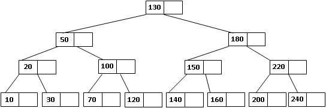

# Estructura de Datos y Algoritmos

# ITBA     2025-Q2

# Otra familia de árboles

_Árbol _  _Multicamino_  _ M\-ario \(orden M\)_

Los nodos guardan hasta M\-1 claves de información\, con un máximo de M hijos\. Cada clave Ci de un cierto nodo será tal que las claves almacenadas en su subárbol izquierdo serán menores y las almacenadas es su subárbol derecho serán mayores que él\.

_Árboles   _  _Multicaminos_  _  Balanceados_

El equilibrio perfecto  resulta muy costoso de mantener y es poco práctico\.

En 1970\,   __R\. Bayer y E\. M\. Mc __  __Creight__  postularon un  __criterio razonable __ que permite implementar algoritmos relativamente sencillos para búsquedas\, inserciones y eliminaciones\.  Para mantener éstos árboles multicaminos balanceados se utiliza una estructura subyacente de la  __familia de los árboles B__ \, que veremos a continuación

# Árbol B de Orden N

Un árbol B de orden N es un árbol de búsqueda \(ordenado\) que cumple con los siguientes axiomas:

Cada nodo contiene a lo sumo 2 \* N claves\.

Cada nodo\, excepto la raíz\, contiene por los menos N claves\.

Cada nodo o es hoja o tiene M\+1 descendientes donde M es el número de claves que posee realmente ese nodo

Todas las hojas están al mismo nivel

En cuanto al orden:  si un nodo tiene c1 c2 …cm elementos c1<c2<…<cm\, pero además para cada ci \(1<=i<=m\) los elementos del subárbol  izquierdo de ci son menores que c1 y los elementos del subárbol derecho de ci son mayores que ci\.

* __Algoritmo__  __ de __  __Búsqueda__
* Buscamos la clave X en un nodo\. Para ello lo  __recorremos secuencialmente__  desde C1 hasta Ck\, siendo k el número de claves que realmente posee dicho nodo\, hasta que se den alguno de estos casos:
  * Si X < C1\, como en el nodo las claves están ordenadas  no tiene sentido seguir buscando en ese nodo\, luego sigo buscando en el subárbol apuntado por P0
  * Si X=Ci para algún i<=k entonces lo encontré
  * Si Ci<X<Ci\+1 para algún i prosigo en la búsqueda en el subárbol apuntado por  Pi
  * Si Ck < X siendo k la cantidad de claves que posee\, entonces sigo la búsqueda en el subárbol apuntado por Ck
* Si en algún caso el puntero por donde hay que seguir la búsqueda fuera null\,  entonces el elemento buscado no está\.

__Algoritmo__  __ de __  __Inserción__

Si se quiere insertar una clave X en un árbol B de orden N\, se procede de la siguiente manera:

La inserción siempre se hace  __en las hojas__  \(para poder detectar si el nodo a insertar ya está presente o no\)

Para insertar se coloca el elemento X en la hoja que corresponda \(el nodo debe estar ordenado\)

Si el elemento nuevo hace que la cantidad nueva k sea mayor que el 2\*n permitido\, el nodo se abre en dos\, subiendo la clave del medio al nodo antecesor de dicho nodo\. Este algoritmo es recursivo hasta la raíz\, o sea si al ubicar la clave del medio en el nodo antecesor ocasiona que el nodo viole la condición de árbol B de orden n \(k>2\*n\) el procedimiento de repite\.

# TP 5D – Ejer 9

Insertemos claves en un árbol B de orden 1\.  Sus nodos son de la forma:

Insertar las claves 100\, 80\, 40\, 20 y 60

Insertar 100

Insertar 100

Insertar 100

Insertar 80

Insertar 100

Insertar 80

Insertar 60 ¿Donde va?

# TP 5D – Ejer 10

Insertaremos las siguientes claves en un árbol B de orden  1:  10\, 20\, 30\, 50\, 70\, 100\, 150\, 130\, 120\, 220\, 180\, 200\, 240\, 140\, 160

Insertaremos las siguientes claves en un árbol B de orden  1:  10\, 20\, 30\, 50\, 70\, 100\, 150\, 130\, 120\, 220\, 180\, 200\, 240\, 140\, 160

Insertar 10

Insertar 20

Insertar 30

Insertar 30

Insertar 50

Insertar 30

Insertar 50

Insertar 70

Insertar 70

Insertar 100

Insertar 70

Insertar 100

Insertar 150

Insertar 150

Insertar 130

Insertar 150

Insertar 130

Insertar 120

Insertar 120

Insertar 220

Insertar 120

Insertar 220

Insertar 180

Insertar 180

Insertar 200

Insertar 180

Insertar 200

Insertar 240

Insertar 240

Insertar 140

Insertar 240

Insertar 140

