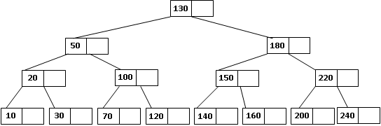
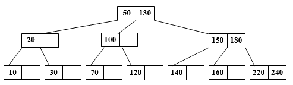
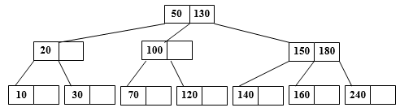
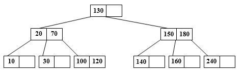

# Estructura de Datos y Algoritmos

# ITBA     2025-2

__Operación__  __ de __  __Borrado__

Si no encuentra en un nodo hoja\, se lo reemplaza por una clave lexicográficamente adyacente\, por ejemplo el sucesor in order y se lo elimina de dicha hoja\. Si fuera hoja se lo elimina directamente\.

Luego\, para la hoja que colaboró el borrado se analiza si cumple las condiciones de árbol B de orden N\. Si ha quedado en rojo \(tiene menos elementos que los permitidos\)\, se une dicho nodo con su hermano y medio antecesor \(el cual es eliminado del nodo al cual pertenece\, porque acude en ayuda de su hijo\) armando un sólo nodo\. Se verifica si cumple las condiciones de árbol B de orden N\, y sino se lo particiona subiendo el elemento del medio\. Después se analiza qué sucede con el nodo donde estaba su medio antecesor\, y se sigue el proceso recurrentemente hasta llegar a la raíz\.

# TP 5C – Ejer 12

Dado el ultimo árbol de Orden 1 obtenido\, eliminar 200\, 220\, 50

Eliminar 200

Como el nodo que contenía al 200   __queda en rojo__  _\,_  se une con su hermano y baja su medio antecesor formando un solo nodo \(220\, 240\)\, que se transforma en un nodo de árbol B de orden 1\.

Pero el nodo donde estaba el medio antecesor 220   __queda en rojo\, __ entonces se une con su hermano y baja el medio antecesor formando un solo nodo \(150\, 180\)\.  ¿Es éste un nodo de un árbol B de orden 1?   Sí\, pero ¿qué pasa con el nodo donde estaba el medio antecesor?  __Queda en rojo \!\!\!   __ Entonces se une con su hermano y baja el medio antecesor formando un solo nodo \(50\, 130\)\.  Es éste un nodo de árbol B de orden 1 ? Sí\.

El árbol B\, después de la eliminación del 200\, queda así:

Eliminamos 50

Como  __no es un nodo hoja__  _ _ se lo reemplaza por una clave lexicográficamente adyacente\,  por ejemplo su sucesor in   order  : 70 \.   Pero el nodo donde se encontraba la clave 70 es una hoja que  __queda en rojo__ \, luego se une con su  hermano y baja el medio antecesor formando un nodo \(100\, 120\)\. Si bien ese nodo es correcto\, el nodo donde estaba el 100  __queda en rojo\, __ luego\, se une con su hermano y su medio antecesor\.

Como tiene dos medio hermanos \(20 y 150\) hay que elegir una convención\, por ejemplo\, si tiene medio hermano izquierdo se toma ése\, sino el de la derecha\. No importa la convención utilizada\, siempre que se la respete durante todo el algoritmo\. Tomaremos esta convención\, por lo cual queda el nodo \(20\, 70\)\.  ¿Es éste un nodo de un árbol B de orden 1? Sí\.  ¿Qué pasa con el nodo donde estaba el medio antecesor?  Sigue siendo un nodo de un árbol B de orden\.

