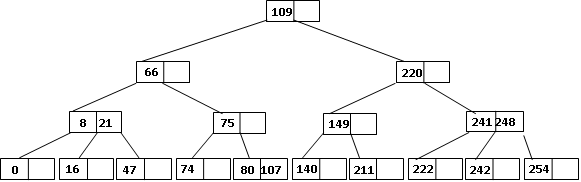
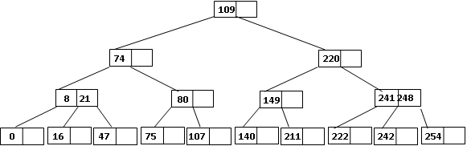
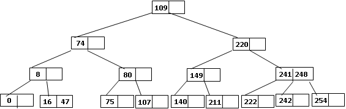
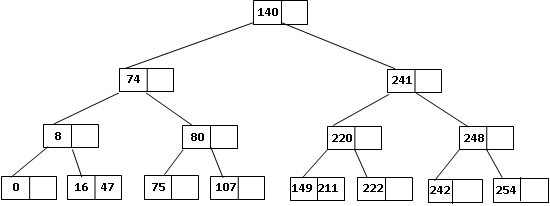
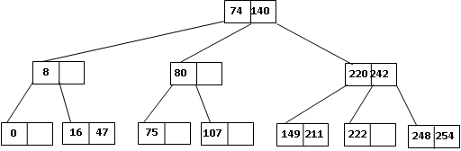
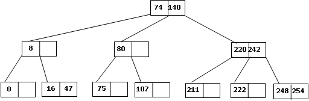
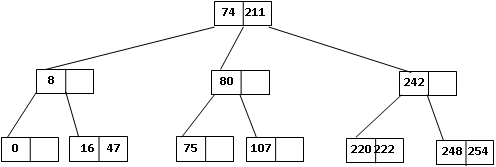
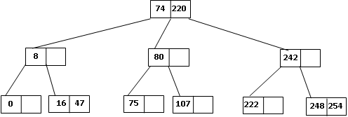
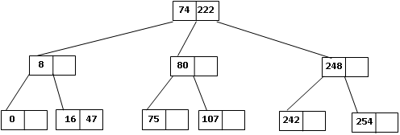
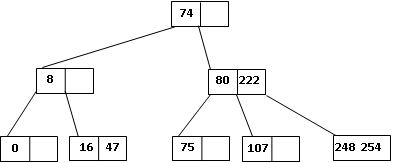

# Estructura de Datos y Algoritmos

# ITBA     2025-2

# TP 5C – Ejer 13

__ \(__  __ej__  __: __  __lexi__  __ mayor\, pref\. __  __hno__  __ __  __izq__  __\)__

__	__ El siguiente árbol surgió de inserción en un árbol B de orden 1 las claves  0\, 8\, 109\, 220\, 222\, 241\, 149\, 107\, 75\, 248\, 254\, 140\, 16\, 66\, 74\, 21\, 211\, 47\, 80 y 242\.  E __liminar__  __ __ las claves  66\, 21\, 109\, 241\, 149\, 140\, 211\, 220 y 242\.

# Eficiencia de los árboles

Aclaraciones

Aunque el código que analizamos para B orden N solo guarda claves\, típicamente se define:

__public__  __ __  __class__  __ __  __BTree__  __<T __  __extends__  __ Comparable<T__  __>\, V> __  __implements__  __ __  __ITree__  __\<T\, V> \{…__

__Donde__  __ V __  __es__  __ para __  __asociar__  __ al Key un Record\. __

Ej: para record student: legajo\, nombre\, email\.

\<10\, Ana\, ana@Hotmail\.com>

\<2\, Juan\, juan@Hotmail\.com>

<7\, Fer\, fer@Hotmail\.com>

Si B ordena por  _legajo_

7\, <7\, Fer\, fer@Hotmail\.com>

10\, \<10\, Ana\, ana@Hotmail\.com>

2\, <2\, Juan\, juan@Hotmail\.com>

Ej: para record student: legajo\, nombre\, email\.

\<10\, Ana\, ana@Hotmail\.com>

\<2\, Juan\, juan@Hotmail\.com>

<7\, Fer\, fer@Hotmail\.com>

Si B ordena por  nombre

Fer\, <7\, Fer\, fer@Hotmail\.com>

Juan\, <2\, Juan\, juan@Hotmail\.com>

Ana\, \<10\, Ana\, ana@Hotmail\.com>

Si la colección tiene mucha información el Record se deja en disco\. Se accede al archivo con

RandomAccessFile  \(fixed length records\) por su offset\.

__Así__  __\, el __  __árbol__  __ __  __quedaría__

__public__  __ __  __class__  __ __  __BTree__  __<T __  __extends__  __ Comparable\<T>\, V> __  __implements__  __ __  __ITree__  __\<T\, V> \{…__

__Donde__  __ V __  __es__  __ __  __el “index u offset” del __  __archivo__  __ __  __en__  __ disco\.__

Ej: para record student: legajo\, nombre\, email\. Todos los registros ocupan\, por ejemplo\, 4\+50\+20 bytes\.

Si B ordena por  _legajo_ 		Si B ordena por  nombre

<10\, Ana\, [ana@Hotmail\.com](mailto:ana@Hotmail.com)>

<2\, Juan\, juan@Hotmail\.com>

<7\, Fer\, [fer@Hotmail\.com](mailto:fer@Hotmail.com)>

