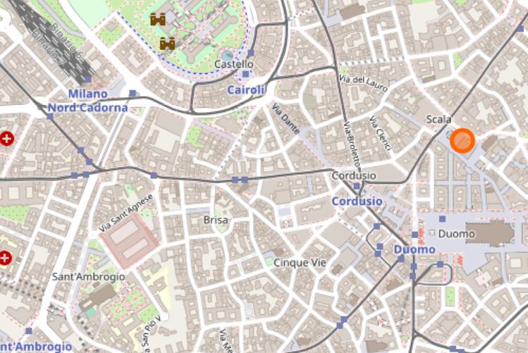

# Estructura de Datos y Algoritmos

# ITBA     2025-Q2

Algoritmos para representar conexiones\.

Muchas motivaciones…

Mapas

En el siglo 18\, en Prusia \(Königsberg\) había zonas separadas por el río Pregolya unidas por 7 puentes\. Se puede pasear por la ciudad pasando  __una y una sola vez __ por cada puente? Cómo?

Hay camino Euleriano posible?

Idea: modelar la situación con un grafo\. Las 4 zonas son vértices y los puentes son los ejes\. Los ejes no son dirigidos porque puedo atravesar el puente en cualquier dirección\.

La teoría de grafos tiene muchos teoremas\.  Ej: para que haya un camino euleriano la cantidad de nodos con grado impar deben ser 0 o 2\.  \(si fueran 2 serían el nodo de salida y el de llegada\)

Tiene solución la visita a los puentes de Prusia?

# Graph

__Caso__  __ de __  __Uso__  __: “__  __Flujo__  __/__  __Transporte__  __”\.__

Para representar rutas\, conexiones y tráfico\. Ej: rutas áreas\, formas alternativas para ir de un lugar a otro\, etc\.

Ej: Actualmente

OpenstreetMap sigue

usando grafos dirigidos

para representar calles\,

avenidas\, puentes\,

POIs\, etc

__Casos de Uso: “Redes sociales\, y el análisis __

__de la comunidad digital”__

Ej: 2500 usuarios de twitter

Y su interconexión

Cuando se precisa representar los vínculos entre objetos\. Ej: Twitter\, Facebook\, DBLP \(autores y publicaciones científicas\)\, Netflix\, etc\, etc\, etc\.

Dada la complejidad de las interrelaciones entre participantes\, existe mucha información que puede extraerse al analizar este tipo de redes: el más influyente\, las comunidades\, recomendaciones\, entre otros\.

__Casos de Uso: “Instaladores/Compiladores/Optimizadores”__

Precisan saber el orden conveniente en que hay que instalar/configurar/ejecutar paquetes\.

Ej: manejador de proyectos de software como maven\.  Con tantas dependencias\, ¿En qué orden debe instalarse un paquete y todas sus dependencias? ¿Quién depende de quién?

Ej: un optimizador de SQL distribuido para ser ejecutado en un cluster de computadoras organiza las tareas

Ej: Al fabricar un elemento \(ej: un auto\)\. ¿Por donde se empieza?

Ej: Al armar un cronograma para cierta actividad\, como  ser ¿cuál es el plan para recibirse de Ing\. en Informática en ITBA?

# Grafos y sus tipos

* __Con ejes no dirigidos__
  * Simple: entre cada par de nodos hay a lo sumo un eje\. No admite lazos \(self\-loops\)

# Tipos de Grafos

* __Con ejes no dirigidos__
  * Multigrafo: entre cada par de nodos puede haber varios ejes\. No admite lazos \(self\-loops\)

* __Con ejes no dirigidos__
  * Pseudografo: entre cada par de nodos puede haber varios ejes y admite lazos \(self\-loops\)

No hay clasificación para simple con lazo \(self\-loop\)

* __Con ejes dirigidos \(__  __digrafos__  __\)__
  * Simple digrafo: entre cada par de nodos hay a lo sumo un eje\. No admite lazos \(self\-loops\)\.

* __Con ejes dirigidos  \(__  __digrafos__  __\)__
  * Multi digrafo: entre cada par de nodos puede haber varios ejes\. No admite lazos\.

* __Con ejes dirigidos \(__  __digrafos__  __\)__
  * Pseudo digrafo: entre cada par de nodos puede haber varios ejes y admite lazos \(self\-loops\)\.

No hay clasificación para simple digrafo con lazo \(self\-loop\)

Depende lo que quiera modelar\, el tipo de grafo que me conviene\.

Ej\. Para rutas áreas\, ¿hay algún vuelo que salga de una ciudad y llegue a la misma ciudad?

Rta: No\. Entonces\, no elegiría ninguno de los casos que acepten lazos\.

Ej: Para correlatividades entre materias\. ¿Puede una materia ser correlativa a ella misma? ¿Serviría no poner quien va antes que quien?

Rta: No\. Entonces\, no elegiría ninguno de los casos que acepten lazos\. Tampoco elegiría uno no dirigido\.

Además de todos los casos que expusimos tenemos las variantes donde los  __ejes aceptan pesos__ \.

Ej: en el caso de rutas áreas esto puede ser muy útil porque podría colocar en dichos pesos la duración del vuelo\, etc\.

__Conclusión__

Por eso hay tantos tipos de grafos\. Porque me permiten modelar situaciones diversas\.

El siguiente cuadro sumariza los  __8 tipos de grafos__ :

| Dirigido? | Multiplicidad? | Lazos? | Nombre |
| :-: | :-: | :-: | :-: |
|  |  |  | Simple |
|  |  |  | _Simple con lazos_ |
|  |  |  | Multi Grafo |
|  |  |  | Pseudo Grafo |
|  |  |  | \(Simple\) Digrafo |
|  |  |  | _Digrafo_  _ con lazos_ |
|  |  |  | Multi Digrafo |
|  |  |  | Pseudo digrafo |

Si además de estas 8 combinaciones les permitimos manejar peso en los ejes =>  __tenemos 16 TIPOS \!\!\!\!__

A veces\, algunas definiciones/algoritmos dependen del tipo\.

Ej: indegree y outdegree solo aplica a grafos dirigidos\. Ej: calcular el camino mínimo solo aplica a grafos con peso en los ejes\, etc\.

# Caso de Uso

Vertexes:

\(A\) \(B\) \(C\) \(D\) \(E\) \(H\) \(Z\)

Edges:

\(A\) \-\- \(B\)

\(A\) \-\- \(C\)

\(A\) \-\- \(E\)

\(B\) \-\- \(A\)

\(B\) \-\- \(H\)

\(C\) \-\- \(A\)

\(C\) \-\- \(E\)

\(C\) \-\- \(z\)

\(E\) \-\- \(A\)

\(E\) \-\- \(C\)

\(H\) \-\- \(B\)

\(Z\) \-\- \(C\)

\#vertices: 7

\#edges: 12

vertex A has degree 3

vertex B has degree 2

vertex C has degree 3

vertex D has degree 0

vertex E has degree 2

vertex H has degree 1

vertex z has degree 1

g\.dump\(\);

System\.out\.println\(String\.format\("\#vertices: %d"\, g\.getVertices\(\)\.size\(\) \)\);

System\.out\.println\(String\.format\("\#edges: %d"\, g\.getEdges\(\)\.size\(\) \)\);

// degree de cada nodo

for\(Character aV: g\.getVertices\(\)\) \{

System\.out\.println\(

String\.format\("vertex %s has degree %d"\, aV\, g\.degree\(aV\)\)\);

\}  

Para ejemplificar las posibles representaciones vamos a tomar como ejemplo:  Grafo Simple

# Formalmente un grafo simple

Sea G=\(V\, E\)

Representamos a ambos conjuntos:

__1\) Vértices V__

__2\) Y hay cuatro propuestas típicas para representar a los ejes __  __E__

Respecto a la implementación de los ejes\, hay 4 implementaciones:

2\.1\) Matriz de adyacencia\. Ideal grafos densos

2\.2\) Lista de adyacencia\. Ideal grafos esparcidos \(sparse\)

2\.3\) Matriz de incidencia\. Ídem\.

2\.4\) Lista de incidencia\. Ídem\.

Empecemos con la representación\.

# 1) Para los vértices:

g\.addEdge\('E'\, 'B'\,  __new __  __EmptyEdgeProp__  __\(\)__ \);  _  _ 

g\.addEdge\('A'\, 'B'\,  __new __  __EmptyEdgeProp__  __\(\)\);  __

g\.addEdge\('F'\, 'B'\,  __new __  __EmptyEdgeProp__  __\(\)\);  __

g\.addVertex\('D'\);

g\.addVertex\('G'\);

g\.addEdge\('E'\, 'F'\,  __new __  __EmptyEdgeProp__  __\(\)\);  __

g\.addEdge\('F'\, 'A'\,  __new __  __EmptyEdgeProp__  __\(\)\);__

g\.addEdge\('F'\, 'G'\,  __new __  __EmptyEdgeProp__  __\(\)\);  __

g\.addEdge\('U'\, 'G'\,  __new __  __EmptyEdgeProp__  __\(\)\);  __

g\.addEdge\('T'\, 'U'\,  __new __  __EmptyEdgeProp__  __\(\)\); __

g\.addEdge\('C'\, 'G'\,  __new __  __EmptyEdgeProp__  __\(\)\);  __  __ __

| E | B | A | F | D | G | U | T | C |
| :-: | :-: | :-: | :-: | :-: | :-: | :-: | :-: | :-: |

# 2.1) Para los ejes: “matriz de adyacencia”

|  | 0 | 1 | 2 | 3 | 4 | 5 | 6 | 7 | 8 |
| :-: | :-: | :-: | :-: | :-: | :-: | :-: | :-: | :-: | :-: |
| 0 | F | T | F | T | F | F | F | F | F |
| 1 | T | F | T | T | F | F | F | F | F |
| 2 | F | T | F | T | F | F | F | F | F |
| 3 | T | T | T | F | F | T | F | F | F |
| 4 | F | F | F | F | F | F | F | F | F |
| 5 | F | F | F | T | F | F | T | F | T |
| 6 | F | F | F | F | F | T | F | T | F |
| 7 | F | F | F | F | F | F | T | F | F |
| 8 | F | F | F | F | F | T | F | F | F |

| E |
| :-: |
| B |
| A |
| F |
| D |
| G |
| U |
| T |
| C |

| E | B | A | F | D | G | U | T | C |
| :-: | :-: | :-: | :-: | :-: | :-: | :-: | :-: | :-: |

|  | 0 | 1 | 2 | 3 | 4 | 5 | 6 | 7 | 8 |
| :-: | :-: | :-: | :-: | :-: | :-: | :-: | :-: | :-: | :-: |
| 0 | F | T | F | T | F | F | F | F | F |
| 1 | T | F | T | T | F | F | F | F | F |
| 2 | F | T | F | T | F | F | F | F | F |
| 3 | T | T | T | F | F | T | F | F | F |
| 4 | F | F | F | F | F | F | F | F | F |
| 5 | F | F | F | T | F | F | T | F | T |
| 6 | F | F | F | F | F | T | F | T | F |
| 7 | F | F | F | F | F | F | T | F | F |
| 8 | F | F | F | F | F | T | F | F | F |

| E |
| :-: |
| B |
| A |
| F |
| D |
| G |
| U |
| T |
| C |

| E | B | A | F | D | G | U | T | C |
| :-: | :-: | :-: | :-: | :-: | :-: | :-: | :-: | :-: |

# 2.2) Para los ejes: “lista de adyacencia” si es muy esparcida

|  | 0 | 1 | 2 | 3 | 4 | 5 | 6 | 7 | 8 |
| :-: | :-: | :-: | :-: | :-: | :-: | :-: | :-: | :-: | :-: |
| 0 |  | T |  | T |  |  |  |  |  |
| 1 | T |  | T | T |  |  |  |  |  |
| 2 |  | T |  | T |  |  |  |  |  |
| 3 | T | T | T |  |  | T |  |  |  |
| 4 |  |  |  |  |  |  |  |  |  |
| 5 |  |  |  | T |  |  | T |  | T |
| 6 |  |  |  |  |  | T |  | T |  |
| 7 |  |  |  |  |  |  | T |  |  |
| 8 |  |  |  |  |  | T |  |  |  |

| F |  |
| :-: | :-: |

| E |
| :-: |
| B |
| A |
| F |
| D |
| G |
| U |
| T |
| C |

| B |  |
| :-: | :-: |

| E |
| :-: |
| B |
| A |
| F |
| D |
| G |
| U |
| T |
| C |

| F |  |
| :-: | :-: |

| A |  |
| :-: | :-: |

| E |  |
| :-: | :-: |

| F |  |
| :-: | :-: |

| B |  |
| :-: | :-: |

| G |  |
| :-: | :-: |

| A |  |
| :-: | :-: |

| B |  |
| :-: | :-: |

| E |  |
| :-: | :-: |

| C |  |
| :-: | :-: |

| U |  |
| :-: | :-: |

| F |  |
| :-: | :-: |

| T |  |
| :-: | :-: |

| G |  |
| :-: | :-: |

| U |  |
| :-: | :-: |

| G |  |
| :-: | :-: |

| E | B | A | F | D | G | U | T | C |
| :-: | :-: | :-: | :-: | :-: | :-: | :-: | :-: | :-: |

| F |  |
| :-: | :-: |

| E |
| :-: |
| B |
| A |
| F |
| D |
| G |
| U |
| T |
| C |

| B |  |
| :-: | :-: |

| F |  |
| :-: | :-: |

| A |  |
| :-: | :-: |

| E |  |
| :-: | :-: |

| F |  |
| :-: | :-: |

| B |  |
| :-: | :-: |

| G |  |
| :-: | :-: |

| A |  |
| :-: | :-: |

| B |  |
| :-: | :-: |

| E |  |
| :-: | :-: |

| C |  |
| :-: | :-: |

| U |  |
| :-: | :-: |

| F |  |
| :-: | :-: |

| T |  |
| :-: | :-: |

| G |  |
| :-: | :-: |

| U |  |
| :-: | :-: |

| G |  |
| :-: | :-: |

# 2.3) Para los ejes: “matriz de incidencia”. Se colocan vértices y ejes en filas y columnas

|  | 0 | 1 | 2 | 3 | 4 | 5 | 6 | 7 | 8 |
| :-: | :-: | :-: | :-: | :-: | :-: | :-: | :-: | :-: | :-: |
| 0 | T | T | F | F | F | F | F | F | F |
| 1 | F | T | T | F | T | F | F | F | F |
| 2 | F | F | T | T | F | F | F | F | F |
| 3 | T | F | F | T | T | T | F | F | F |
| 4 | F | F | F | F | F | F | F | F | F |
| 5 | F | F | F | F | F | T | T | T | F |
| 6 | F | F | F | F | F | F | T | F | T |
| 7 | F | F | F | F | F | F | F | F | T |
| 8 | F | F | F | F | F | F | F | T | F |

| E |
| :-: |
| B |
| A |
| F |
| D |
| G |
| U |
| T |
| C |

| e1 | e2 | e3 | e4 | e5 | e6 | e7 | e8 | e9 |
| :-: | :-: | :-: | :-: | :-: | :-: | :-: | :-: | :-: |

# 2.4) Para los ejes: “lista de incidencia”. Idem. Se representa una lista asociada que compacta

Queremos que el usuario genere varios tipos de grafos posibles \* 2 \(por el peso en los ejes\) \* 4 \(por las implementaciones posibles\)\, pero no vamos a esperar que el usuario conozca el nombre de un montón de clases\, para los casos\.

Buena idea: escribir un Factory\.

Esta idea es la que implementa la clase JGraphT\, una biblioteca de código abierto sobre grafos muy importante\.

La clase   GraphFractory   es abstracta\.   Create   es método   static  \. No me de una instancia de   GraphFactory  \. Me da una instancia de la clase que corresponda a través de un servicio

Se parametrizan las clases que representan las propiedades de los vértices y las propiedades de los ejes

Modo de uso:

 __GraphService__   __<__  __Character\,EmptyEdgeProp__  __>__  g =

 __GraphFactory\.__    _create_   _\(_  _Multiplicity\._  _SIMPLE_  _\, _

EdgeMode\. _UNDIRECTED_  _\,_

SelfLoop\. _NO_  _\,_

Weight\. _NO_  _\,_

Storage\. _SPARSE_  _\);_

_Características del tipo de grafo  y del tipo de almacenamiento_

La clase   GraphFractory   es abstracta\.   Create   es método   static  \. No me de una instancia de   GraphFactory  \. Me da una instancia de la clase que corresponda a través de un servicio

Se parametrizan las clases que representan las propiedades de los vértices y las propiedades de los ejes

Modo de uso:

 __GraphService__   __<__  __Character\,EmptyEdgeProp__  __>__  g =

 __GraphFactory\.__    _create_   _\(_  _Multiplicity\._  _SIMPLE_  _\, _

EdgeMode\. _UNDIRECTED_  _\,_

SelfLoop\. _NO_  _\,_

Weight\. _NO_  _\,_

Storage\. _SPARSE_  _\);_

 __GraphService__   __<__  __Flight\,WeightedEdgeProp__  __>__  g =

 __GraphFactory\.__    _create_   _\(_  _Multiplicity\._  _MULTI_  _\, _

EdgeMode\. _DIRECTED_  _\,_

SelfLoop\. _NO_  _\,_

Weight\. _YES_  _\,_

Storage\. _SPARSE_  _\);_

_Características del tipo de grafo  y del tipo de almacenamiento_

Instanciamos una clase u otra\. Ambas implementan el GraphService \(sparse\)\.

Si es SimpleOrDefault sabemos que tiene  máximo un eje entre 2 nodos\.

Un Factory expone el orden de los parámetros en forma fija:

public static \<V\, E> GraphService\<V\, E> create\(

Multiplicity edgeMultiplicity\,

EdgeMode theEdgeMode\,

SelfLoop acceptSelfLoops\,

Weight hasWeight\, Storage theStorage\)

Otra buena idea es ofrecer una clase Builder que permita que en cualquier orden se pasen parámetros en forma aislada  \(si no se proporcionan asumen algún default\) y cuando lo decida invoque build\(\) que finalmente invoca al GraphFactory\. Es un caso de postergación\.

El usuario también podría crear grafos de diferentes formas:

 __GraphService__    __ <__    __Character\,EmptyEdgeProp__    __>__    __ __    __g = __ 

__new __  __GraphBuilder__ <Character\,EmptyEdgeProp>  __\(\)\.__

withMultiplicity\(Multiplicity\.SIMPLE\)\.

withDirected\(EdgeMode\.UNDIRECTED\)\.

withAcceptSelfLoop\(SelfLoop\.NO\)\.

withAcceptWeight\(Weight\.YES\)\.

withStorage\(Storage\.SPARSE\)\.

__build__  __\(\);__

 __GraphService__    __ <__    __Character\,EmptyEdgeProp__    __>__    __ g = __ 

__new __  __GraphBuilder__ <Character\,EmptyEdgeProp>  __\(\)\.__

withStorage\(Storage\.SPARSE\)\.

withAcceptSelfLoop\(SelfLoop\.NO\)\.

withAcceptWeight\(Weight\.YES\)\.

withMultiplicity\(Multiplicity\.SIMPLE\)\.

withDirected\(EdgeMode\.UNDIRECTED\)\.

__build__  __\(\);__

// equivalente a la de orden PREDETERMINADO

 __GraphService__    __<__    __Character\,EmptyEdgeProp__    __> __    __g = __ 

__GraphFactory\.create__ \(Multiplicity\.SIMPLE\,

EdgeMode\.UNDIRECTED\,

SelfLoop\.NO\,

Weight\.YES\,

Storage\.SPARSE\);

Es muy fácil implementar esta técnica\.

GraphBuilder es una clase instanciable y tiene vbles de instancia para cada estado posible\, con algún default\.

Hay un método de instancia por cada propiedad\. Setea la propiedad y devuelve this para poder encadenar   invocaciones\.

El método build\(\) no devuelve this\. Es lo último a invocar\. Reusa al GraphFactory de parámetros ordenados

GraphFactory \(sea que lo invoca directamente el usuario o sea que se invoca a partir del GraphBuilder\) genera una instancia de  __SimpleOrDefault__  __ y __  __Multi__  __\.__

Ambas clases tienen  __mucho en común__ \.

Sin embargo\, difieren en algo:

__addEdge__ :  en el caso de SimpleOrDefault\, si se vuelve a crear otro eje entre el mismo par de vértices\, se ignora\. En Multi no se ignora\, se crea\.

__removeEdge__ : en el caso de SimpleOrDefault\, si se indica un par de vértices\, con sus propiedades y se lo encuentra\, se borra el único eje encontrado\. En el caso de Multi se borran todas las apariciones de ese eje con mismas propiedades entre esos vértices\.

Tip: si no se especifican properties se borra en el caso de SimpleOrDefault el único eje que pudiera existir entre dichos vértices\. Si es Multi lanza exception \(para evitar ambigüedad\)

Es responsabilidad del usuario definir equals/hash en la clase que represente las propiedades de los vértices y las propiedades de los ejes\.

Como ambas clases tienen mucho en común\, podemos hacerlas especializar de la clase abstracta AdjacencyListGraph

AdjacencyListGraph<Vprops\, Eprops>

SimpleOrDefault<Vprops\, Eprops>

Multi<Vprops\, Eprops>

Sea SimpleOrDefault  o  Multi

Como cada vértice tiene una lista de adyacencia asociada\, podemos armar un Map de vértice a su lista de adyacencia\.

Claro que esa “lista de adyacencia” será diferente si estamos con un SimpleOrDefault o Multi\.

__abstract__  __ __  __public__  __ __  __class__  __ __  __AdjacencyListGraph__  __\<V\, E> __  __implements__  __ __  __GraphService__  __\<V\, E> \{__

__private__  __ __  __boolean__  __ __  __isSimple__  __;__

__protected__  __ __  __boolean__  __ __  __isDirected__  __;__

__private__  __ __  __boolean__  __ __  __acceptSelfLoop__  __;__

__private__  __ __  __boolean__  __ __  __isWeighted__  __;__

__protected__  __ __  __String__  __ __  __type__  __;__

// HashMap no  _respeta el orden de _  _insercion_  _\. En el _  _testing_  _ considerar eso_

__private Map<__  __V\,Collection__  __<__  __InternalEdge__  __>> __  __adjacencyList__  __= __

__ __  __                   new __  __HashMap__  __<>\(\);__

//    _respeta el orden de llegada y facilita el _    _testing_    _\. Asocia una lista por llegada\._ 

//private Map<  V\,Collection  <  InternalEdge  >>   adjacencyList  =   new   LinkedHashMap  <>\(\);

Opción 1 \(la que usamos para la discusión\): los vértices están en cualquier lado\.

No requiere que los vértices implementen Comparable\.

Opción 2: además del arreglo interno para el hash\, cada slot indica quien llegó antes y quien después armando  una lista doblemente encadenada\. No requiere que los vértices implementen Comparable\. Ocupa mucho espacio\.

# Con un HashMap yo quiero esto

| F |  |
| :-: | :-: |

| E |
| :-: |
| B |
| A |
| F |
| D |
| G |
| U |
| T |
| C |

| B |  |
| :-: | :-: |

| F |  |
| :-: | :-: |

| A |  |
| :-: | :-: |

| E |  |
| :-: | :-: |

| F |  |
| :-: | :-: |

| B |  |
| :-: | :-: |

| G |  |
| :-: | :-: |

| A |  |
| :-: | :-: |

| B |  |
| :-: | :-: |

| E |  |
| :-: | :-: |

| C |  |
| :-: | :-: |

| U |  |
| :-: | :-: |

| F |  |
| :-: | :-: |

| T |  |
| :-: | :-: |

| G |  |
| :-: | :-: |

| U |  |
| :-: | :-: |

| G |  |
| :-: | :-: |

| F |  |
| :-: | :-: |

| E |
| :-: |
| B |
| A |
| F |
| D |
| G |
| U |
| T |
| C |

| B |  |
| :-: | :-: |

| F |  |
| :-: | :-: |

| A |  |
| :-: | :-: |

| E |  |
| :-: | :-: |

| F |  |
| :-: | :-: |

| B |  |
| :-: | :-: |

| G |  |
| :-: | :-: |

| A |  |
| :-: | :-: |

| B |  |
| :-: | :-: |

| E |  |
| :-: | :-: |

| C |  |
| :-: | :-: |

| U |  |
| :-: | :-: |

| F |  |
| :-: | :-: |

| T |  |
| :-: | :-: |

| G |  |
| :-: | :-: |

| T |  |
| :-: | :-: |

| G |  |
| :-: | :-: |

|  |
| :-: |
|  |
|  |
|  |
|  |
|  |

| U |  |  |
| :-: | :-: | :-: |

| T |  |  |
| :-: | :-: | :-: |

| U |  |
| :-: | :-: |

| G |  |
| :-: | :-: |

| U |  |
| :-: | :-: |

| C |  |  |
| :-: | :-: | :-: |

| D |  |  |
| :-: | :-: | :-: |

| G |  |  |
| :-: | :-: | :-: |

Pero quizás internamente

tenga esto\!\!\!\. Mostramos solo un fragmento…

| G |  |
| :-: | :-: |

| U |  |
| :-: | :-: |

| F |  |
| :-: | :-: |

| C |  |
| :-: | :-: |

# Con un LinkedHashMap con el orden de llegada a la inserción de los vértices

Si se hizo esto:

__g\.addVertex__  __\('D'\);__

g\.addEdge\('U'\, 'G'\, new EmptyEdgeProp\(\)\);

…

Internamente

tenga esto\!\!\!\. Mostramos solo un fragmento…

First: ptr a D

Cada nodo tiene:

Dato\, Value\,  Prev  \,   Next \, Ptr

|  |
| :-: |
|  |
|  |
|  |
|  |
|  |

| D |  | \- | \- | \- |
| :-: | :-: | :-: | :-: | :-: |

Si se hizo esto:

g\.addVertex\('D'\);

__g\.addEdge__  __\('U'\, 'G'\, new __  __EmptyEdgeProp__  __\(\)\); __

…

Internamente

tenga esto\!\!\!\. Mostramos solo un fragmento…

First: ptr a D

Cada nodo tiene:

Dato\, Value\,  Prev  \,   Next \, Ptr

|  |
| :-: |
|  |
|  |
|  |
|  |
|  |

| U |  |  | \- | \- |
| :-: | :-: | :-: | :-: | :-: |

| D |  | \- |  | \- |
| :-: | :-: | :-: | :-: | :-: |

Si se hizo esto:

g\.addVertex\('D'\);

__g\.addEdge__  __\('U'\, 'G'\, new __  __EmptyEdgeProp__  __\(\)\); __

…

Internamente

tenga esto\!\!\!\. Mostramos solo un fragmento…

First: ptr a D

Cada nodo tiene:

Dato\, Value\,  Prev  \,   Next \, Ptr

|  |
| :-: |
|  |
|  |
|  |
|  |
|  |

| U |  |  |  | \- |
| :-: | :-: | :-: | :-: | :-: |

| G |  |  | \- | \- |
| :-: | :-: | :-: | :-: | :-: |

| D |  | \- |  |  |
| :-: | :-: | :-: | :-: | :-: |

Si se hizo esto:

g\.addVertex\('D'\);

__g\.addEdge__  __\('U'\, 'G'\, new __  __EmptyEdgeProp__  __\(\)\); __

…

Internamente

tenga esto\!\!\!\. Mostramos solo un fragmento…

First: ptr a D

Cada nodo tiene:

Dato\, Value\,  Prev  \,   Next \, Ptr

| G |  |
| :-: | :-: |

|  |
| :-: |
|  |
|  |
|  |
|  |
|  |

| U |  |  |  | \- |
| :-: | :-: | :-: | :-: | :-: |

| G |  |  | \- | \- |
| :-: | :-: | :-: | :-: | :-: |

| D |  | \- |  |  |
| :-: | :-: | :-: | :-: | :-: |

Si se hizo esto:

g\.addVertex\('D'\);

__g\.addEdge__  __\('U'\, 'G'\, new __  __EmptyEdgeProp__  __\(\)\); __

…

Internamente

tenga esto\!\!\!\. Mostramos solo un fragmento…

First: ptr a D

Cada nodo tiene:

Dato\, Value\,  Prev  \,   Next \, Ptr

| G |  |
| :-: | :-: |

|  |
| :-: |
|  |
|  |
|  |
|  |
|  |

| U |  |  |  | \- |
| :-: | :-: | :-: | :-: | :-: |

| G |  |  | \- | \- |
| :-: | :-: | :-: | :-: | :-: |

| D |  | \- |  |  |
| :-: | :-: | :-: | :-: | :-: |

| U |  |
| :-: | :-: |

Nosotros usamos HashMap \(no esperar ningún orden específico\)

__abstract__  __ __  __public__  __ __  __class__  __ __  __AdjacencyListGraph__  __\<V\, E> __  __implements__  __ __  __GraphService__  __\<V\, E> \{__

__private__  __ __  __boolean__  __ __  __isSimple__  __;__

__protected__  __ __  __boolean__  __ __  __isDirected__  __;__

__private__  __ __  __boolean__  __ __  __acceptSelfLoop__  __;__

__private__  __ __  __boolean__  __ __  __isWeighted__  __;__

__protected__  __ __  __String__  __ __  __type__  __;__

// HashMap no  _respeta el orden de _  _insercion_  _\. En el _  _testing_  _ considerar eso_

__private Map<V\,   Collection<__  __InternalEdge__  __>> __  __adjacencyList__  __= __

__                    new __  __HashMap__  __<>\(\);__

¿ Cómo implementamos  __addVertex__  __\(__ \) en  __AdjacencyListGraph__  __\<V\, E>__  ?

@Override

__public__  __ __  __void__  __ __  __addVertex__  __\(V __  __aVertex__  __\) \{__

__   __  __if__  __ __  __\(__  __aVertex__  __ == __  __null__  __ \)__

__      __  __throw__  __ __  __new __  __IllegalArgumentException__  __\(…__  _\);_

// no edges yet

getAdjacencyList\(\)\.putIfAbsent\(aVertex\,

__           new __  __ArrayList__  __<__  __InternalEdge__  __>\(\)\);__

\}

