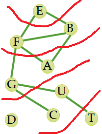

# Estructura de Datos y Algoritmos

# ITBA     2025-Q2

# Recorridos en Grafos

Recorridos \(traversal\) en grafos se usan para ver los nodos alcanzables a partir de un nodo y se muestra dicho camino\.

Los métodos son:

Breadth\-First Search  \(BFS\)

Depth\-First Search \(DFS\)

# g.printBFS(‘E’)

|  | 0 | 1 | 2 | 3 | 4 | 5 | 6 | 7 | 8 |
| :-: | :-: | :-: | :-: | :-: | :-: | :-: | :-: | :-: | :-: |
| 0 | F | T | F | T | F | F | F | F | F |
| 1 | T | F | T | T | F | F | F | F | F |
| 2 | F | T | F | T | F | F | F | F | F |
| 3 | T | T | T | F | F | T | F | F | F |
| 4 | F | F | F | F | F | F | F | F | F |
| 5 | F | F | F | T | F | F | T | F | T |
| 6 | F | F | F | F | F | T | F | T | F |
| 7 | F | F | F | F | F | F | T | F | F |
| 8 | F | F | F | F | F | T | F | F | F |

| E |
| :-: |
| B |
| A |
| F |
| D |
| G |
| U |
| T |
| C |

| E | B | A | F | D | G | U | T | C |
| :-: | :-: | :-: | :-: | :-: | :-: | :-: | :-: | :-: |

|  | 0 | 1 | 2 | 3 | 4 | 5 | 6 | 7 | 8 |
| :-: | :-: | :-: | :-: | :-: | :-: | :-: | :-: | :-: | :-: |
| 0 | F | T | F | T | F | F | F | F | F |
| 1 | T | F | T | T | F | F | F | F | F |
| 2 | F | T | F | T | F | F | F | F | F |
| 3 | T | T | T | F | F | T | F | F | F |
| 4 | F | F | F | F | F | F | F | F | F |
| 5 | F | F | F | T | F | F | T | F | T |
| 6 | F | F | F | F | F | T | F | T | F |
| 7 | F | F | F | F | F | F | T | F | F |
| 8 | F | F | F | F | F | T | F | F | F |

| E |
| :-: |
| B |
| A |
| F |
| D |
| G |
| U |
| T |
| C |

|  |
| :-: |

| E | B | A | F | D | G | U | T | C |
| :-: | :-: | :-: | :-: | :-: | :-: | :-: | :-: | :-: |

|  | 0 | 1 | 2 | 3 | 4 | 5 | 6 | 7 | 8 |
| :-: | :-: | :-: | :-: | :-: | :-: | :-: | :-: | :-: | :-: |
| 0 | F | T | F | T | F | F | F | F | F |
| 1 | T | F | T | T | F | F | F | F | F |
| 2 | F | T | F | T | F | F | F | F | F |
| 3 | T | T | T | F | F | T | F | F | F |
| 4 | F | F | F | F | F | F | F | F | F |
| 5 | F | F | F | T | F | F | T | F | T |
| 6 | F | F | F | F | F | T | F | T | F |
| 7 | F | F | F | F | F | F | T | F | F |
| 8 | F | F | F | F | F | T | F | F | F |

| E |
| :-: |
| B |
| A |
| F |
| D |
| G |
| U |
| T |
| C |

| E |
| :-: |

| E | B | A | F | D | G | U | T | C |
| :-: | :-: | :-: | :-: | :-: | :-: | :-: | :-: | :-: |

|  | 0 | 1 | 2 | 3 | 4 | 5 | 6 | 7 | 8 |
| :-: | :-: | :-: | :-: | :-: | :-: | :-: | :-: | :-: | :-: |
| 0 | F | T | F | T | F | F | F | F | F |
| 1 | T | F | T | T | F | F | F | F | F |
| 2 | F | T | F | T | F | F | F | F | F |
| 3 | T | T | T | F | F | T | F | F | F |
| 4 | F | F | F | F | F | F | F | F | F |
| 5 | F | F | F | T | F | F | T | F | T |
| 6 | F | F | F | F | F | T | F | T | F |
| 7 | F | F | F | F | F | F | T | F | F |
| 8 | F | F | F | F | F | T | F | F | F |

| E |
| :-: |
| B |
| A |
| F |
| D |
| G |
| U |
| T |
| C |

| E | B | A | F | D | G | U | T | C |
| :-: | :-: | :-: | :-: | :-: | :-: | :-: | :-: | :-: |

|  | 0 | 1 | 2 | 3 | 4 | 5 | 6 | 7 | 8 |
| :-: | :-: | :-: | :-: | :-: | :-: | :-: | :-: | :-: | :-: |
| 0 | F | T | F | T | F | F | F | F | F |
| 1 | T | F | T | T | F | F | F | F | F |
| 2 | F | T | F | T | F | F | F | F | F |
| 3 | T | T | T | F | F | T | F | F | F |
| 4 | F | F | F | F | F | F | F | F | F |
| 5 | F | F | F | T | F | F | T | F | T |
| 6 | F | F | F | F | F | T | F | T | F |
| 7 | F | F | F | F | F | F | T | F | F |
| 8 | F | F | F | F | F | T | F | F | F |

| E |
| :-: |
| B |
| A |
| F |
| D |
| G |
| U |
| T |
| C |

| B | F |
| :-: | :-: |

Vecinos de E  no marcados  como visitados aun\.

| E | B | A | F | D | G | U | T | C |
| :-: | :-: | :-: | :-: | :-: | :-: | :-: | :-: | :-: |

|  | 0 | 1 | 2 | 3 | 4 | 5 | 6 | 7 | 8 |
| :-: | :-: | :-: | :-: | :-: | :-: | :-: | :-: | :-: | :-: |
| 0 | F | T | F | T | F | F | F | F | F |
| 1 | T | F | T | T | F | F | F | F | F |
| 2 | F | T | F | T | F | F | F | F | F |
| 3 | T | T | T | F | F | T | F | F | F |
| 4 | F | F | F | F | F | F | F | F | F |
| 5 | F | F | F | T | F | F | T | F | T |
| 6 | F | F | F | F | F | T | F | T | F |
| 7 | F | F | F | F | F | F | T | F | F |
| 8 | F | F | F | F | F | T | F | F | F |

| E |
| :-: |
| B |
| A |
| F |
| D |
| G |
| U |
| T |
| C |

| F |
| :-: |

| E | B | A | F | D | G | U | T | C |
| :-: | :-: | :-: | :-: | :-: | :-: | :-: | :-: | :-: |

|  | 0 | 1 | 2 | 3 | 4 | 5 | 6 | 7 | 8 |
| :-: | :-: | :-: | :-: | :-: | :-: | :-: | :-: | :-: | :-: |
| 0 | F | T | F | T | F | F | F | F | F |
| 1 | T | F | T | T | F | F | F | F | F |
| 2 | F | T | F | T | F | F | F | F | F |
| 3 | T | T | T | F | F | T | F | F | F |
| 4 | F | F | F | F | F | F | F | F | F |
| 5 | F | F | F | T | F | F | T | F | T |
| 6 | F | F | F | F | F | T | F | T | F |
| 7 | F | F | F | F | F | F | T | F | F |
| 8 | F | F | F | F | F | T | F | F | F |

| E |
| :-: |
| B |
| A |
| F |
| D |
| G |
| U |
| T |
| C |

| F | A | F |
| :-: | :-: | :-: |

Vecinos de B  no marcados  como visitados aun\.

| E | B | A | F | D | G | U | T | C |
| :-: | :-: | :-: | :-: | :-: | :-: | :-: | :-: | :-: |

|  | 0 | 1 | 2 | 3 | 4 | 5 | 6 | 7 | 8 |
| :-: | :-: | :-: | :-: | :-: | :-: | :-: | :-: | :-: | :-: |
| 0 | F | T | F | T | F | F | F | F | F |
| 1 | T | F | T | T | F | F | F | F | F |
| 2 | F | T | F | T | F | F | F | F | F |
| 3 | T | T | T | F | F | T | F | F | F |
| 4 | F | F | F | F | F | F | F | F | F |
| 5 | F | F | F | T | F | F | T | F | T |
| 6 | F | F | F | F | F | T | F | T | F |
| 7 | F | F | F | F | F | F | T | F | F |
| 8 | F | F | F | F | F | T | F | F | F |

| E |
| :-: |
| B |
| A |
| F |
| D |
| G |
| U |
| T |
| C |

| A | F |
| :-: | :-: |

| E | B | A | F | D | G | U | T | C |
| :-: | :-: | :-: | :-: | :-: | :-: | :-: | :-: | :-: |

|  | 0 | 1 | 2 | 3 | 4 | 5 | 6 | 7 | 8 |
| :-: | :-: | :-: | :-: | :-: | :-: | :-: | :-: | :-: | :-: |
| 0 | F | T | F | T | F | F | F | F | F |
| 1 | T | F | T | T | F | F | F | F | F |
| 2 | F | T | F | T | F | F | F | F | F |
| 3 | T | T | T | F | F | T | F | F | F |
| 4 | F | F | F | F | F | F | F | F | F |
| 5 | F | F | F | T | F | F | T | F | T |
| 6 | F | F | F | F | F | T | F | T | F |
| 7 | F | F | F | F | F | F | T | F | F |
| 8 | F | F | F | F | F | T | F | F | F |

| E |
| :-: |
| B |
| A |
| F |
| D |
| G |
| U |
| T |
| C |

| A | F | A | G |
| :-: | :-: | :-: | :-: |

Vecinos de F  no marcados  como visitados aun\.

| E | B | A | F | D | G | U | T | C |
| :-: | :-: | :-: | :-: | :-: | :-: | :-: | :-: | :-: |

|  | 0 | 1 | 2 | 3 | 4 | 5 | 6 | 7 | 8 |
| :-: | :-: | :-: | :-: | :-: | :-: | :-: | :-: | :-: | :-: |
| 0 | F | T | F | T | F | F | F | F | F |
| 1 | T | F | T | T | F | F | F | F | F |
| 2 | F | T | F | T | F | F | F | F | F |
| 3 | T | T | T | F | F | T | F | F | F |
| 4 | F | F | F | F | F | F | F | F | F |
| 5 | F | F | F | T | F | F | T | F | T |
| 6 | F | F | F | F | F | T | F | T | F |
| 7 | F | F | F | F | F | F | T | F | F |
| 8 | F | F | F | F | F | T | F | F | F |

| E |
| :-: |
| B |
| A |
| F |
| D |
| G |
| U |
| T |
| C |

| F | A | G |
| :-: | :-: | :-: |

| E | B | A | F | D | G | U | T | C |
| :-: | :-: | :-: | :-: | :-: | :-: | :-: | :-: | :-: |

|  | 0 | 1 | 2 | 3 | 4 | 5 | 6 | 7 | 8 |
| :-: | :-: | :-: | :-: | :-: | :-: | :-: | :-: | :-: | :-: |
| 0 | F | T | F | T | F | F | F | F | F |
| 1 | T | F | T | T | F | F | F | F | F |
| 2 | F | T | F | T | F | F | F | F | F |
| 3 | T | T | T | F | F | T | F | F | F |
| 4 | F | F | F | F | F | F | F | F | F |
| 5 | F | F | F | T | F | F | T | F | T |
| 6 | F | F | F | F | F | T | F | T | F |
| 7 | F | F | F | F | F | F | T | F | F |
| 8 | F | F | F | F | F | T | F | F | F |

| E |
| :-: |
| B |
| A |
| F |
| D |
| G |
| U |
| T |
| C |

| F | A | G |
| :-: | :-: | :-: |

A no tiene vecinos no visitados\. No agrega nada

| E | B | A | F | D | G | U | T | C |
| :-: | :-: | :-: | :-: | :-: | :-: | :-: | :-: | :-: |

|  | 0 | 1 | 2 | 3 | 4 | 5 | 6 | 7 | 8 |
| :-: | :-: | :-: | :-: | :-: | :-: | :-: | :-: | :-: | :-: |
| 0 | F | T | F | T | F | F | F | F | F |
| 1 | T | F | T | T | F | F | F | F | F |
| 2 | F | T | F | T | F | F | F | F | F |
| 3 | T | T | T | F | F | T | F | F | F |
| 4 | F | F | F | F | F | F | F | F | F |
| 5 | F | F | F | T | F | F | T | F | T |
| 6 | F | F | F | F | F | T | F | T | F |
| 7 | F | F | F | F | F | F | T | F | F |
| 8 | F | F | F | F | F | T | F | F | F |

| E |
| :-: |
| B |
| A |
| F |
| D |
| G |
| U |
| T |
| C |

| A | G |
| :-: | :-: |

A no se procesa \(se ignora\) porque ya fue visitado

| E | B | A | F | D | G | U | T | C |
| :-: | :-: | :-: | :-: | :-: | :-: | :-: | :-: | :-: |

|  | 0 | 1 | 2 | 3 | 4 | 5 | 6 | 7 | 8 |
| :-: | :-: | :-: | :-: | :-: | :-: | :-: | :-: | :-: | :-: |
| 0 | F | T | F | T | F | F | F | F | F |
| 1 | T | F | T | T | F | F | F | F | F |
| 2 | F | T | F | T | F | F | F | F | F |
| 3 | T | T | T | F | F | T | F | F | F |
| 4 | F | F | F | F | F | F | F | F | F |
| 5 | F | F | F | T | F | F | T | F | T |
| 6 | F | F | F | F | F | T | F | T | F |
| 7 | F | F | F | F | F | F | T | F | F |
| 8 | F | F | F | F | F | T | F | F | F |

| E |
| :-: |
| B |
| A |
| F |
| D |
| G |
| U |
| T |
| C |

| G |
| :-: |

G no se procesa \(se ignora\) porque ya fue visitado

| E | B | A | F | D | G | U | T | C |
| :-: | :-: | :-: | :-: | :-: | :-: | :-: | :-: | :-: |

|  | 0 | 1 | 2 | 3 | 4 | 5 | 6 | 7 | 8 |
| :-: | :-: | :-: | :-: | :-: | :-: | :-: | :-: | :-: | :-: |
| 0 | F | T | F | T | F | F | F | F | F |
| 1 | T | F | T | T | F | F | F | F | F |
| 2 | F | T | F | T | F | F | F | F | F |
| 3 | T | T | T | F | F | T | F | F | F |
| 4 | F | F | F | F | F | F | F | F | F |
| 5 | F | F | F | T | F | F | T | F | T |
| 6 | F | F | F | F | F | T | F | T | F |
| 7 | F | F | F | F | F | F | T | F | F |
| 8 | F | F | F | F | F | T | F | F | F |

| E |
| :-: |
| B |
| A |
| F |
| D |
| G |
| U |
| T |
| C |

| E | B | A | F | D | G | U | T | C |
| :-: | :-: | :-: | :-: | :-: | :-: | :-: | :-: | :-: |

|  | 0 | 1 | 2 | 3 | 4 | 5 | 6 | 7 | 8 |
| :-: | :-: | :-: | :-: | :-: | :-: | :-: | :-: | :-: | :-: |
| 0 | F | T | F | T | F | F | F | F | F |
| 1 | T | F | T | T | F | F | F | F | F |
| 2 | F | T | F | T | F | F | F | F | F |
| 3 | T | T | T | F | F | T | F | F | F |
| 4 | F | F | F | F | F | F | F | F | F |
| 5 | F | F | F | T | F | F | T | F | T |
| 6 | F | F | F | F | F | T | F | T | F |
| 7 | F | F | F | F | F | F | T | F | F |
| 8 | F | F | F | F | F | T | F | F | F |

| E |
| :-: |
| B |
| A |
| F |
| D |
| G |
| U |
| T |
| C |

| U | C |
| :-: | :-: |

Vecinos de G  no marcados  como visitados aun\.

| E | B | A | F | D | G | U | T | C |
| :-: | :-: | :-: | :-: | :-: | :-: | :-: | :-: | :-: |

|  | 0 | 1 | 2 | 3 | 4 | 5 | 6 | 7 | 8 |
| :-: | :-: | :-: | :-: | :-: | :-: | :-: | :-: | :-: | :-: |
| 0 | F | T | F | T | F | F | F | F | F |
| 1 | T | F | T | T | F | F | F | F | F |
| 2 | F | T | F | T | F | F | F | F | F |
| 3 | T | T | T | F | F | T | F | F | F |
| 4 | F | F | F | F | F | F | F | F | F |
| 5 | F | F | F | T | F | F | T | F | T |
| 6 | F | F | F | F | F | T | F | T | F |
| 7 | F | F | F | F | F | F | T | F | F |
| 8 | F | F | F | F | F | T | F | F | F |

| E |
| :-: |
| B |
| A |
| F |
| D |
| G |
| U |
| T |
| C |

| C |
| :-: |

| E | B | A | F | D | G | U | T | C |
| :-: | :-: | :-: | :-: | :-: | :-: | :-: | :-: | :-: |

|  | 0 | 1 | 2 | 3 | 4 | 5 | 6 | 7 | 8 |
| :-: | :-: | :-: | :-: | :-: | :-: | :-: | :-: | :-: | :-: |
| 0 | F | T | F | T | F | F | F | F | F |
| 1 | T | F | T | T | F | F | F | F | F |
| 2 | F | T | F | T | F | F | F | F | F |
| 3 | T | T | T | F | F | T | F | F | F |
| 4 | F | F | F | F | F | F | F | F | F |
| 5 | F | F | F | T | F | F | T | F | T |
| 6 | F | F | F | F | F | T | F | T | F |
| 7 | F | F | F | F | F | F | T | F | F |
| 8 | F | F | F | F | F | T | F | F | F |

| E |
| :-: |
| B |
| A |
| F |
| D |
| G |
| U |
| T |
| C |

| C | T |
| :-: | :-: |

Vecinos de U no marcados  como visitados aun\.

| E | B | A | F | D | G | U | T | C |
| :-: | :-: | :-: | :-: | :-: | :-: | :-: | :-: | :-: |

|  | 0 | 1 | 2 | 3 | 4 | 5 | 6 | 7 | 8 |
| :-: | :-: | :-: | :-: | :-: | :-: | :-: | :-: | :-: | :-: |
| 0 | F | T | F | T | F | F | F | F | F |
| 1 | T | F | T | T | F | F | F | F | F |
| 2 | F | T | F | T | F | F | F | F | F |
| 3 | T | T | T | F | F | T | F | F | F |
| 4 | F | F | F | F | F | F | F | F | F |
| 5 | F | F | F | T | F | F | T | F | T |
| 6 | F | F | F | F | F | T | F | T | F |
| 7 | F | F | F | F | F | F | T | F | F |
| 8 | F | F | F | F | F | T | F | F | F |

| E |
| :-: |
| B |
| A |
| F |
| D |
| G |
| U |
| T |
| C |

| T |
| :-: |

| E | B | A | F | D | G | U | T | C |
| :-: | :-: | :-: | :-: | :-: | :-: | :-: | :-: | :-: |

|  | 0 | 1 | 2 | 3 | 4 | 5 | 6 | 7 | 8 |
| :-: | :-: | :-: | :-: | :-: | :-: | :-: | :-: | :-: | :-: |
| 0 | F | T | F | T | F | F | F | F | F |
| 1 | T | F | T | T | F | F | F | F | F |
| 2 | F | T | F | T | F | F | F | F | F |
| 3 | T | T | T | F | F | T | F | F | F |
| 4 | F | F | F | F | F | F | F | F | F |
| 5 | F | F | F | T | F | F | T | F | T |
| 6 | F | F | F | F | F | T | F | T | F |
| 7 | F | F | F | F | F | F | T | F | F |
| 8 | F | F | F | F | F | T | F | F | F |

| E |
| :-: |
| B |
| A |
| F |
| D |
| G |
| U |
| T |
| C |

| T |
| :-: |

C no tiene vecinos no visitados\. No agrega nada

| E | B | A | F | D | G | U | T | C |
| :-: | :-: | :-: | :-: | :-: | :-: | :-: | :-: | :-: |

|  | 0 | 1 | 2 | 3 | 4 | 5 | 6 | 7 | 8 |
| :-: | :-: | :-: | :-: | :-: | :-: | :-: | :-: | :-: | :-: |
| 0 | F | T | F | T | F | F | F | F | F |
| 1 | T | F | T | T | F | F | F | F | F |
| 2 | F | T | F | T | F | F | F | F | F |
| 3 | T | T | T | F | F | T | F | F | F |
| 4 | F | F | F | F | F | F | F | F | F |
| 5 | F | F | F | T | F | F | T | F | T |
| 6 | F | F | F | F | F | T | F | T | F |
| 7 | F | F | F | F | F | F | T | F | F |
| 8 | F | F | F | F | F | T | F | F | F |

| E |
| :-: |
| B |
| A |
| F |
| D |
| G |
| U |
| T |
| C |

| E | B | A | F | D | G | U | T | C |
| :-: | :-: | :-: | :-: | :-: | :-: | :-: | :-: | :-: |

|  | 0 | 1 | 2 | 3 | 4 | 5 | 6 | 7 | 8 |
| :-: | :-: | :-: | :-: | :-: | :-: | :-: | :-: | :-: | :-: |
| 0 | F | T | F | T | F | F | F | F | F |
| 1 | T | F | T | T | F | F | F | F | F |
| 2 | F | T | F | T | F | F | F | F | F |
| 3 | T | T | T | F | F | T | F | F | F |
| 4 | F | F | F | F | F | F | F | F | F |
| 5 | F | F | F | T | F | F | T | F | T |
| 6 | F | F | F | F | F | T | F | T | F |
| 7 | F | F | F | F | F | F | T | F | F |
| 8 | F | F | F | F | F | T | F | F | F |

| E |
| :-: |
| B |
| A |
| F |
| D |
| G |
| U |
| T |
| C |

T no tiene vecinos no visitados\. No agrega nada

| E | B | A | F | D | G | U | T | C |
| :-: | :-: | :-: | :-: | :-: | :-: | :-: | :-: | :-: |

¿A qué algoritmo que vimos en arboles se parece?

¿Qué estructura auxiliar hay que usar?

|  | 0 | 1 | 2 | 3 | 4 | 5 | 6 | 7 | 8 |
| :-: | :-: | :-: | :-: | :-: | :-: | :-: | :-: | :-: | :-: |
| 0 | F | T | F | T | F | F | F | F | F |
| 1 | T | F | T | T | F | F | F | F | F |
| 2 | F | T | F | T | F | F | F | F | F |
| 3 | T | T | T | F | F | T | F | F | F |
| 4 | F | F | F | F | F | F | F | F | F |
| 5 | F | F | F | T | F | F | T | F | T |
| 6 | F | F | F | F | F | T | F | T | F |
| 7 | F | F | F | F | F | F | T | F | F |
| 8 | F | F | F | F | F | T | F | F | F |

| E |
| :-: |
| B |
| A |
| F |
| D |
| G |
| U |
| T |
| C |

| E | B | A | F | D | G | U | T | C |
| :-: | :-: | :-: | :-: | :-: | :-: | :-: | :-: | :-: |

Atención: Dependen de cómo se almacena todo\, el orden obtenido puede variar\.

Enunciar TODOS los otros posibles recorridos BFS desde E válidos\.

Ej:

E  B F  A  G  C  U T

E  F B  A  G  U  C T

E  F B  G  A  U  C T

E  F B  G  A  C  U T

E  F B  A  G  C  U T

_printBFS_  __\(V\) clásico\. Tiene que estar OK para todo tipo de grafo\.__

Respecto a la implementación\. ¿Qué estructura auxiliar usa????

Rta:  _Queue_ \. Es como navegar por niveles\.

Y además \(es un grafo\!\!\!\) precisa marcar los vértices por los que pasó:

__Opción 1:  estructura paralela a los vértices booleana__

Opción 2: representar el vértice con un tag booleano

Escribamos el código Java para lista de adyacencia\.

Agregamos en la interface\.

__public__  __ __  __void__  __ __  __printBFS__  __\(V __  __source__  __\);__

Ahora el otro recorrido

|  | 0 | 1 | 2 | 3 | 4 | 5 | 6 | 7 | 8 |
| :-: | :-: | :-: | :-: | :-: | :-: | :-: | :-: | :-: | :-: |
| 0 | F | T | F | T | F | F | F | F | F |
| 1 | T | F | T | T | F | F | F | F | F |
| 2 | F | T | F | T | F | F | F | F | F |
| 3 | T | T | T | F | F | T | F | F | F |
| 4 | F | F | F | F | F | F | F | F | F |
| 5 | F | F | F | T | F | F | T | F | T |
| 6 | F | F | F | F | F | T | F | T | F |
| 7 | F | F | F | F | F | F | T | F | F |
| 8 | F | F | F | F | F | T | F | F | F |

| E |
| :-: |
| B |
| A |
| F |
| D |
| G |
| U |
| T |
| C |

|  |
| :-: |
|  |

| E | B | A | F | D | G | U | T | C |
| :-: | :-: | :-: | :-: | :-: | :-: | :-: | :-: | :-: |

|  | 0 | 1 | 2 | 3 | 4 | 5 | 6 | 7 | 8 |
| :-: | :-: | :-: | :-: | :-: | :-: | :-: | :-: | :-: | :-: |
| 0 | F | T | F | T | F | F | F | F | F |
| 1 | T | F | T | T | F | F | F | F | F |
| 2 | F | T | F | T | F | F | F | F | F |
| 3 | T | T | T | F | F | T | F | F | F |
| 4 | F | F | F | F | F | F | F | F | F |
| 5 | F | F | F | T | F | F | T | F | T |
| 6 | F | F | F | F | F | T | F | T | F |
| 7 | F | F | F | F | F | F | T | F | F |
| 8 | F | F | F | F | F | T | F | F | F |

| E |
| :-: |
| B |
| A |
| F |
| D |
| G |
| U |
| T |
| C |

| E |
| :-: |
|  |

| E | B | A | F | D | G | U | T | C |
| :-: | :-: | :-: | :-: | :-: | :-: | :-: | :-: | :-: |

|  | 0 | 1 | 2 | 3 | 4 | 5 | 6 | 7 | 8 |
| :-: | :-: | :-: | :-: | :-: | :-: | :-: | :-: | :-: | :-: |
| 0 | F | T | F | T | F | F | F | F | F |
| 1 | T | F | T | T | F | F | F | F | F |
| 2 | F | T | F | T | F | F | F | F | F |
| 3 | T | T | T | F | F | T | F | F | F |
| 4 | F | F | F | F | F | F | F | F | F |
| 5 | F | F | F | T | F | F | T | F | T |
| 6 | F | F | F | F | F | T | F | T | F |
| 7 | F | F | F | F | F | F | T | F | F |
| 8 | F | F | F | F | F | T | F | F | F |

| E |
| :-: |
| B |
| A |
| F |
| D |
| G |
| U |
| T |
| C |

| E | B | A | F | D | G | U | T | C |
| :-: | :-: | :-: | :-: | :-: | :-: | :-: | :-: | :-: |

|  | 0 | 1 | 2 | 3 | 4 | 5 | 6 | 7 | 8 |
| :-: | :-: | :-: | :-: | :-: | :-: | :-: | :-: | :-: | :-: |
| 0 | F | T | F | T | F | F | F | F | F |
| 1 | T | F | T | T | F | F | F | F | F |
| 2 | F | T | F | T | F | F | F | F | F |
| 3 | T | T | T | F | F | T | F | F | F |
| 4 | F | F | F | F | F | F | F | F | F |
| 5 | F | F | F | T | F | F | T | F | T |
| 6 | F | F | F | F | F | T | F | T | F |
| 7 | F | F | F | F | F | F | T | F | F |
| 8 | F | F | F | F | F | T | F | F | F |

| E |
| :-: |
| B |
| A |
| F |
| D |
| G |
| U |
| T |
| C |

Vecinos de E  no marcados  como visitados aun\.

| B |
| :-: |
| F |

| E | B | A | F | D | G | U | T | C |
| :-: | :-: | :-: | :-: | :-: | :-: | :-: | :-: | :-: |

|  | 0 | 1 | 2 | 3 | 4 | 5 | 6 | 7 | 8 |
| :-: | :-: | :-: | :-: | :-: | :-: | :-: | :-: | :-: | :-: |
| 0 | F | T | F | T | F | F | F | F | F |
| 1 | T | F | T | T | F | F | F | F | F |
| 2 | F | T | F | T | F | F | F | F | F |
| 3 | T | T | T | F | F | T | F | F | F |
| 4 | F | F | F | F | F | F | F | F | F |
| 5 | F | F | F | T | F | F | T | F | T |
| 6 | F | F | F | F | F | T | F | T | F |
| 7 | F | F | F | F | F | F | T | F | F |
| 8 | F | F | F | F | F | T | F | F | F |

| E |
| :-: |
| B |
| A |
| F |
| D |
| G |
| U |
| T |
| C |

|  |
| :-: |
| F |

| E | B | A | F | D | G | U | T | C |
| :-: | :-: | :-: | :-: | :-: | :-: | :-: | :-: | :-: |

|  | 0 | 1 | 2 | 3 | 4 | 5 | 6 | 7 | 8 |
| :-: | :-: | :-: | :-: | :-: | :-: | :-: | :-: | :-: | :-: |
| 0 | F | T | F | T | F | F | F | F | F |
| 1 | T | F | T | T | F | F | F | F | F |
| 2 | F | T | F | T | F | F | F | F | F |
| 3 | T | T | T | F | F | T | F | F | F |
| 4 | F | F | F | F | F | F | F | F | F |
| 5 | F | F | F | T | F | F | T | F | T |
| 6 | F | F | F | F | F | T | F | T | F |
| 7 | F | F | F | F | F | F | T | F | F |
| 8 | F | F | F | F | F | T | F | F | F |

| E |
| :-: |
| B |
| A |
| F |
| D |
| G |
| U |
| T |
| C |

Vecinos de B  no marcados  como visitados aun\.

| A |
| :-: |
| F |
| F |

| E | B | A | F | D | G | U | T | C |
| :-: | :-: | :-: | :-: | :-: | :-: | :-: | :-: | :-: |

|  | 0 | 1 | 2 | 3 | 4 | 5 | 6 | 7 | 8 |
| :-: | :-: | :-: | :-: | :-: | :-: | :-: | :-: | :-: | :-: |
| 0 | F | T | F | T | F | F | F | F | F |
| 1 | T | F | T | T | F | F | F | F | F |
| 2 | F | T | F | T | F | F | F | F | F |
| 3 | T | T | T | F | F | T | F | F | F |
| 4 | F | F | F | F | F | F | F | F | F |
| 5 | F | F | F | T | F | F | T | F | T |
| 6 | F | F | F | F | F | T | F | T | F |
| 7 | F | F | F | F | F | F | T | F | F |
| 8 | F | F | F | F | F | T | F | F | F |

| E |
| :-: |
| B |
| A |
| F |
| D |
| G |
| U |
| T |
| C |

|  |
| :-: |
| F |
| F |

| E | B | A | F | D | G | U | T | C |
| :-: | :-: | :-: | :-: | :-: | :-: | :-: | :-: | :-: |

|  | 0 | 1 | 2 | 3 | 4 | 5 | 6 | 7 | 8 |
| :-: | :-: | :-: | :-: | :-: | :-: | :-: | :-: | :-: | :-: |
| 0 | F | T | F | T | F | F | F | F | F |
| 1 | T | F | T | T | F | F | F | F | F |
| 2 | F | T | F | T | F | F | F | F | F |
| 3 | T | T | T | F | F | T | F | F | F |
| 4 | F | F | F | F | F | F | F | F | F |
| 5 | F | F | F | T | F | F | T | F | T |
| 6 | F | F | F | F | F | T | F | T | F |
| 7 | F | F | F | F | F | F | T | F | F |
| 8 | F | F | F | F | F | T | F | F | F |

| E |
| :-: |
| B |
| A |
| F |
| D |
| G |
| U |
| T |
| C |

Vecinos de A  no marcados  como visitados aun\.

| F |
| :-: |
| F |
| F |

| E | B | A | F | D | G | U | T | C |
| :-: | :-: | :-: | :-: | :-: | :-: | :-: | :-: | :-: |

|  | 0 | 1 | 2 | 3 | 4 | 5 | 6 | 7 | 8 |
| :-: | :-: | :-: | :-: | :-: | :-: | :-: | :-: | :-: | :-: |
| 0 | F | T | F | T | F | F | F | F | F |
| 1 | T | F | T | T | F | F | F | F | F |
| 2 | F | T | F | T | F | F | F | F | F |
| 3 | T | T | T | F | F | T | F | F | F |
| 4 | F | F | F | F | F | F | F | F | F |
| 5 | F | F | F | T | F | F | T | F | T |
| 6 | F | F | F | F | F | T | F | T | F |
| 7 | F | F | F | F | F | F | T | F | F |
| 8 | F | F | F | F | F | T | F | F | F |

| E |
| :-: |
| B |
| A |
| F |
| D |
| G |
| U |
| T |
| C |

|  |
| :-: |
| F |
| F |

| E | B | A | F | D | G | U | T | C |
| :-: | :-: | :-: | :-: | :-: | :-: | :-: | :-: | :-: |

|  | 0 | 1 | 2 | 3 | 4 | 5 | 6 | 7 | 8 |
| :-: | :-: | :-: | :-: | :-: | :-: | :-: | :-: | :-: | :-: |
| 0 | F | T | F | T | F | F | F | F | F |
| 1 | T | F | T | T | F | F | F | F | F |
| 2 | F | T | F | T | F | F | F | F | F |
| 3 | T | T | T | F | F | T | F | F | F |
| 4 | F | F | F | F | F | F | F | F | F |
| 5 | F | F | F | T | F | F | T | F | T |
| 6 | F | F | F | F | F | T | F | T | F |
| 7 | F | F | F | F | F | F | T | F | F |
| 8 | F | F | F | F | F | T | F | F | F |

| E |
| :-: |
| B |
| A |
| F |
| D |
| G |
| U |
| T |
| C |

Vecinos de F  no marcados  como visitados aun\.

| G |
| :-: |
| F |
| F |

| E | B | A | F | D | G | U | T | C |
| :-: | :-: | :-: | :-: | :-: | :-: | :-: | :-: | :-: |

|  | 0 | 1 | 2 | 3 | 4 | 5 | 6 | 7 | 8 |
| :-: | :-: | :-: | :-: | :-: | :-: | :-: | :-: | :-: | :-: |
| 0 | F | T | F | T | F | F | F | F | F |
| 1 | T | F | T | T | F | F | F | F | F |
| 2 | F | T | F | T | F | F | F | F | F |
| 3 | T | T | T | F | F | T | F | F | F |
| 4 | F | F | F | F | F | F | F | F | F |
| 5 | F | F | F | T | F | F | T | F | T |
| 6 | F | F | F | F | F | T | F | T | F |
| 7 | F | F | F | F | F | F | T | F | F |
| 8 | F | F | F | F | F | T | F | F | F |

| E |
| :-: |
| B |
| A |
| F |
| D |
| G |
| U |
| T |
| C |

|  |
| :-: |
| F |
| F |

| E | B | A | F | D | G | U | T | C |
| :-: | :-: | :-: | :-: | :-: | :-: | :-: | :-: | :-: |

|  | 0 | 1 | 2 | 3 | 4 | 5 | 6 | 7 | 8 |
| :-: | :-: | :-: | :-: | :-: | :-: | :-: | :-: | :-: | :-: |
| 0 | F | T | F | T | F | F | F | F | F |
| 1 | T | F | T | T | F | F | F | F | F |
| 2 | F | T | F | T | F | F | F | F | F |
| 3 | T | T | T | F | F | T | F | F | F |
| 4 | F | F | F | F | F | F | F | F | F |
| 5 | F | F | F | T | F | F | T | F | T |
| 6 | F | F | F | F | F | T | F | T | F |
| 7 | F | F | F | F | F | F | T | F | F |
| 8 | F | F | F | F | F | T | F | F | F |

| E |
| :-: |
| B |
| A |
| F |
| D |
| G |
| U |
| T |
| C |

Vecinos de G  no marcados  como visitados aun\.

|  |
| :-: |
| U |
| C |
| F |
| F |

| E | B | A | F | D | G | U | T | C |
| :-: | :-: | :-: | :-: | :-: | :-: | :-: | :-: | :-: |

|  | 0 | 1 | 2 | 3 | 4 | 5 | 6 | 7 | 8 |
| :-: | :-: | :-: | :-: | :-: | :-: | :-: | :-: | :-: | :-: |
| 0 | F | T | F | T | F | F | F | F | F |
| 1 | T | F | T | T | F | F | F | F | F |
| 2 | F | T | F | T | F | F | F | F | F |
| 3 | T | T | T | F | F | T | F | F | F |
| 4 | F | F | F | F | F | F | F | F | F |
| 5 | F | F | F | T | F | F | T | F | T |
| 6 | F | F | F | F | F | T | F | T | F |
| 7 | F | F | F | F | F | F | T | F | F |
| 8 | F | F | F | F | F | T | F | F | F |

| E |
| :-: |
| B |
| A |
| F |
| D |
| G |
| U |
| T |
| C |

|  |
| :-: |
|  |
| C |
| F |
| F |

| E | B | A | F | D | G | U | T | C |
| :-: | :-: | :-: | :-: | :-: | :-: | :-: | :-: | :-: |

|  | 0 | 1 | 2 | 3 | 4 | 5 | 6 | 7 | 8 |
| :-: | :-: | :-: | :-: | :-: | :-: | :-: | :-: | :-: | :-: |
| 0 | F | T | F | T | F | F | F | F | F |
| 1 | T | F | T | T | F | F | F | F | F |
| 2 | F | T | F | T | F | F | F | F | F |
| 3 | T | T | T | F | F | T | F | F | F |
| 4 | F | F | F | F | F | F | F | F | F |
| 5 | F | F | F | T | F | F | T | F | T |
| 6 | F | F | F | F | F | T | F | T | F |
| 7 | F | F | F | F | F | F | T | F | F |
| 8 | F | F | F | F | F | T | F | F | F |

| E |
| :-: |
| B |
| A |
| F |
| D |
| G |
| U |
| T |
| C |

Vecinos de U  no marcados  como visitados aun\.

|  |
| :-: |
| T |
| C |
| F |
| F |

| E | B | A | F | D | G | U | T | C |
| :-: | :-: | :-: | :-: | :-: | :-: | :-: | :-: | :-: |

|  | 0 | 1 | 2 | 3 | 4 | 5 | 6 | 7 | 8 |
| :-: | :-: | :-: | :-: | :-: | :-: | :-: | :-: | :-: | :-: |
| 0 | F | T | F | T | F | F | F | F | F |
| 1 | T | F | T | T | F | F | F | F | F |
| 2 | F | T | F | T | F | F | F | F | F |
| 3 | T | T | T | F | F | T | F | F | F |
| 4 | F | F | F | F | F | F | F | F | F |
| 5 | F | F | F | T | F | F | T | F | T |
| 6 | F | F | F | F | F | T | F | T | F |
| 7 | F | F | F | F | F | F | T | F | F |
| 8 | F | F | F | F | F | T | F | F | F |

| E |
| :-: |
| B |
| A |
| F |
| D |
| G |
| U |
| T |
| C |

|  |
| :-: |
|  |
| C |
| F |
| F |

| E | B | A | F | D | G | U | T | C |
| :-: | :-: | :-: | :-: | :-: | :-: | :-: | :-: | :-: |

|  | 0 | 1 | 2 | 3 | 4 | 5 | 6 | 7 | 8 |
| :-: | :-: | :-: | :-: | :-: | :-: | :-: | :-: | :-: | :-: |
| 0 | F | T | F | T | F | F | F | F | F |
| 1 | T | F | T | T | F | F | F | F | F |
| 2 | F | T | F | T | F | F | F | F | F |
| 3 | T | T | T | F | F | T | F | F | F |
| 4 | F | F | F | F | F | F | F | F | F |
| 5 | F | F | F | T | F | F | T | F | T |
| 6 | F | F | F | F | F | T | F | T | F |
| 7 | F | F | F | F | F | F | T | F | F |
| 8 | F | F | F | F | F | T | F | F | F |

| E |
| :-: |
| B |
| A |
| F |
| D |
| G |
| U |
| T |
| C |

T no tiene vecinos no visitados\. No agrega nada

|  |
| :-: |
|  |
| C |
| F |
| F |

| E | B | A | F | D | G | U | T | C |
| :-: | :-: | :-: | :-: | :-: | :-: | :-: | :-: | :-: |

|  | 0 | 1 | 2 | 3 | 4 | 5 | 6 | 7 | 8 |
| :-: | :-: | :-: | :-: | :-: | :-: | :-: | :-: | :-: | :-: |
| 0 | F | T | F | T | F | F | F | F | F |
| 1 | T | F | T | T | F | F | F | F | F |
| 2 | F | T | F | T | F | F | F | F | F |
| 3 | T | T | T | F | F | T | F | F | F |
| 4 | F | F | F | F | F | F | F | F | F |
| 5 | F | F | F | T | F | F | T | F | T |
| 6 | F | F | F | F | F | T | F | T | F |
| 7 | F | F | F | F | F | F | T | F | F |
| 8 | F | F | F | F | F | T | F | F | F |

| E |
| :-: |
| B |
| A |
| F |
| D |
| G |
| U |
| T |
| C |

|  |
| :-: |
|  |
|  |
| F |
| F |

| E | B | A | F | D | G | U | T | C |
| :-: | :-: | :-: | :-: | :-: | :-: | :-: | :-: | :-: |

|  | 0 | 1 | 2 | 3 | 4 | 5 | 6 | 7 | 8 |
| :-: | :-: | :-: | :-: | :-: | :-: | :-: | :-: | :-: | :-: |
| 0 | F | T | F | T | F | F | F | F | F |
| 1 | T | F | T | T | F | F | F | F | F |
| 2 | F | T | F | T | F | F | F | F | F |
| 3 | T | T | T | F | F | T | F | F | F |
| 4 | F | F | F | F | F | F | F | F | F |
| 5 | F | F | F | T | F | F | T | F | T |
| 6 | F | F | F | F | F | T | F | T | F |
| 7 | F | F | F | F | F | F | T | F | F |
| 8 | F | F | F | F | F | T | F | F | F |

| E |
| :-: |
| B |
| A |
| F |
| D |
| G |
| U |
| T |
| C |

C no tiene vecinos no visitados\. No agrega nada

|  |
| :-: |
|  |
|  |
| F |
| F |

| E | B | A | F | D | G | U | T | C |
| :-: | :-: | :-: | :-: | :-: | :-: | :-: | :-: | :-: |

|  | 0 | 1 | 2 | 3 | 4 | 5 | 6 | 7 | 8 |
| :-: | :-: | :-: | :-: | :-: | :-: | :-: | :-: | :-: | :-: |
| 0 | F | T | F | T | F | F | F | F | F |
| 1 | T | F | T | T | F | F | F | F | F |
| 2 | F | T | F | T | F | F | F | F | F |
| 3 | T | T | T | F | F | T | F | F | F |
| 4 | F | F | F | F | F | F | F | F | F |
| 5 | F | F | F | T | F | F | T | F | T |
| 6 | F | F | F | F | F | T | F | T | F |
| 7 | F | F | F | F | F | F | T | F | F |
| 8 | F | F | F | F | F | T | F | F | F |

| E |
| :-: |
| B |
| A |
| F |
| D |
| G |
| U |
| T |
| C |

F no se procesa \(se ignora\) porque ya fue visitado

|  |
| :-: |
|  |
|  |
| F |
| F |

| E | B | A | F | D | G | U | T | C |
| :-: | :-: | :-: | :-: | :-: | :-: | :-: | :-: | :-: |

|  | 0 | 1 | 2 | 3 | 4 | 5 | 6 | 7 | 8 |
| :-: | :-: | :-: | :-: | :-: | :-: | :-: | :-: | :-: | :-: |
| 0 | F | T | F | T | F | F | F | F | F |
| 1 | T | F | T | T | F | F | F | F | F |
| 2 | F | T | F | T | F | F | F | F | F |
| 3 | T | T | T | F | F | T | F | F | F |
| 4 | F | F | F | F | F | F | F | F | F |
| 5 | F | F | F | T | F | F | T | F | T |
| 6 | F | F | F | F | F | T | F | T | F |
| 7 | F | F | F | F | F | F | T | F | F |
| 8 | F | F | F | F | F | T | F | F | F |

| E |
| :-: |
| B |
| A |
| F |
| D |
| G |
| U |
| T |
| C |

| E | B | A | F | D | G | U | T | C |
| :-: | :-: | :-: | :-: | :-: | :-: | :-: | :-: | :-: |

_printDFS_  __\(V\) clásico\. Tiene que estar OK para todo tipo de grafo\.__

Respecto a la implementación\. ¿Qué estructura auxiliar usa????

Rta:  _Stack_ \. \(quizás por recursión\)

Y además \(es un grafo\!\!\!\) precisa marcar los vértices por los que pasó:

__Opción 1:  estructura paralela a los vértices booleana__

Opción 2: representar el vértice con un tag booleano

Escribamos el código Java para lista de adyacencia\.

Agregamos en la interface\.

__public__  __ __  __void__  __ __  __printDFS__  __\(V __  __source__  __\);__

