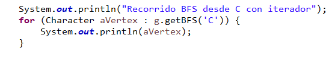
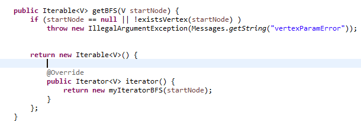
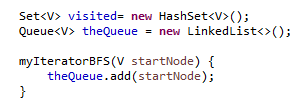
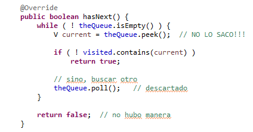
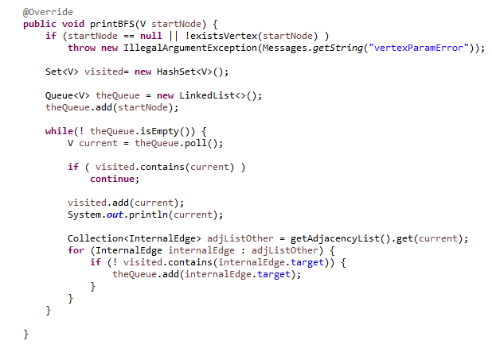
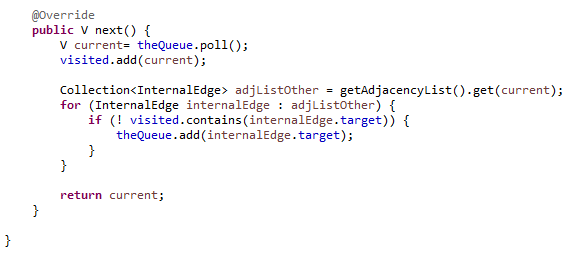

# Estructura de Datos y Algoritmos

# ITBA     2025-Q2

__Implementar version iterable de PrintBFS__

# TP 6 – Ejer 2.3

Pasemos a versión Iterable para usar el  __foreach__

__Caso de Uso__

Pasemos a versión Iterable para usar el  __foreach__

__Observación:__

__Iterable e Iterator están relacionadas\!__

__Implementar version iterable de PrintDFS \(no recursiva\)__

__\(con esto correcto podremos hacer la version iteradora de DFS\)__

__Implementar version iterable de PrintDFS__

__\(usar lo anterior\)__

