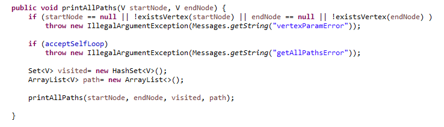
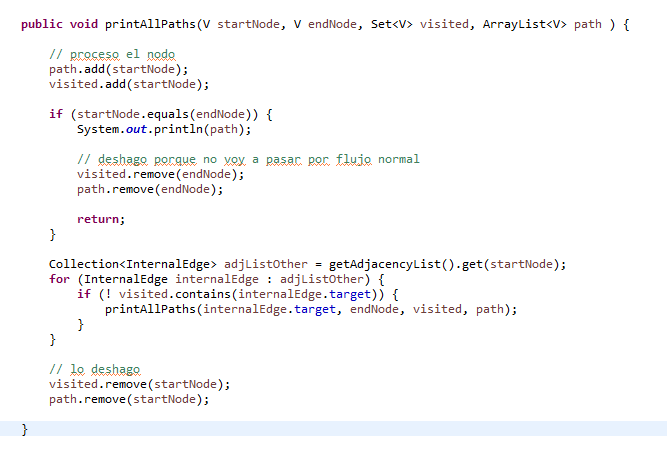

# Estructura de Datos y Algoritmos

# ITBA     2025-Q2

__Solo para grafo __  __SimpleOrDefault__  __\, sin lazos__

Agregar el siguiente método a la interface

__void__  __ __  __printAllPaths__  __\(V __  __startNode__  __\, V __  __endNode__  __\);__

# TP 6 – Ejer 3

# g.printAllPaths(‘A’, ‘F’);

