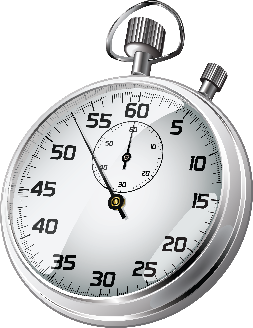

# Estructura de Datos y Algoritmos

# ITBA     2025-Q2

# Análisis de Algoritmos

_Pregunta:_

Tengo un cierto problema para resolver\, y

2 algoritmos que lo resuelven:  _algoA_  y   __algoB__   \.

¿ Cuál usaríamos?

¿ Cómo saber cuál es mejor?

_\(término introducido por Donald _  _Knuth_  _\)_

Nos permite “caracterizar” la  cantidad de recursos computacionales  que usará el mismo cuando se aplique a ciertos datos y evaluar así “su performance”\.

Nos permite tener una  métrica  para rankear algoritmos y así poder decidir  _cuál es mejor_  _ _ y  cuál es peor \.

La principales métricas para medir la complejidad de algoritmos que ejecutan en máquinas secuenciales \(un core\) son:

El   tiempo   de   ejecución      _\(runtime analysis/time complexity\)_

El   espacio   que   utilizan    \( _space complexity_ \)

# 1. Tiempo de ejecución

_Pregunta:_

¿ Y cómo mido ese tiempo?

_1\.A\) _ Empíricamente

_1\.B\)  _ Teóricamente

El intervalo temporal es cerrado\-abierto:

\[  _start_ \,   end \)

_start_  pertenece al intervalo

end  no pertenece al intervalo

Interesa saber la cantidad de ms que transcurrieron durante el mismo\.

Ej:

\[40 ms\,   40 ms\) => duración 0 ms

\[40 ms\,   41 ms\) => duración 1 ms

\[40 ms\,   42 ms\) => duración  2 ms

\[40 ms\,   39 ms\) => inválido

# TP 1-Ejer 1

# Implementar la clase MyTimer
(From scratch)

el constructor  __MyTimer__  __\(\) __ da inicio al mismo\.

el método  __stop\(\) __ detiene el timer y da fin al intervalo\, es decir\, dicho valor ya no es parte del mismo\.

El método  __toString__ \(\) devuelve la duración del intervalo en ms y además el detalle de su duración en días\, horas\, minutos y segundos con fracción de segundos con 3 decimales\.

Tip: Utilizar  __System\.currentTimeMillis\(\)__  para obtener el tiempo actual en milisegundos o bien

__System\.nanoTime__  __\(\) __  __y dividir 1000000__

Manejo incorrecto del Timer que no pueda solucionarse: lanzar  __RuntimeException__ \.

# TP 1-Ejer 1

# Implementar la clase MyTimer
(From scratch)

Caso de uso:

Salida esperada:

# TP 1-Ejer 1

public     static     void     main  \(  String  \[\]   args  \) \{ 

      MyTimer     timer   = new   MyTimer  \(\); 

    //   bla     bla     bla   …\.\.

_    _  timer\.stop  \(\); 

      System\.out\.println  \(  timer  \); 

\}

# Implementar la clase MyTimer
(From scratch)

\(93623040 ms\) 1 día 2 hs 0 min 23\,040 s

__Consideraciones__

El problema de API MyTimer anterior es que resulta difícil chequear si funciona correctamente\, especialmente cuando transcurren horas e incluso días\.

Extenderemos la API\.

La forma de iniciar el  __MyTimer__  V2 es con 2 constructores: sin parámetro \(automático\) y con parámetro \(indicando en ms el comienzo\)\.

La forma de detener el timer es con 2  __stop__ : sin parámetro \(automático\) y con parámetro \(indicando en ms el fin del mismo\)\.

El método  __toString__  __\(\) __ devuelve la duración del intervalo en ms y además el detalle de su duración en días\, horas\, minutos y segundos con fracción de segundos con 3 decimales\.

Manejo incorrecto del MyTimer V2 que no pueda solucionarse: lanzar  __RuntimeException__ \.  La API es más versátil pero hay más casos para contemplar\!\!\!

# TP 1-Ejer 2

# Mejorar la clase MyTimer V2
(From scratch)

Casos de uso:

# TP 1-Ejer 2

MyTimer     t1= new   MyTimer  \(\);

MyTimer     t2= new   MyTimer  \(long   ms  \);

// bla bla bla

t1\.stop\(\);

// bla bla bla

t2\.stop\(long   ms  \);	

System\.out\.println\(t1\);

System\.out\.println\(t2\);

t1= new   MyTimer  \(\);

// bla bla bla

t1\.stop\(long   ms  \);

t2= new   MyTimer  \(long   ms  \);

// bla bla bla

t2\.stop  \(\);

# Implementar la clase MyTimer mejorada
(From scratch)

__Consideraciones__

Si usamos en las aplicaciones bibliotecas propias\, crear un “proyecto Java” sirve\.

Pero si usamos bibliotecas externas \(otros jars\)\, es complicado mantener actualizaciones y versiones de esta manera\, dado que “importamos” jars estáticamente\.

Existe algo muy útil\, para los casos en que usamos bibliotecas externas\, y por supuesto lo podemos usar aún para aplicaciones nuestras\.

# Maven

Introducción

