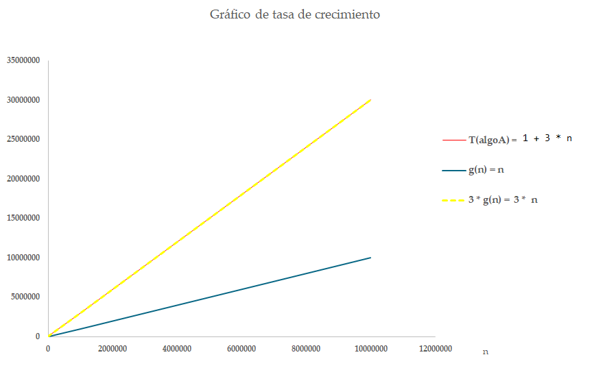
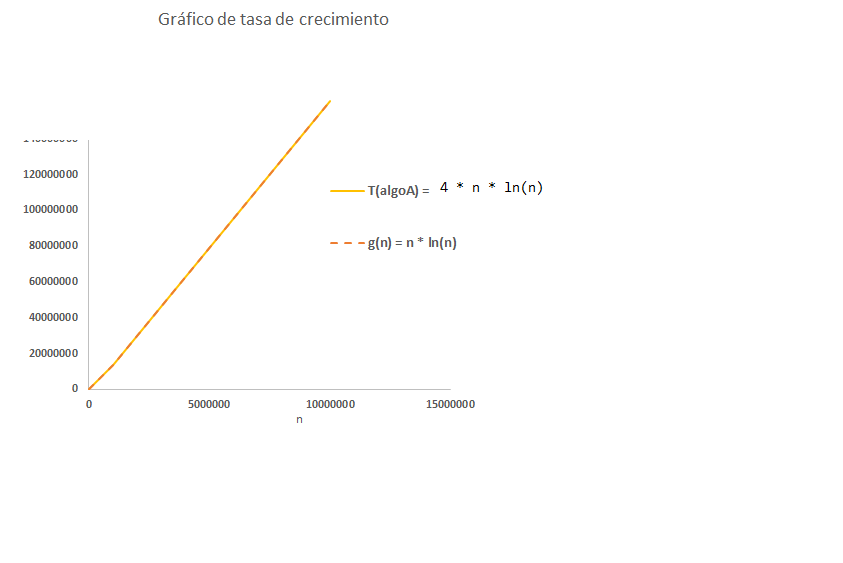
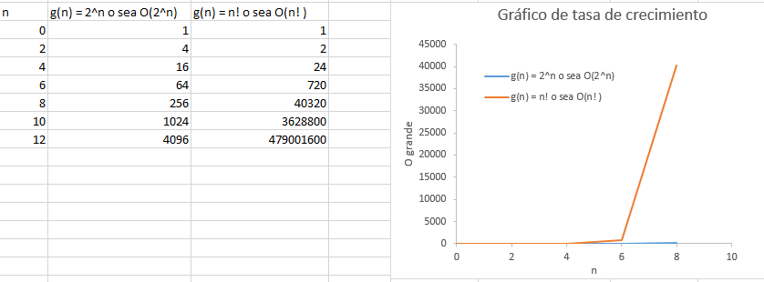
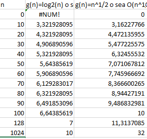

# Estructura de Datos y Algoritmos

# ITBA     2025-Q2

¿Cómo anduvo el testeo?

Contemplaron qué hacer si se hacen 2 stops?

Error?

Acumula?

¿Probaron en las 3 APIS con algo así?

__int__  __ __  __init__  __= 0;__

MyTimer myCrono =  __new __  __MyTimer__  __\(__  __init__  __\);__

myCrono\.stop\(init \+ 86400000\);

//  \(86400000 ms\) 1 día 0 hs 0 min 0\,000 s

__int__  __ __  __init__  __= 0;__

MyTimer myCrono =  __new __  __MyTimer__  __ \(__  __init__  __\);__

myCrono\.stop\(init \+ 86400000 \* 10 \);

# Análisis de Algoritmos

La principales métricas para medir la complejidad de algoritmos que ejecutan en máquinas secuenciales \(un core\) son:

El   tiempo   de   ejecución      _\(runtime analysis/time complexity\)_

El   espacio   que   utilizan    \( _space complexity_ \)

# 1. Tiempo de ejecución

* _Pregunta:_
* ¿ Y cómo mido ese tiempo?
* 1\.A\) Empíricamente
* 1\.B\)  Teóricamente

# 1.A) Tiempo de ejecución empírica

A continuación tenemos 2 algoritmos: algoA y algoB\.

Ambos calculan el máximo elemento de un vector\.

_Aclaración_

Asumimos que ya tiene getters en la clase MyTimer\(\)\.

Para los próximos ejercicios asumimos que el método que devuelve la cantidad de milisegundos totales transcurridos en MyTimer\(\) se llama así:

long       getElapsedTime  \(\)

\(o sea\, lo que dentro del toString estaba entre paréntesis\)

# Bajar de campus

__public static void main\(String\[\] __  __args__  __\) \{__

MyTimer t2;

__try \{__

t2=  __new __  __MyTimer__  __\(\);__

t2\.stop\(\);

\}

__catch\(__  __Exception__  __ e\) \{__

\}

__int__  __\[\] __  __myArray__  __ = new __  __int__  __\[__  _N\];_

__int__  __ __  __rta__  __;__

// generate array

__for \(__  __int__  __ rec = __  _N; rec > 0; rec\-\-\)_

myArray\[ _N \- _  _rec_  _\] = _  _rec_  _;_

…

t2=  __new __  __MyTimer__  __\(\);__

rta = AlgoA\. _max_  _\(_  _myArray_  _\);_

t2\.stop\(\);

System\. _out\.println_  _\(_  _String\.format_  _\("_  _max_  _ Algo A %d\. _  _Delay_  _ %d \(ms\)"\, _  _rta_  _\, t2\.getElapsedTime\(\)\)\);_

// generate array

__for \(__  __int__  __ rec = __  _N; rec > 0; rec\-\-\)_

myArray\[ _N \- _  _rec_  _\] = _  _rec_  _;_

t2=  __new __  __MyTimer__  __\(\);__

rta = AlgoB\. _max_  _\(_  _myArray_  _\);_

t2\.stop\(\);

System\. _out\.println_  _\(_  _String\.format_  _\("_  _max_  _ Algo B %d\. _  _Delay_  _ %d \(ms\)"\, _  _rta_  _\, t2\.getElapsedTime\(\)\)\);_

\}

\}

public class  __AlgoA__  \{    public static int  __max__ \(int\[\] array\) \{        if \(array == null || array\.length == 0\)            throw new RuntimeException\("Empty array"\);        int candidate = array\[0\];        for \(int rec = 1; rec < array\.length; rec\+\+\)            if \( candidate < array\[rec\] \)                candidate = array\[rec\];        return candidate;    \}\}

import java\.util\.Arrays;public class  __AlgoB__  \{    public static int  __max__  \(int\[\] array\) \{        if \(array == null || array\.length == 0\)            throw new RuntimeException\("Empty array"\);         __Arrays\.sort\(array\);__   // ordena ascendentemente        return array\[array\.length \- 1\];    \}\}

Generar un Nuevo Proyecto Maven con los seteos convenientes\.

Debe usar la  __biblioteca TimerFromScratch\-1 \(la API __  __from__  __ __  __scratch__  __\) __ para determinar cuál de los 2 algoritmos es mejor: ¿ __algoA__  o  __algoB__ ?

Armar una tabla de comparación con los ms de cada uno para las siguientes ejecuciones\.

# TP 1- Ejer 9

# Completar

El tiempo de ejecución empírico para los sig\. valores:

| n | Time\(algoA\) en ms | Time\(algoB\) en  ms |
| :-: | :-: | :-: |
| 1000 |  |  |
| 100 000 000 |  |  |
| 200 000 000 |  |  |
| 400 000 000 |  |  |
| 600 000 000 |  |  |
| 800 000 000 |  |  |
| 2   000 000 000 |  |  |

# Para poder compilar:

Tip: deberán incluir la dependencia de su biblioteca Timer a usar

\<dependencies>

\<dependency>

\<groupId>ar\.edu\.itba\.eda\</groupId>

<artifactId>TimerFromScratch</artifactId>

<version>1</version>

\</dependency>

</dependencies>

# Estos son los que obtuve yo:

| n | Time\(algoA\) en ms | Time\(algoB\) en ms |
| :-: | :-: | :-: |
| 1000 | 2 | _1_ |
| 100 000 000 | _100_ |  __364__  |
| 200 000 000 | _160_ |  __850__  |
| 400 000 000 |  __320__  |  __1600__  |
| 600 000 000 |  __500__  |  __2349__  |
| 800   000 000 |  __1021__  |  __4201__  |
| 2   000 000 000 | Heap     Overflow |  |

 __Cuidado__   :   muchas     veces     inferimos   que un   algoritmo     es     bueno     porque   lo   ejecutamos   con “  pocos     datos  ” y   cuando   lo   ponemos     en     producción   no se   comporta     igual  \. El   tamaño   del input   puede     afectar     la performance de un   algoritmo  \.

# 1.A) Tiempo de ejecución empírica

La idea de usar la métrica “tiempo de ejecución calculada empíricamente” para rankear algoritmos tiene varias dificultades\. ¿Cuáles?

__Por__  __ __  __ejemplo__  __:__

Como los algoritmos tardan diferente dependiendo de los datos con los que operan \(input\)\, para probar realmente con datos grandes\, habría que generar esos valores\. Podría tardar días chequear los tiempos en grandes inputs…\.

    ¡  Qué     bueno     sería     si     pudiera     caracterizar     algoritmos   sin   tener   que   generar     esos   datasets   masivos   \!

Si mi algoA lo ejecutó en mi compu y tarda X ms\, y otro propone un algoB que ejecuta en su compu y tarda X/2 ms\, ¿Cómo saber cuál realmente tarda menos si las compus son diferentes\!\!\!\. Ese ranking puede ser engañoso\.

    ¡  Qué     bueno     sería     si     pudiera     caracterizar     algoritmos   sin   depender   de hardware y software   donde     ejecutan   \!

# 1.B) Tiempo de ejecución teórica

| Consiste en usar una descripción de alto nivel del algoritmo para evaluar su eficiencia independientemente del hardware y software donde ejecute\. Se lo describe con una “expresión \(fórmula\)\.” |
| :-: |

__Idea __  __básica__ : “ __contar__  __ la __  __cantidad__  __ de __  __operaciones__  __ __  __primitivas__ ” que ejecuta el algoritmo\. No importa cuanto tardan\. Tardan “unidades de tiempo genéricas”\.

Dichas operaciones son las más costosas en ejecutar en cualquier computadora: comparaciones\, operaciones \(aritméticas\)\, transferencia de control desde una fn hacia otra\.  \(las asignaciones llevan tiempo despreciable\, se pueden ignorar\)\.

Como el tamaño del input afecta la performance del algoritmo\, entonces la “fórmula” se realiza contando la cantidad de operaciones primitivas que se realiza expresada en términos del tamaño de entrada\.

Calcular  __T\(__  __algoA__  __\)__  como una fórmula expresada en términos de la cantidad de operaciones que realiza para un arreglo de tamaño N \(sabemos que depende de eso…\)

Luego\, calcular O grande\, es decir\, cota\.

# TP 1- Ejer 10

# 1.B) Tiempo de ejecución teórica

__public class AlgoA \{__

__public static __  __int__  __ max \(__  __int__  __\[\] array\) __ \{

__if \(array == null || __  __array\.length__  __ == 0\)__

__         throw new __  __RuntimeException__  __\("Empty array"\);__

__    __  __int__  __ __  __candidate__  __= __  __array__  __\[0\];__

__    for \(__  __int__  __ rec= 1; rec < __  __array\.length__  __;  __  __rec\+\+\)__

__         __  __if__  __ \( __  __candidate__  __ < __  __array__  __\[__  __rec__  __\] \)__

candidate= array\[rec\];

__     __  __return__  __ __  __candidate__  __;__

\}

\}

3 operaciones fijas

Luego: 1 comparación\+1 suma \+ 1 comparación\. Esto se hace N\-1 veces

__public class AlgoB \{__

__public static __  __int__  __ max \(__  __int__  __\[\] array\) __  __\{__

__     if \(array == null || __  __array\.length__  __ == 0\)__

__          throw new __  __RuntimeException__  __\("Empty array"\);__

_      // ordena ascendentemente_

__      Arrays\.__  _sort\(array\);  _

__      __  __return__  __ __  __array__  __\[array\.length\-1\];__

__\}__

__\}__

3 operaciones fijas

Esa invocación\, es 1 operación\, pero qué conlleva esa ejecución?

Buscar cómo dice que lo implementó Java:

[https://docs\.oracle\.com/javase/8/docs/api/java/util/Arrays\.html](https://docs.oracle.com/javase/8/docs/api/java/util/Arrays.html)

1 operaciones fijas

| Consiste en usar una descripción de alto nivel del algoritmo para evaluar su eficiencia independientemente del hardware y software donde ejecute\. Se lo describe con una “expresión \(fórmula\)\.” |
| :-: |

| __Comportamiento__  __ __  __asintótico__  __ __  __cota__  __ superior u O __  __grande__ La descripción que buscamos para comparar algoritmos es una “asíntota” \(cota\) expresada en términos de N que nos permita caracterizar la “tasa de crecimiento u orden de crecimiento de la fórmula” |
| :-: |

__Definición de Comportamiento asintótico superior u O grande \(__  _asymptotic_  _ _  _upper_  _ _  _bound_  _ running time u O\-_  _notation_  __\) de un algoritmo\.__

__Sean __  __T\(N\) __  __y __  __g\(N\) __  __funciones con __  __N __  __>0\.__

__ Se dice que T\(n\) es O \(  __  __g\(N\) __  __\) __  __sii__  __  __  __ c > 0 __  __\(constante no dependiente de N\) __  __y  n__  __0__  __ > 0 __  __tal __  __que __  __N __  __≥ n__  __0__  __ se cumple que  0 ≤  __  _T\(N\)_  __ __  __≤ c \* __   __g\(N\)\.__ 

__Ej__  __: En nuestro caso\, __  __algoA__  __ tiene __  __T\(N\) __  __= __  __ __  __3 \* __  __N__

 __Pero para hacer más complicada la discusión\, supongamos que __    __T\(N\) =  __    __1 \+ 3 __    __\* __    __N\,  __   __o sea __   __g\(N\) __    __puede ser __    __N__   __\. __

__O sea\, si 0≤ __  _1\+3\*N_  __ __  __≤ c \* __   __N__   __  __  __¿cuánto debe valer c?__

__0≤ 1__  __/N __  __\+ 3 ≤ c    __

__Si __  __N __  __es 2 entonces c __  __>= 3\.5__

__Si __  __N __  __es 5 entonces __  __c >= 3\.2\, __  __mejor la cota\.__

__Si __  __N __  __es 500\, c __  __>= 3\.002\, __  __mejor aún\. __

__Yo quiero __  __N__  __ __  __∞\, __  __entonces__  __ c __  __>= __  __3\.  __  __Así__  __\, el __  __orden__  __ de __  __algoA__  __ __  __es__  __ __  __O\(N\)\.__

__Encontré__  __ __  __caracterizar__  __ __  __una__  __ __  __constante__  __ c\, que __  __es__  __ 3\, para el __  __cual__  __ __  __ser__  __ __  __verifica__  __ la __  __fórmula__  __ para __  __N__  __ __  __∞ __  __ \(__  __ __  __N __  __≥ n__  __0__  __ __  __\)\. __  El algoritmo es    O\(N\)\.

Ahora uds…

__T\(__  __algoB__  __\)__  =  4 \+ N \* ln\(N\)

__¿__  __Cuál__  __ __  __es__  __ O para __  __algoB__  __?__

__Rta__  __:  __  __algoB__  __ __  __tiene__  __ O\( __  __N __  __\* __  __ln\(N\) __  __\)__

y finalmente\, ¿Cuál de los 2 algoritmos es mejor\, para N creciente?

Rta: O\(N\)\. O sea\, algoA es mejor que algoB\. Coincide con el cálculo empírico\. Bien\!

Caracterizar las siguientes complejidades O grande\, para ver cuáles algoritmos serían mejores que otros\.

Representar en una planilla de cálculo el gráfico del comportamiento para n= 0\, 2\, 4\, 6\, 8\, 10 y 12 para las siguientes complejidades:  O\(2N\) \,  O\(N\*log2\(N\)\)\, O\(N\)\, O\(log2\(N\)\)\, O\(N\)\, O\(N3\)\, O\(N2\)

# TP 1- Ejer 12

Rta: el peor es O\(2^N\) a partir de n ≥ 10 \(no muy grande…\)

¿Conocen algo peor que O\( 2^N\) ?  ¿Algo que crezca más rápido?

Rta: por ejemplo O \(N\!\)

Dado que 2^N y N^3 crecen tanto\, para poder ver gráficamente cómo crecen las otras\, saquémoslo del gráfico\. ¿Cómo queda?

# 1. Tiempo de ejecución

* _Pregunta:_
* ¿ Y cómo mido ese tiempo?
* 1\.A\) Empíricamente
* 1\.B\)  Teóricamente

_Importante_

Para realizar el cálculo de la complejidad temporal de un algoritmo\, no basta con analizar el “tamaño de los datos de entrada”\. La performance del algoritmo también puede depender de cómo vienen los datos\.

Ej: si ordeno un vector de componentes\, puede que mi algoritmo sea mejor si los datos vienen “casi ordenados” que si vienen “totalmente desordenados”\.

Se puede hacer un análisis del  _“mejor caso”_ \,  “caso promedio”  o  “peor caso”    de input\. Nosotros\, salvo que digamos lo contrario\, vamos a realizar siempre el análisis del  peor caso\.

Resumiendo: el cálculo de la complejidad temporal de un algoritmo depende del tamaño de los datos de entrada y de cómo vienen esos datos\.

# Análisis de Algoritmos

La principales métricas para medir la complejidad de algoritmos que ejecutan en máquinas secuenciales \(un core\) son:

El   tiempo   de   ejecución      _\(runtime analysis/time complexity_  _\)_

El   espacio   que   utilizan    \( _space complexity_ \)

# 2. Espacio de RAM

* _Pregunta:_
* ¿ Y cómo mido ese espacio?
* Teóricamente
* Para que un algoritmo ejecute algo en el procesador\, los datos deben estar en RAM\.
* O sea\, puede ser que los datos residan en disco\, pero el procesador no va directo a disco\. Va a disco\, lo carga en RAM y ejecuta\. O sea\, que ese es el espacio que tendremos en cuenta\.

| Consiste en usar una descripción de alto nivel del algoritmo para evaluar cuánta  espacio   extra   precisa    para sus variables \(parámetros formales\, invocaciones a otras funciones\, variables locales\)\. Se lo describe con una “expresión \(fórmula\) en términos del tamaño de entrada del problema\.La idea es la misma\, buscan una cota \(O grande\) para el espacio RAM \(stack y heap\)\. Busca independizarse de software y hardware\, es decir no va tener en cuenta si una computadora es de 32 bits o 64 bits\, etc\. Se expresa a través de “N”\. |
| :-: |

# Calcular complejidad espacial

__public__  __ __  __class__  __ __  __algoA__  __ \{__

__public static __  __int__  __ max \(__  __int__  __\[\] array\)__

\{

__if __  __\(array == null || __  __array\.length__  __ == 0\)__

__         throw __  __new __  __RuntimeException__  __\("Empty array"\);__

__ __  __   __  __int__  __ __  __candidate__  __= __  __array__  __\[0\];__

__    for __  __\(__  __int__  __ rec= 1; rec < __  __array\.length__  __;  __  __rec\+\+\)__

__         __  __if__  __ __  __\( __  __candidate__  __ < __  __array__  __\[__  __rec__  __\] \)__

candidate= array\[rec\];

__     __  __return__  __ __  __candidate__  __;__

\}

\}

__public__  __ __  __class__  __ __  __algoB__  __ \{__

__public static __  __int__  __ max \(__  __int__  __\[\] array\)__

\{

__if \(array == null || __  __array\.length__  __ == 0\)__

__          throw new __  __RuntimeException__  __\("Empty array"\);__

Arrays\. _sort_  _\(_  _array_  _\);  // ordena ascendentemente_

__      __  __return__  __ __  __array__  __\[array\.length\-1\];__

\}

\}

__public__  __ __  __class__  __ __  __algoA__  __ \{__

__public static __  __int__  __ max \(__  __int__  __\[\] array\)__

\{

__if __  __\(array == null || __  __array\.length__  __ == 0\)__

__         throw __  __new __  __RuntimeException__  __\("Empty array"\);__

__ __  __   __  __int__  __ __  __candidate__  __= __  __array__  __\[0\];__

__    for __  __\(__  __int__  __ rec= 1; rec < __  __array\.length__  __;  __  __rec\+\+\)__

__         __  __if__  __ __  __\( __  __candidate__  __ < __  __array__  __\[__  __rec__  __\] \)__

candidate= array\[rec\];

__     __  __return__  __ __  __candidate__  __;__

\}

\}

array es un puntero a un arreglo pre alocado: 1 unidad

1 unidad para candidate\.

1 unidad para rec

_S_  _\( _  _algoA_  _\) = 3   o sea\,  el _  _espacio_  _ _  _usado_  _ _  _es_  _ de O\(1\)_

__public__  __ __  __class__  __ __  __algoB__  __ \{__

__public static __  __int__  __ max \(__  __int__  __\[\] array\)__

\{

__if \(array == null || __  __array\.length__  __ == 0\)__

__          throw new __  __RuntimeException__  __\("Empty array"\);__

Arrays\. _sort_  _\(_  _array_  _\);  // ordena ascendentemente_

__      __  __return__  __ __  __array__  __\[array\.length\-1\];__

\}

\}

array es un puntero a un arreglo pre alocado: 1 unidad

????

Miren la implementación:

[https://](https://github.com/frohoff/jdk8u-dev-jdk/blob/master/src/share/classes/java/util/DualPivotQuicksort.java)[github\.com/frohoff/jdk8u\-dev\-jdk/blob/master/src/share/classes/java/util/DualPivotQuicksort\.java](https://github.com/frohoff/jdk8u-dev-jdk/blob/master/src/share/classes/java/util/DualPivotQuicksort.java)

_S\(_  _algoB_  _\) _  _usa_  _ _  _una_  _ _  _unidad_  _ \(_  _puntero_  _\)\, e _  _invoca_  _ a un _  _algoritmo_  _ que _  _tiene_  _ dos _  _invocaciones_  _ _  _recursivas_  _ que se _  _acumulan_  _\._

_El _  _espacio_  _ _  _usado_  _ _  _es_  _ O\( N \)? _  _Es_  _ O\(log N\)?_

En términos de espacio\, también  __algoA__  es mejor que  __algoB__ \.

__algoA__  es superador que  __algoB__

Sin embargo\, no siempre un algoritmo es mejor que otro tanto en la parte temporal como en la espacial\.

Muchas veces sucede que es mejor en lo temporal y peor en lo espacial o viceversa\.

Es decir\, evaluar si un algoritmo es mejor que otro puede ser un tradeoff entre espacio vs tiempo…

# Ejemplo de trafeoff

algoC  tiene

complejidad temporal  O\(2^n\)

complejidad espacial  O\(log  2   \(n\) \)

algoD  tiene

complejidad temporal  O\(n  \)

complejidad espacial  O\(n\)

¿Cuál eligen como mejor?

# 2. Espacio de RAM

* Para caracterizar el espacio en nuestros algoritmos que escribimos en Java\, tenemos que tener en cuenta el espacio que se aloca para:
* __Heap__  => cada vez que hacemos “new” reservamos lugar en esta zona\. El GC es el proceso que libera esa zona cuando detecta que una zona ya no es más referenciada por ninguna variable\.
* __Stack__  => cada vez que se invoca un método se genera un  _stack frame_  para el mismo\, conteniendo: los parámetros formales con sus valores\, variables auxiliares declaradas dentro del mismo y el lugar de la próxima sentencia que falta a ejecutar \(así\, cuando se retorne\, continúa la ejecución\)\. O sea\, no resulta gratis “invocar funciones”\, se generan  _stack frames\.\.\._

# . Ejemplo:

x = 3;

matriz= new int \[x\];

other = matriz;

newone= new int\[x\];

Stack					Heap

|  |  |
| :-: | :-: |
|  |  |
| $2A |  |
|  |  |
|  |  |
|  |  |
|  |  |
| $10 |  |

| $2A \(newone\) |
| :-: |
| $10 \(other\) |
| $10 \(matriz\) |
| 3  \(x\) |

# Ejemplo:

x = 3;

matriz= new int \[x\];

other = matriz;

newone= new int\[x\];

other = newone;

Stack					Heap

|  |  |
| :-: | :-: |
|  |  |
| $2A |  |
|  |  |
|  |  |
|  |  |
|  |  |
| $10 |  |

| $2A \(newone\) |
| :-: |
| $10 \(other\) |
| $10 \(matriz\) |
| 3  \(x\) |

