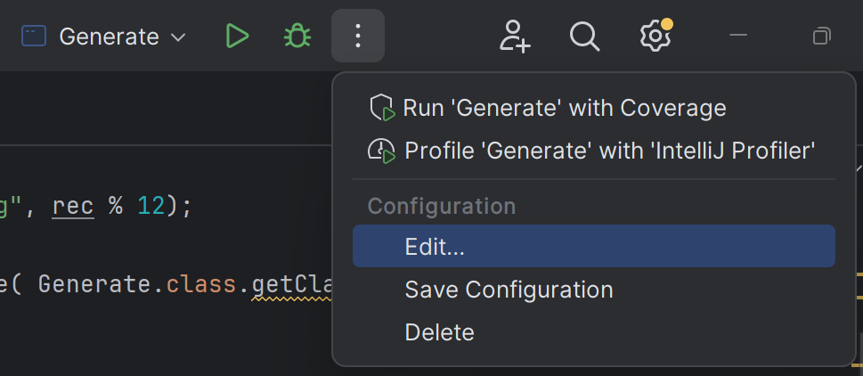
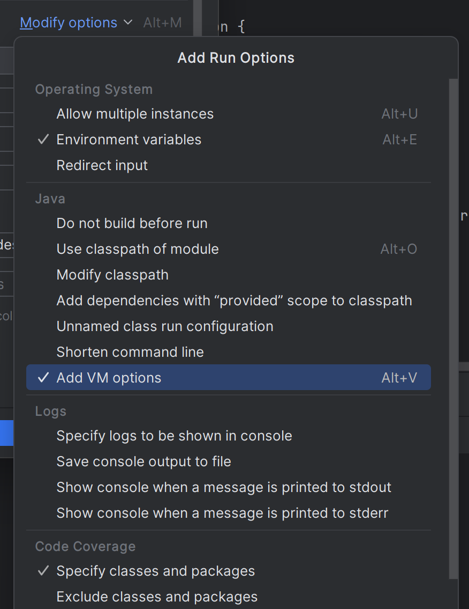
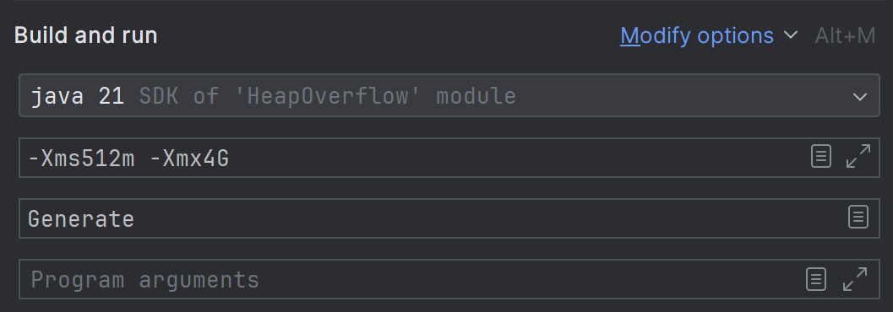

# Estructura de Datos y Algoritmos

# ITBA     2025-Q2

__Generaremos una aplicación que genere HeapOverflow\.__

__Buscar en campus el Proyecto que hemos exportado:__

__HeapOverflow\.zip__

__Descompactarlo:__

__HeapOverflow__

__	src__

__		main	__

__		resources__

__	pom\.xml__

# TP 1- Ejer 13.1 y 13.2

Unzip

File → Open en IntelliJ

Eligen la carpeta donde está el proyecto

Listo\!\! Ahora analicemos el código\. Ejecutarlo\.

¿En qué momento da HeapOverflow?

En mi compu en n=1019

¿En las de ustedes?

__Configurando la alocación del heap…__

# TP 1- Ejer 13.3

# Configuracion del Heap

Java permite configurar al heap con parámetros: la cantidad inicial de heap prealocada y la cantidad máxima posible de alocar:

$ cd target

$ java \-Xms512m \-Xmx4G \-cp HeapOverflow\-1\.jar space\.Generate

Ejercicio: completar el siguiente cuadro según los parámetros de heap siguientes\, en que “n” obtenemos HeapOverflow

| Parámetros | Heap Overflow en n |
| :-: | :-: |
| \-Xms512m \-Xmx1G |  |
| \-Xms512m \-Xmx2G |  |
| \-Xms512m \-Xmx4G |  |
| \-Xms512m \-Xmx8G |  |
| \-Xms512m \-Xmx12G |  |
| \-Xms512m \-Xmx16G |  |

__Generar una aplicación que produzca Stack Overflow__

# TP 1 – Ejer 14

__Ejercicio:__  Cambiar el parámetro default para el stack y ver qué sucede

| Parámetros | Stack Overflow |
| :-: | :-: |
| \-Xss10k | ? |
| \-Xss1024k | ? |
| \-Xss2048k | ? |
| __\-Xss512m__ |  |
| \-Xss1G |  |
|  |  |

