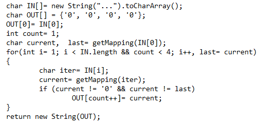

# Estructura de Datos y Algoritmos

# ITBA     2025-Q2

¿Estructura de Datos?             O          	 ¿Algoritmos?

# Algoritmos para textos

Múltiples motivaciones…

Política: este discurso ya lo escuché… Está repitiendo lo que dijo otro político\.

Alumnos/Autores: esta respuesta coincide con la de este otro alumno => se copió\!\!

Plagio en música

Coincidencia de textos completa o parcial

\(exact string matching\)

Política: este discurso se parece a uno que escuché…

Biología: ADN

Typos

Coincidencia de textos aproximada

# Algunas definiciones

  * Alfabeto      :  __conjunto__  de símbolos o caracteres\.
  * Dado un alfabeto   y  k≥0  \,   un string S  es un elemento  k
  * Para S  k\, se dice que   S   es k\, y denota su longitud\. Si k=0\, S se dice que es el string vacío\, se lo denota con 

¿Por qué se lo denota con ?

Para evitar los problemas que tienen los compiladores\!\!

Un  _meta\-_  _símbolo_  no debería ser al mismo tiempo  _parte del _  _alfabeto_  _ _  \(regla básica\)\.

Los lenguajes de programación violan estas reglas y ahí surgen los problemas\.

Ejemplo:  En Java\, el caracter  _comilla_  _ _  _doble_  _ _ delimita el comienzo y fin del string\.  No son parte de las operaciones\. El string “EDA” tiene 3 símbolos\, no 5\. Hasta ahí parece sencillo: quitemos los 2 caracteres externos\.

Pero\, si el compilador encontrara  “  hola”que  ”    daría error\, porque no sabe dónde termina el string:

¿Es  “ hola ”   y lo que sigue está mal?

¿Debería ser  “ hola”que ”  ?

Para evitar ambiguedades obliga a escapar al símbolo comillas dobles cuando participa del string\. Se lo escapa con la barra invertida:  \\”

Pero yo lo veo como un doble caracter\, pero representa uno solo\!\!\!\!

Ejemplo:  “  _hola_  _\\”que_  ”  estaría queriendo representar al string  _hola”que_

de 8 caracteres y no de 9 caracteres\.

Pero la ambiguedad no está solucionada\. Otra vez\, el símbolo barra invertida es  meta\-  símbolo  y  parte del   alfabeto   \.

Ejemplo:   “  _\\\\_  _hola_  _\\”que_  ”  _    _ estaría queriendo representar al string   _\\_  _hola”que_  _ _ de 9 caracteres no de 11 caracteres\.

Si no nos presenta confusión\, podemos hablar del “” como el string vacío…

  *  _Conjunto_    _ de _    _todos_    _ _    _los_    _ strings _    _posibles_    _ _    _sobre_    _ _    _cierto_    _ _    _alfabeto_ 
  * Dado un   alfabeto       \,        =       k      con   k  ≥0      

  *  _Concatenación_    _ de Strings_ 
  * Dado un   alfabeto     \, y  u      \,  w       \.
  * Se llama   _concatenación_   al string   definido     como     _uw_   \(un   elemento   a   continuación   del   otro  \, sin   símbolos   extra entre   ellos  \)  \.
  *  _Prefijos_    _\, _    _Sufijos_    _ y Substrings_ 
  * Dados un   alfabeto       y    los   strings  x      \,  w       \,  z       \.    Sea    p=  xwz  \. 
  * Se dice que   _x _  _es_  _ un _  _prefijo_  _ _  de p\. Se dice que   _w _  _es_  _ un substring _  de p\. Se dice que   _z _  _es_  _ un _  _sufijo_  _ _  de p  \.
  *  _Bordes_ 
  * Dados un   alfabeto       y    los   strings  x      \,  w       \,  z       \.    Si  p =   wx   =   zw          donde    |x| = |z|\,  se   dice que   _w _  _es_  _ un _  _border _  de p\. 

# Ejemplos

  * = \{ 0\, 1\, 2\, 3\, 4\, 5\}
  * Sea s = “01230”
  * ¿Cuáles son los prefijos de s?
  * Rta: “”\, “0”\, “01”\, “012”\, “0123”\, s
  * ¿Cuáles son los sufijos de s?
  * Rta: “”\, “0”\, “30”\, “230”\, “1230”\, s
  * ¿Cuáles son los borders de s?
  * Rta: “”\, s\, “0”\.     Como mínimo  hay 2 borders: “” y s
  * ¿Cuáles son los substrings de s?
  * Rta: “”\, “0”\, “01”\, “012”\, “0123”\, s\, “30”\, “230”\, “1230”\, “1”\, “12”\, “123”\, “2”\, “23”\, “3”\, “30”\, “0”

# Data Quality - Matching

El tópico de “búsqueda aproximada” fue estudiado ampliamente\.

Los buscadores usan alguna estrategia\, en el caso de que la búsqueda lanzada no sea reconocida en el “corpus” que poseen sobre búsquedas y documentos indizados\.

Las estrategias pueden ser muy variadas  \(combinaciones de una o más de estas\):

Buscar las palabras y si las palabras no están en el corpus de los documentos indizados\, encontrar las que mayor similitud posean y  sugerirlas\.

Distancia\(heigth\, hey\)= 5

Distancia\(heigth\, height\) = 1

Distancia\(heigth\, eight\) = 2

…

Did you mean

Height

Eight?

Las estrategias pueden ser muy variadas  \(combinaciones de una o más de estas\):

Tomar el idioma que tiene configurado el browser para saber en qué corpus buscar las palabras usadas\. Hay reglas conocidas por el idioma en cuestión\. Ejemplo\, en inglés HT con TH: heig __ht__  vs  wid __th__ \, leng __th__ \.

Did you mean

Height?

Las estrategias pueden ser muy variadas  \(combinaciones de una o más de estas\):

Sabiendo que los usuarios buscan palabras y cuando fue un error de typo/ortografía/etc\.\, no cliquean nada del resultado e intentan realizar inmediatamente la búsqueda arreglada\, almacenan esas búsquedas erróneas con la que arrojó resultados navegados\. Es decir\, hay un MATCHING entre errores viejos y soluciones que los mismos usuarios hicieron\. Si esos errores son frecuentes\, tendrán solución rápida\.

New regla

Heigth=height

No sólo Google/Yahoo/Bing  intentan mejorar y arreglar las búsquedas erróneas\.

Los sitios que permiten realizar compras por Internet\, también\.

Si un producto no se encuentra \(en la categoría esperada\)\, entonces el usuario intenta usar el botón de búsqueda\. Pero si esta no da coincidencia => el usuario abandona el sitio y va a otro \(en no más de 2 intentos\)\.

Sería fácil encontrar en este sitio? [http://qualtex\.blogspot\.com](http://qualtex.blogspot.com/)[/](http://qualtex.blogspot.com/)

Mi notebook está teniendo un problema con la letra M\. No me toma la tecla\, salvo que la presione fuertemente\.

Fíjense la diferencia con este sitio\. En este caso el problema fue con la tecla L:

O en un error de ortografía:

__Mínimas reglas __ que deberían aplicarse:

Sacar blancos del comienzo y final \(trim\)\.

Pero no es suficiente\. Si la palabra es compuesta habría que sacar blancos internos\.

Ej:  ‘  yogurt       bebible   ‘

Buscar pasando todo a mayúscula o minúscula\.  Ej: YogUrt= YOGURT

Si se conocen abreviaturas\, usarlas\. Ej:  BA por Buenos Aires

Los símbolos de puntuación\, eliminarlos\. Ej: Bs\. As\. por Bs As

Si se conocen sinónimos\, usarlos\. Ej:   _computadora_  por  _ordenador_ \,  _teléfono celular _ por  _teléfono móvil_ \. Inclusive entre diferentes idiomas\.

__Reglas específicas __ que deberían aplicarse para los tipos de datos:

Fechas y sus formatos

Ej:   12/10/2016  =  12 Oct 2016 = 2016\-10\-12

La hora y sus formatos

EJ: 15:30 = 3:30 PM

Números

Ej: 12\.300\.140  = 12300140

Números Decimales

Ej: 12\,1 = 12\.1

String correspondientes a nombre y apellidos

Ej:  John Peter Doe = John P\. Doe = J\. D\. Doe = Doe\, John Peter =  Doe\, John P\. = Doe\, J\. P\.

# Algoritmos

__SOUNDEX__

Es un algoritmo fonético\, es decir codifica a una palabra según “suena”\. Intenta solucionar problemas de pronunciación\.

Fue creado para el alfabeto inglés \(o sea\, codifica las 26 letras del mismo\)\. Existen otras adaptaciones como Soundex\_FR para idioma francés\.

Originalmente fue propuesto a comienzos del siglo XX por Rusell y Odell\. Se lo utilizó para el censo de USA en los 30’\.

Aquellas palabras que “suenan igual”\, aunque no se escriban igual\, deben ser codificadas de la misma manera\.

Existen varias versiones y adaptaciones\. Estudiaremos la siguiente\, que codifica un string IN en otro OUT\.

Character\.isLetter

| 26 Letras | Pesos fonéticos |
| :-: | :-: |
| A\, E\, I\, O\, U\, Y\, W\, H | 0  \-\- no se codifica |
| B\, F\, P\, V | 1 |
| C\, G\, J\, K\, Q\, S\, X\, Z | 2 |
| D\, T | 3 |
| L | 4 |
| M\, N | 5 |
| R | 6 |

Soundex siempre devuelve una código OUT de exactamente 4 caracteres\, formados por: primero una letra y luego 3 dígitos \(pesos fonéticos\)\.

Si hace falta\, para completar el código de 4 caracteres\, se completan con 0s \(ceros\) al final\.

Character\.isLetter

| 26 Letras | Pesos fonéticos |
| :-: | :-: |
| A\, E\, I\, O\, U\, Y\, W\, H | 0  \-\- no se codifica |
| B\, F\, P\, V | 1 |
| C\, G\, J\, K\, Q\, S\, X\, Z | 2 |
| D\, T | 3 |
| L | 4 |
| M\, N | 5 |
| R | 6 |

Paso 1 \(opcional\): Pasar a mayúsculas y dejar sólo las letras \(dígitos\, símbolos de puntuación\, espacios\, etc\. se eliminan\)\.

Paso 2:  Colocar OUT\[0\]=IN\[0\]\.

Paso 3: Se calcula vble\.  __last__  como el peso fonético de IN\[0\]

Paso 4: Para cada letra  __iter__  siguiente en IN y hasta completar 3 dígitos o terminar de procesar IN\, hacer

3\.1\) calcular vble  __current__  con peso fonético de  __iter__  __\. __ Si es diferente a 0 y no coincide con  __last__ \, appendear  __current__  __ en OUT\.__

__	__ 3\.2\) __ independiente del paso anterior\, __ tapar  __last__  __ = __  __current__ \.

Paso 5: si hace falta completar con ‘0’s y devolver OUT\.

_Actividad_

Apliquemos  __Soundex__  __ __ para codificar strings por su fonética\.

| 26 Letras | Pesos fonéticos |
| :-: | :-: |
| A\, E\, I\, O\, U\, Y\, W\, H | 0  \-\- no se codifica |
| B\, F\, P\, V | 1 |
| C\, G\, J\, K\, Q\, S\, X\, Z | 2 |
| D\, T | 3 |
| L | 4 |
| M\, N | 5 |
| R | 6 |

| Soundex\(‘  LUxuRY’\)= | L | 2 | 6 | _0_ |
| :-: | :-: | :-: | :-: | :-: |

| Soundex\(‘  LUxuRY  YYYAAAEE’\)= | L | 2 | 6 | _0_ |
| :-: | :-: | :-: | :-: | :-: |

_Actividad_

Apliquemos  __Soundex__  __ __ para codificar strings por su fonética\.

| 26 Letras | Pesos fonéticos |
| :-: | :-: |
| A\, E\, I\, O\, U\, Y\, W\, H | 0  \-\- no se codifica |
| B\, F\, P\, V | 1 |
| C\, G\, J\, K\, Q\, S\, X\, Z | 2 |
| D\, T | 3 |
| L | 4 |
| M\, N | 5 |
| R | 6 |

| Soundex\(‘  SZLLOYDTIRUL’\)= | S | 4 | 3 | 6 |
| :-: | :-: | :-: | :-: | :-: |

# Cómo usar soundex?

Soundex codifica\, pero ¿Cómo usarlo para comparar proximidad entre palabras?

Soundex NO es una métrica\.

Hay que definir cómo obtener una métrica a partir de soundex\.

__Definición__  __ de __  __Similitud__  __ para Soundex__

__	__ Es la proporción de caracteres coincidentes entre los encodings respecto a la longitud del encoding\.

__Ej__  __:  Soundex \( “threshold”\) = T624__

__       Soundex\( “hold” \) = __  __H430__

__       Soundex\( “__  __zresjoulding__  __”\) __ =  __Z624__

__       Soundex\( “phone”\) = P500__

__       Soundex \( “__  __foun__  __” \) = F500__

__Soundex \(“threshold”\, “hold” \) = 0__

__Soundex\(“threshold”\, “__  __zresjoulding__  __”\) = ¾ = 0\.75__

__Soundex\(“phone”\, “__  __foun__  __” \) = 3/4 = 0\.75__

__¿ __  __Cuáles__  __ son __  __los__  __ __  __únicos__  __ __  __valores__  __ __  __posibles__  __ de __  __similitud__  __ __  __que __  __obtenemos__  __?__

Rta 0\, 0\.25\, 0\.5\, 0\.75\, 1

