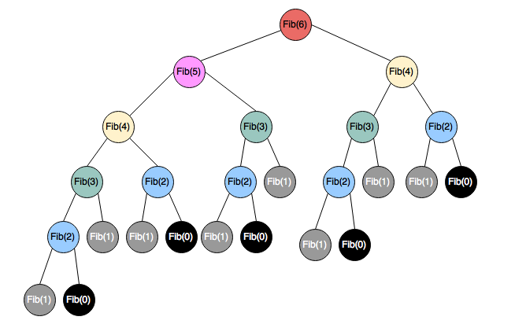

# Estructura de Datos y Algoritmos

# ITBA     2025-Q2

# Levenshtein Distance

Es un algoritmo que calcula la  __MINIMA__  cantidad de operaciones necesarias para transformar un string en otro\. Las operaciones válidas son:  __insertar\, borrar o sustituir un __  __caracter__ \.

Aquellos strings que son iguales\, deben tener distancia 0 porque no hace falta transformar uno en otro\.

Ej: Levenshtein\(‘big data’\, ‘bigdata’\) =

1 es la mínima\, pero hay muchas formas de ir de str1 a str2\.

‘big data’ => BBBBIII o sea 7

‘big data’ => BSSS      o sea 4

‘big data’ => \-\-\-SSSSD o sea 5

Etc\, etc\, etc\.

A diferencia de Soundex\, que se adaptó para proponer una medida de similitud\, a partir de su cálculo\,  __Levenshtein__  __ ES __ un métrica de distancia\. Por lo tanto\, cumple con propiedades:

__Simetría__ : Levenshtein\(str1\, str2\) = Levenshtein\(str2\, str1\)

__Desigualdad__ : Levenshtein\(str1\, str2\) \+ Levenshtein\(str2\, str3\)

>=Levenshtein\(str1\, str3\)

El problema es que una implementación ensayo&error sería tan ineficiente\! Impracticable\.

Por eso\, se lo suele implementar con la  __técnica de Programación Dinámica__

__Programación Dinámica __ es una técnica que consiste en reusar valores previamente calculados para no tener que recalcularlos repetidamente\. Sirve\, si para cierto cálculo\, pueden reusarse valores previos…

Así\, los valores calculados deben almacenarse en una estructura de datos \(vector\, matriz\, etc\.\) con el objetivo de “buscarlos” \(lookup\) y no calcularlos nuevamente cuando se los precise\.

Desde el punto de vista de complejidad algorítmica computacional\, una operación Lookup podría ser de costo bajísimo\!

¿Conocen algún ejemplo de uso de programación dinámica?

Cálculo de camino más corto entre 2 nodos de un grafo\, Fibonacci\, etc\, etc\.

__EJ: __  __Fibo__  __\(N\) = N si N=0 __  __or__  __ N= 1__

__		__  __Fibo__  __\(N\-1\) \+ __  __Fibo__  __\(N\-2\) si N > 1     __

__Fibo__  __\(5\)=5__

Especialización en Ciencia de Datos

__EJ: __  __Fibo__  __\(N\) = N si N=0 __  __or__  __ N= 1__

__		__  __Fibo__  __\(N\-1\) \+ __  __Fibo__  __\(N\-2\) si N > 1     __

__Fibo__  __\(5\)= __   __Fibo__    __\(4\)__   __ \+ __   __Fibo__    __\(3\)__ 

__ __  __       = __   __Fibo__    __\(3\) \+ __    __Fibo__    __\(2\) __   __\+ __   __Fibo__    __\(2\) \+ __    __Fibo__    __\(1\)__ 

__ __  __        = __   __Fibo__    __\(2\) \+ __    __Fibo__    __\(1\) __   __\+ __  __Fibo__  __\(1\) \+ __  __Fibo__  __\(0\) \+ __  _Fibo_  _\(1\) \+ _  _Fibo_  _\(0\) _  __\+ 1__

__ __  __        = __   __Fibo__    __\(1\) \+ __    __Fibo__    __\(0\) __   __\+ 1 \+ 1 \+ 0 \+ 1 \+ 0 \+ 1__

__ __  __        = 1        \+ 0       \+ __  __1 __  __\+ __  __1 \+ 0 \+ 1 \+ 0 \+ __  __1 = 5__

__El problema es que este algoritmo recursivo __  __tiene complejidad temporal __  __O\(2^__  __N__  __\)\.__

__La complejidad __  __espaciale__  __ __  __e__  __s __  __O\(N\)__

Especialización en Ciencia de Datos

__EJ: __  __Fibo__  __\(N\) = N si N=0 __  __or__  __ N= 1__

__	__  __	__  __Fibo__  __\(N\-1\) \+ __  __Fibo__  __\(N\-2\) si N > 1     __

__Con programación dinámica\, los valores calculados los aprovecharíamos\.__

__Fibo__  __\(5\)= __   __Fibo__    __\(4\)__   __                                  \+ __   __Fibo__    __\(3\)__ 

__ __  __       = __   __Fibo__    __\(3\) \+                      __    __Fibo__    __\(2\)  __   __\+ ?__

__ __  __        = __   __Fibo__    __\(2\) \+            __    __Fibo__    __\(1\) __   __\+ __   __?__   __      \+ ?__

__ __  __        = __   __Fibo__    __\(1\) \+ __    __Fibo__    __\(0\) __   __\+ 1       \+ __   __?__   __      \+ __  __?__

__         = 1 \+ 		0    \+ __  __1 __  __      \+ __   __?__   __      \+ ?__

__	__  __= 1 \+ 		0    \+ 1       \+ 1      \+ ?__

__	= 1 \+ 		0    \+ 1       \+ 1      \+ 2 = 5__

__Este algoritmo es O\(__  __N__  __\)\.__

Especialización en Ciencia de Datos

__EJ: __  __Fibo__  __\(N\) =   N si N=0 __  __or__  __ N= 1__

__		__  __Fibo__  __\(N\-1\) \+ __  __Fibo__  __\(N\-2\) si N > 1     __

__El problema es que este algoritmo recursivo es O\(2^N\)\.__

__EJ: __  __Fibo__  __\(N\) = N si N=0 __  __or__  __ N= 1__

__		__  __Fibo__  __\(N\-1\) \+ __  __Fibo__  __\(N\-2\) si N > 1     __

__Con programación dinámica\, los valores calculados los aprovecharíamos\.__

__Fibo__  __\(5\)= __   __Fibo__    __\(4\)__   __                                  \+ __   __Fibo__    __\(3\)__ 

__        = __   __Fibo__    __\(3\) \+                      __    __Fibo__    __\(2\)  __   __\+ ?__

__         = __   __Fibo__    __\(2\) \+            __    __Fibo__    __\(1\) __   __\+ __   __?__   __      \+ ?__

__         = __   __Fibo__    __\(1\) \+ __    __Fibo__    __\(0\) __   __\+ 1       \+ __   __?__   __      \+ ?__

__         = 1 \+ 		0    \+ 1       \+ __   __?__   __      \+ ?__

__	= 1 \+ 		0    \+ 1       \+ 1      \+ ?__

__	= 1 \+ 		0    \+ 1       \+ 1      \+ 2 = 5__

__Este algoritmo es O\(__  __N__  __\)\.__

Posible implementación \(si invocan con N >= 50 se nota la diferencia con cache o sin cache\)

__public__  __ __  __class__  __ __  __FastFibo__  __ \{__

__    private __  __static __  __HashMap__  __\<Integer\, Long> __  _cache= new _  _HashMap_  _<>\(\);_

__    public __  __static long __  __fibo__  __\(__  __int__  __ N\) \{__

 __        __    __if__    __ __    __\(__    __cache\.containsKey__    __\(N\)\) __ 

 __             __    __return__    __ __    __cache\.get__    __\(N\);__ 

__        __  __long__  __ __  __rta__  __;__

__       __  __if__  __ __  __\(N <= 1\)__

__            __  __rta__  __= N;__

__      __  __else__

__           __  __rta__  __= __  __fibo__  __\(N\-1\) \+ __  __fibo__  __\(N\-2\);__

__       __   __cache\.put__    __\(N__    __\,  __    __rta__    __\);__ 

__       __  __return__  __ __  __rta__  __;__

__    \}__

\}

# String Matching – Levenshtein Distance

|  |  | B | I | G |  | D | A | T | A |
| :-: | :-: | :-: | :-: | :-: | :-: | :-: | :-: | :-: | :-: |
|  |  |  |  |  |  |  |  |  |  |
| B |  |  |  |  |  |  |  |  |  |
| I |  |  |  |  |  |  |  |  |  |
| G |  |  |  |  |  |  |  |  |  |
| D |  |  |  |  |  |  |  |  |  |
| A |  |  |  |  |  |  |  |  |  |
| T |  |  |  |  |  |  |  |  |  |
| A |  |  |  |  |  |  |  |  |  |

Programación Dinámica para Levenshtein\(‘big data’\, ‘bigdata’\)

La celda representa

Levenshtein\(‘BIG’\, ‘BI’\)

# Levenshtein Distance

Programación Dinámica para Levenshtein\(‘big data’\, ‘bigdata’\)

|  |  | B | I | G |  | D | A | T | A |
| :-: | :-: | :-: | :-: | :-: | :-: | :-: | :-: | :-: | :-: |
|  | 0 | 1 | 2 | 3 | 4 | 5 | 6 | 7 | 8 |
| B | 1 |  |  |  |  |  |  |  |  |
| I | 2 |  |  |  |  |  |  |  |  |
| G | 3 |  |  |  |  |  |  |  |  |
| D | 4 |  |  |  |  |  |  |  |  |
| A | 5 |  |  |  |  |  |  |  |  |
| T | 6 |  |  |  |  |  |  |  |  |
| A | 7 |  |  |  |  |  |  |  |  |

Entonces

Levenshtein\(‘’\,’’\)= 0

Levenshtein\(‘B’\, ‘’\)=1

Levenshtein\(‘BI’\, ‘’\)=2

Levenshtein\(‘BIG’\, ‘’\)=3

…

Entonces

Levenshtein\(‘’\,’B’\)= 1

Levenshtein\(‘’\, ‘BI’\)=2

Levenshtein\(‘’\, ‘BIG’\)=3

Levenshtein\(‘’\,BIGD’\)=4

…

Programación Dinámica para Levenshtein\(‘big data’\, ‘bigdata’\)

|  |  | B | I | G |  | D | A | T | A |
| :-: | :-: | :-: | :-: | :-: | :-: | :-: | :-: | :-: | :-: |
|  | 0 | 1 | 2 | 3 | 4 | 5 | 6 | 7 | 8 |
| B | 1 |  |  |  |  |  |  |  |  |
| I | 2 |  |  |  |  |  |  |  |  |
| G | 3 |  |  |  |  |  |  |  |  |
| D | 4 |  |  |  |  |  |  |  |  |
| A | 5 |  |  |  |  |  |  |  |  |
| T | 6 |  |  |  |  |  |  |  |  |
| A | 7 |  |  |  |  |  |  |  |  |

La celda representa

Levenshtein\(‘BIG’\, ‘BI’\)

Levenshtein\(‘BI G ’\, ‘B I ’\)=

Min \( 	Levenshtein\(‘BI’\, ‘B’\) \+  ‘G’==‘I’?0:1\,

Levenshtein\(‘BIG’\, ‘B’\) \+ 1

Levenshtein\(‘BI’\, ‘BI’\) \+ 1\,

\)

Programación Dinámica para Levenshtein\(‘big data’\, ‘bigdata’\)

|  |  | B | I | G |  | D | A | T | A |
| :-: | :-: | :-: | :-: | :-: | :-: | :-: | :-: | :-: | :-: |
|  | 0 | 1 | 2 | 3 | 4 | 5 | 6 | 7 | 8 |
| B | 1 |  |  |  |  |  |  |  |  |
| I | 2 |  |  |  |  |  |  |  |  |
| G | 3 |  |  |  |  |  |  |  |  |
| D | 4 |  |  |  |  |  |  |  |  |
| A | 5 |  |  |  |  |  |  |  |  |
| T | 6 |  |  |  |  |  |  |  |  |
| A | 7 |  |  |  |  |  |  |  |  |

Levenshtein\(w\,z\)=

Min \(  Levenshtein  \(    \,     \)  \+ w==z?0:1\,

_Levenshtein_  _\(_  __  w  _\,_  _ _  _\) _ \+ 1\,

_Levenshtein_  _\(_  __  _\, _  __  z  _\)_  \+ 1

\)

Calculemos la distancia de Levenshtein\(‘big data’\, ‘bigdata’\)

|  |  | B | I | G |  | D | A | T | A |
| :-: | :-: | :-: | :-: | :-: | :-: | :-: | :-: | :-: | :-: |
|  | 0 | 1 | 2 | 3 | 4 | 5 | 6 | 7 | 8 |
| B | 1 | 0 | 1 | 2 | 3 | 4 | 5 | 6 | 7 |
| I | 2 | 1 | 0 | 1 | 2 | 3 | 4 | 5 | 6 |
| G | 3 | 2 | 1 | 0 | 1 | 2 | 3 | 4 | 5 |
| D | 4 | 3 | 2 | 1 | 1 | 1 | 2 | 3 | 4 |
| A | 5 | 4 | 3 | 2 | 2 | 2 | 1 | 2 | 3 |
| T | 6 | 5 | 4 | 3 | 3 | 3 | 2 | 1 | 2 |
| A | 7 | 6 | 5 | 4 | 4 | 4 | 3 | 2 | 1 |

_¿Cuál es la distancia _  _Levenshtein_  _ \(“_  _exkusa_  _”\, “ex\-amigo”\) ?_

_Rta_  _  6_

_Ej_  _: \_ \_ I S _  _S_  _ _  _S_  _ _  _S_  _ I_

_O bien_

_Ej_  _: \_ \_ S _  _S_  _ _  _S_  _ _  _S_  _ I _  _I_

Se puede normalizar para que el número obtenido esté entre 0 y 1\. El valor 1 implica coincidencia\.

__Existen variantes:__

Por ejemplo: Damerau\-Levenshtein: las operaciones no son sólo borrado\, inserción\, y sustitución\. También se agrega transposición\.

Otras variantes no consideran que las operaciones valen todas igual\. Alguna es más cara que otra y cambia la fórmula de distancia\, entonces\.

