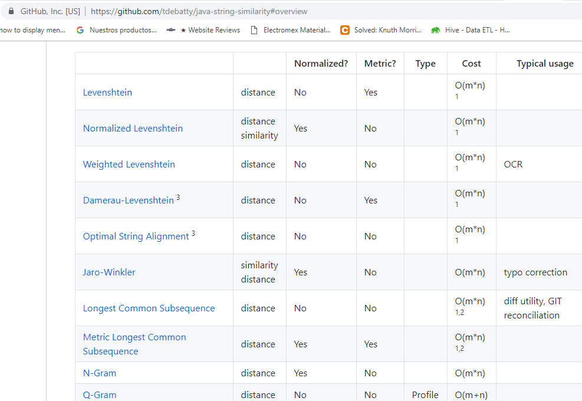

# Estructura de Datos y Algoritmos

# ITBA     2025-Q2

__¿Tiene Java 8 manejo de Strings Matching?__

__¿Tiene Java estos algoritmos \(Soundex\, Metaphone\, Levenshtein\, Q\-Grams\)?__

# TP 2A- Ejer 11-1

# String Matching

¿Existen bibliotecas externas con estas implementaciones?

Imaginarse que están solos liderando un Proyecto y precisan usar esas funcionalidades\. Buscar qué biblioteca/s de   __Apache Commons __ sirven para eso \(analizar en  _[https://commons\.apache\.org/](https://commons.apache.org/)_ \) y tienen un manejo avanzado de Strings\.

__Crear un nuevo proyecto mvn que utilice las dependencias para manejo de Strings de apache commons\.__

__Usar dichas implementaciones para detectar similitud entre 2 strings por medio de: Soundex\, Levenshtein\, Qgrams__

__Donde se puede\, agregar métodos para extraer la máxima info posible\. Ej: de soundex el enconding\, de qGrams printTokens\, etc __

__Verificar que lo obtenido coincide con la implementación de Uds\. __

# TP 2A- Ejer 11-2

Es decir\, se busca que el código permita obtener como mínimo:

El  _soundex\(“maven”\)_ \, soundex\(“meibem”\) y la  _similitud de ambo_ s\, según soundex\, que en este caso es 1\.

El soundex\(“threshold”\) y soundex\(“hold”\) y la similitud de ambos\, según soundex\, que en este caso es 0\.

El soundex\(“hold”\) y soundex\(“joul”\) y la similitud de ambos\, según soundex\, que en este caso es 0\.5

_LevenshteinDistance_ \(“exkusa”\, “ex\-amigo”\) y la  _similitud de ambos_  que es 1\-6/8\, o sea 0\.25

Pista:

Buscar en:  __codec__  y  __text__

¿Qué no pudieron hacer?

Como habrán observado\, no hay tratamiento de Q\-Grams\.

Tuvieron que incluir para Soundex \(encoding\):

\<\!\-\- https://mvnrepository\.com/artifact/commons\-codec/commons\-codec \-\->

\<dependency>

\<groupId> _commons\-codec_ \</groupId>

\<artifactId> _commons\-codec_ \</artifactId>

\<version>1\.15\</version>

\</dependency>

Tuvieron que incluir para Levenshtein \(similitud\):

\<\!\-\- https://mvnrepository\.com/artifact/org\.apache\.commons/commons\-text \-\->

\<dependency>

\<groupId>org\.apache\.commons\</groupId>

\<artifactId>commons\-text\</artifactId>

\<version>1\.9\</version>

\</dependency>

Es común que tengamos que utilizar más de una biblioteca en nuestras aplicaciones\. Por eso\, la ventaja de usar Maven…

Analizaron cómo obtener para Levenshtein:

Cantidad de sustituciones necesarias? Cantidad de borrados? Cantidad de inserciones?

Analizaron cómo obtener para Levenshtein:

Cantidad de sustituciones necesarias? Cantidad de borrados? Cantidad de inserciones?

Rta: lo pueden hacer utilizando la clase LevenshteinDetailedDistance

__Usar distancia de Levenshtein para calcular la similitud en Metaphone \(que Uds\. no lo implementaron from scratch\, pero ahora lo tienen gracias a Apache commons\! \)__

__Cómo implementó Apache commons Soundex\, Metaphone y Levenshtein__

__Muy distinto a lo que Uds\. Pensaron?__

__Ej: busquen en google__

__apache commons Soundex\.java__

¿Existe alguna otra biblioteca que nos permira trabajar con QGrams?

Usando varias\, llegaríamos al objetivo…

En integración de bibliotecas\, Maven ayuda…

Agregar al proyecto maven la biblioteca  _java\-string\-similarity_ \. Buscarla en Maven e incluir su dependencia\.

Si se fijan en su documentación

__Agregar al proyecto anterior la dependencia de __  __java\-string\-similarity__  __ que permite implementar QGram paramétrico\. __

__Usar la biblioteca para implementar:__

__similitud entre 2 strings  y printTokens\(\)__

__Verificar que lo obtenido coincide con la implementación de Uds\. __

# TP 2A- Ejer 14-1 y 14-2

\<\!\-\- Soundex \-\->

\<dependency>

\<groupId>commons\-codec\</groupId>

\<artifactId>commons\-codec\</artifactId>

\<version>1\.5\</version>

\</dependency>

\<\!\-\- Levenshtein \-\->

\<dependency>

\<groupId>org\.apache\.commons\</groupId>

\<artifactId>commons\-text\</artifactId>

\<version>1\.5\</version>

\</dependency>

\<\!\-\- QGrams \-\->

\<dependency>

\<groupId>info\.debatty\</groupId>

\<artifactId>java\-string\-similarity\</artifactId>

\<version>2\.0\.0\</version>

\</dependency>

import org\.apache\.commons\.codec\.language\.Metaphone;

import org\.apache\.commons\.codec\.language\.Soundex;

import org\.apache\.commons\.text\.similarity\.LevenshteinDetailedDistance;

import org\.apache\.commons\.text\.similarity\.LevenshteinDistance;

import info\.debatty\.java\.stringsimilarity\.QGram;

Soundex s = new Soundex\(\);       					s\.difference\("HELLO"\, "ALO"\);

Metaphone m = new Metaphone\(\);   				m\.encode\("HELLO"\);

LevenshteinDistance l = new LevenshteinDistance\(\);

l\.apply\( "HELLO"\, "ALO" \);

QGram qg = new QGram\( 2 \);

qg\.distance\( "Hello"\, "Alo" \);

qg\.getProfile\( "Hello" \);

