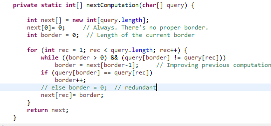
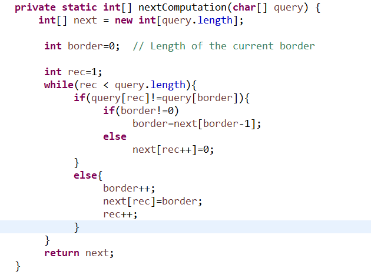

# Estructura de Datos y Algoritmos

# ITBA     2025-Q2

# Algoritmos para texto

Hemos analizado algunos de los algoritmos que manejan “similitud” entre strings o textos\. Es decir\, algoritmos que no necesariamente buscan matching exacto\.

Pero sobre el procesamiento de textos hay muchos más desafíos\.

Por ejemplo: “ búsqueda   exacta ”

Búsqueda exacta: ideal\, por ejemplo para cuando realizamos una búsqueda \(opcionalmente para realizar un reemplazo\) en un editor de texto\.

Ej: notepad\, vi\, etc\.

__Problema__  __ 1__

Dado dos arreglos de chars \(no strings por ahora\) target y query\, queremos un código Java que permita calcular la primera aparición de source en target\, o \-1 si no hay tal aparición\.

Ej:  target=“abracadabra”   query=“ra” \, entonces se obtiene 2

Ej:  target=“abracadabra”   query=“abra” \, entonces se obtiene 0

Ej:  target=“abracadabra”   query=“aba” \, entonces se obtiene \-1

Java viene con indexOf para Strings\. Pero antes de conocer qué estrategia siguieron\, veamos varias existentes\.

# From scratch (no usar API)

__Lo __  __invocaríamos__  __ __  __así__  __:  __  __ExactSearch\.indexOf__  __\( char\[\] query\, char\[\] target\)__

__char__  __\[\] target= "abracadabra"\.__  __toCharArray__  __\(\);__

__char__  __\[\] __  __query__  __= "__  __ra__  __"\.__  __toCharArray__  __\(\);__

System\.   _out\.println_    _\( _    _ExactSearch\.indexOf_    _\( _    _query_    _\, target\) \);  //2_ 

__char__  __\[\] target= "abracadabra"\.__  __toCharArray__  __\(\);__

__char__  __\[\] __  __query__  __= “abra"\.__  __toCharArray__  __\(\);__

System\.   _out\.println_    _\(_    _ExactSearch\.indexOf_    _\( _    _query_    _\, target\) \);  //0_ 

__char__  __\[\] target= "abracadabra"\.__  __toCharArray__  __\(\);__

__char__  __\[\] __  __query__  __= “aba"\.__  __toCharArray__  __\(\);__

System\.   _out\.println_    _\(_    _ExactSearch\.indexOf_    _\( _    _query_    _\, target\) \);  //_    _\-_    _1_ 

__char__  __\[\] target= "__  __ab"\.__  __toCharArray__  __\(\);__

__char__  __\[\] __  __query__  __= “aba"\.__  __toCharArray__  __\(\);__

System\.   _out\.println_    _\(_    _ExactSearch\.indexOf_    _\( _    _query_    _\, target\) \);  //_    _\-_    _1_ 

__char__  __\[\] target= __  __“__  __xa__  __"\.__  __toCharArray__  __\(\);__

__char__  __\[\] __  __query__  __= “aba"\.__  __toCharArray__  __\(\);__

System\.   _out\.println_    _\(_    _ExactSearch\.indexOf_    _\( _    _query_    _\, target\) \);  //_    _\-_    _1_ 

__char__  __\[\] target= "abracadabras"\.__  __toCharArray__  __\(\);__

__char__  __\[\] __  __query__  __= “abras"\.__  __toCharArray__  __\(\);__

System\.   _out\.println_    _\(_    _ExactSearch\.indexOf_    _\( _    _query_    _\, target\) \);  _    _//_    _7_ 

Implementarlo \(sin usar métodos Java\, es un arreglo de chars\!\!\!\)

# TP 2B- Ejer 1.1

Algoritmo Fuerza Bruta o Naïve\. Ej:

| A | B | R | A | C | A | D | A | B | R | A |
| :-: | :-: | :-: | :-: | :-: | :-: | :-: | :-: | :-: | :-: | :-: |

| R | A |
| :-: | :-: |

Algoritmo Fuerza Bruta o Naive

| A | B | R | A | C | A | D | A | B | R | A |
| :-: | :-: | :-: | :-: | :-: | :-: | :-: | :-: | :-: | :-: | :-: |

| R | A |
| :-: | :-: |

Algoritmo Fuerza Bruta o Naive

| A | B | R | A | C | A | D | A | B | R | A |
| :-: | :-: | :-: | :-: | :-: | :-: | :-: | :-: | :-: | :-: | :-: |

| R | A |
| :-: | :-: |

Algoritmo Fuerza Bruta o Naive

| A | B | R | A | C | A | D | A | B | R | A |
| :-: | :-: | :-: | :-: | :-: | :-: | :-: | :-: | :-: | :-: | :-: |

| R | A |
| :-: | :-: |

Algoritmo Fuerza Bruta o Naïve\. Ej:

| A | B | R | A | C | A | D | A | B | R | A |
| :-: | :-: | :-: | :-: | :-: | :-: | :-: | :-: | :-: | :-: | :-: |

| A | B | A |
| :-: | :-: | :-: |

Algoritmo Fuerza Bruta o Naïve\. Ej:

| A | B | R | A | C | A | D | A | B | R | A |
| :-: | :-: | :-: | :-: | :-: | :-: | :-: | :-: | :-: | :-: | :-: |

| A | B | A |
| :-: | :-: | :-: |

Algoritmo Fuerza Bruta o Naïve\. Ej:

| A | B | R | A | C | A | D | A | B | R | A |
| :-: | :-: | :-: | :-: | :-: | :-: | :-: | :-: | :-: | :-: | :-: |

| A | B | A |
| :-: | :-: | :-: |

Algoritmo Fuerza Bruta o Naïve\. Ej:

| A | B | R | A | C | A | D | A | B | R | A |
| :-: | :-: | :-: | :-: | :-: | :-: | :-: | :-: | :-: | :-: | :-: |

| A | B | A |
| :-: | :-: | :-: |

# Posible solución:

__public __  __static __  __int__  __ __  __indexOf__  __\(char\[\] query\, char\[\] target\)__

\{

__	__  __int__  __ __  __idxTarget__  __= 0;__

__	__  __int__  __ __  __idxQuery__  __= 0;__

__	__  __while__  __\(__  __idxTarget__  __ __  __< __  __target\.length__  __ __  __&& __  idxQuery < query\.length\)  \{

__		__  __if__  __ __  __\(__  __query__  __\[__  __idxQuery__  __\] == target\[__  __idxTarget__  __\]\)  __ \{

idxQuery\+\+;

idxTarget\+\+;

\}

__		__  __else__  __  __ \{

idxTarget= idxTarget \- idxQuery \+ 1;

idxQuery = 0;

\}

\}

__	__  __if__  __ __  __\(__  __idxQuery__  __ == __  __query\.length__  __\) // __  __found__  __\!__

__		__  __return__  __ __  __idxTarget\-idxQuery__  __;__

__	__  __return__  __ __  __\-1;__

\}

# Otra posible implementación

__public static __  __int__  __ __  __indexOf__  __\(char\[\] query\, char\[\] target\)__

\{

__	__  __int__  __ __  __idxTarget__  __= 0;__

__	__  __int__  __ __  __idxQuery__  __ __  __0;__

__	__  __while__  __\(__  __idxTarget__  __ __  __< __  __target\.length__  __ __  __&& __  idxQuery < query\.length\) \{

__		__  __if__  __ __  __\(__  __query__  __\[__  __idxQuery__  __\] == target\[__  __idxTarget__  __\]\)   __ \{

idxQuery\+\+;

idxTarget\+\+;

__			__  __if__  __ __  __\(__  __idxQuery__  __ == __  __query\.length__  __\)__

__				__  __return__  __ __  __idxTarget\-idxQuery__  __;__

\}

__		__  __else__  __  __ \{

idxTarget= idxTarget \- idxQuery \+ 1;

idxQuery = 0;

\}

\}

__	__  __return__  __ __  __\-1;__

\}

Cuál es el peor caso?

Complejidad espacial?

Complejidad temporal?

# TP 2B- Ejer 1.2 y 1.3

El algoritmo anterior se denomina “naïve”\.

¿Cuál es el peor caso?	Que el query no se encuentre en el target

¿Complejidad temporal?   O \( n \* m \)  Sea |target|= n   y  |source| = m

¿Complejidad espacial?     O\(1\)

Buscar cómo implementa Java el  String\.indexOf

Es el algoritmo naive?

# TP 2B- Ejer 1.4

¿Habrá otro algoritmo? ¿Mejor en lo temporal o en lo espacial?

El algortimo Naïve no aprovecha lo que aprendió durante el recorrido cuando encuentra un mismatch\. Hace  __backtracking __  __en__  __ el query y __  __en__  __ el target__ \.

__El __  __algoritmo__  __ __  __Knuth\-Morris\-Pratt__ :  no vuelve a chequear un caracter que ya sabe que matcheó\! No hace backtracking en el target\.

Primero la idea…

# Algoritmo Knuth-Morris-Pratt.

Scanea el target de izquierda a derecha\, pero usa conocimiento sobre los caracteres comparados antes de determinar la próxima posición del patrón a usar\.

Preprocesa el query  antes de la búsqueda  una vez\, con el objetivo de analizar la estructura \(las características del patrón query\)\. Para ello construye una tabla Next del mismo tamaño del query\.

La tabla de Next tiene en cada posición “i“  la longitud del  __borde__  __ __  __propio__  __ __ más grande para el substring query desde 0 hasta i\.

Cálculo de Next

Next\[2\]?

Los prefijos son: \, A\, AB\, ABA\.

Los sufijos son: \, A\, BA\, ABA

Los bordes: \, A\, ABA\.   Pero el más largo propio es longitud 1 \(A\)

Next\[1\]?

Los prefijos son: \, A\, AB\.

Los sufijos son: \, B\, AB

Los bordes: \, AB\.   Pero el más largo propio es longitud 0

Next\[0\]

siempre es 0\!

| query | A | B | A |
| :-: | :-: | :-: | :-: |
| Next | 0 | 0 | 1 |

Ejercicio 1\. Calcular el next en cada caso

| query | X | E | E | E |
| :-: | :-: | :-: | :-: | :-: |
| Next | 0 | 0 | 0 | 0 |

| query | B | C | B | C |
| :-: | :-: | :-: | :-: | :-: |
| Next | 0 | 0 | 1 | 2 |

| query | A | B | X | A | B | U |
| :-: | :-: | :-: | :-: | :-: | :-: | :-: |
| Next | 0 | 0 | 0 | 1 | 2 | 0 |

Algoritmo Knuth\-Morris\-Pratt\. Cálculo de Next

| query | A | B | R | A | C | A | D | A | B | R | A |
| :-: | :-: | :-: | :-: | :-: | :-: | :-: | :-: | :-: | :-: | :-: | :-: |
| Next | 0 | 0 | 0 | 1 | 0 | 1 | 0 | 1 | 2 | 3 | 4 |

| query | S | A | S | S |
| :-: | :-: | :-: | :-: | :-: |
| Next | 0 | 0 | 1 | 1 |

# Revisando propiedades de los next

| query | A | B | A |
| :-: | :-: | :-: | :-: |
| Next | 0 | 0 | 1 |

| query | X | E | E | E |
| :-: | :-: | :-: | :-: | :-: |
| Next | 0 | 0 | 0 | 0 |

| query | B | C | B | C |
| :-: | :-: | :-: | :-: | :-: |
| Next | 0 | 0 | 1 | 2 |

| query | A | B | X | A | B | U |
| :-: | :-: | :-: | :-: | :-: | :-: | :-: |
| Next | 0 | 0 | 0 | 1 | 2 | 0 |

| query | A | B | R | A | C | A | D | A | B | R | A |
| :-: | :-: | :-: | :-: | :-: | :-: | :-: | :-: | :-: | :-: | :-: | :-: |
| Next | 0 | 0 | 0 | 1 | 0 | 1 | 0 | 1 | 2 | 3 | 4 |

| query | S | A | S | S |
| :-: | :-: | :-: | :-: | :-: |
| Next | 0 | 0 | 1 | 1 |

N\[i \] <= N\[i \- 1\] \+ 1 Pero puede ser que N\[i\]= 0

# Implementacion Original

Queremos calcular Next para un cierto String\.

Aprovechando la propiedad de Next

# Otra forma

| A | A | T | A | A | A | T | U |
| :-: | :-: | :-: | :-: | :-: | :-: | :-: | :-: |

| 0 |  |  |  |  |  |  |  |
| :-: | :-: | :-: | :-: | :-: | :-: | :-: | :-: |

| A | A | T | A | A | A | T | U |
| :-: | :-: | :-: | :-: | :-: | :-: | :-: | :-: |

| 0 |  |  |  |  |  |  |  |
| :-: | :-: | :-: | :-: | :-: | :-: | :-: | :-: |

| A | A | T | A | A | A | T | U |
| :-: | :-: | :-: | :-: | :-: | :-: | :-: | :-: |

| 0 | 1 |  |  |  |  |  |  |
| :-: | :-: | :-: | :-: | :-: | :-: | :-: | :-: |

| A | A | T | A | A | A | T | U |
| :-: | :-: | :-: | :-: | :-: | :-: | :-: | :-: |

| 0 | 1 |  |  |  |  |  |  |
| :-: | :-: | :-: | :-: | :-: | :-: | :-: | :-: |

| A | A | T | A | A | A | T | U |
| :-: | :-: | :-: | :-: | :-: | :-: | :-: | :-: |

| 0 | 1 |  |  |  |  |  |  |
| :-: | :-: | :-: | :-: | :-: | :-: | :-: | :-: |

| A | A | T | A | A | A | T | U |
| :-: | :-: | :-: | :-: | :-: | :-: | :-: | :-: |

| 0 | 1 |  |  |  |  |  |  |
| :-: | :-: | :-: | :-: | :-: | :-: | :-: | :-: |

| A | A | T | A | A | A | T | U |
| :-: | :-: | :-: | :-: | :-: | :-: | :-: | :-: |

| 0 | 1 | 0 |  |  |  |  |  |
| :-: | :-: | :-: | :-: | :-: | :-: | :-: | :-: |

| A | A | T | A | A | A | T | U |
| :-: | :-: | :-: | :-: | :-: | :-: | :-: | :-: |

| 0 | 1 | 0 |  |  |  |  |  |
| :-: | :-: | :-: | :-: | :-: | :-: | :-: | :-: |

| A | A | T | A | A | A | T | U |
| :-: | :-: | :-: | :-: | :-: | :-: | :-: | :-: |

| 0 | 1 | 0 |  |  |  |  |  |
| :-: | :-: | :-: | :-: | :-: | :-: | :-: | :-: |

| A | A | T | A | A | A | T | U |
| :-: | :-: | :-: | :-: | :-: | :-: | :-: | :-: |

| 0 | 1 | 0 | 1 |  |  |  |  |
| :-: | :-: | :-: | :-: | :-: | :-: | :-: | :-: |

| A | A | T | A | A | A | T | U |
| :-: | :-: | :-: | :-: | :-: | :-: | :-: | :-: |

| 0 | 1 | 0 | 1 |  |  |  |  |
| :-: | :-: | :-: | :-: | :-: | :-: | :-: | :-: |

| A | A | T | A | A | A | T | U |
| :-: | :-: | :-: | :-: | :-: | :-: | :-: | :-: |

| 0 | 1 | 0 | 1 |  |  |  |  |
| :-: | :-: | :-: | :-: | :-: | :-: | :-: | :-: |

| A | A | T | A | A | A | T | U |
| :-: | :-: | :-: | :-: | :-: | :-: | :-: | :-: |

| 0 | 1 | 0 | 1 | 2 |  |  |  |
| :-: | :-: | :-: | :-: | :-: | :-: | :-: | :-: |

| A | A | T | A | A | A | T | U |
| :-: | :-: | :-: | :-: | :-: | :-: | :-: | :-: |

| 0 | 1 | 0 | 1 | 2 |  |  |  |
| :-: | :-: | :-: | :-: | :-: | :-: | :-: | :-: |

| A | A | T | A | A | A | T | U |
| :-: | :-: | :-: | :-: | :-: | :-: | :-: | :-: |

| 0 | 1 | 0 | 1 | 2 |  |  |  |
| :-: | :-: | :-: | :-: | :-: | :-: | :-: | :-: |

| A | A | T | A | A | A | T | U |
| :-: | :-: | :-: | :-: | :-: | :-: | :-: | :-: |

| 0 | 1 | 0 | 1 | 2 |  |  |  |
| :-: | :-: | :-: | :-: | :-: | :-: | :-: | :-: |

| A | A | T | A | A | A | T | U |
| :-: | :-: | :-: | :-: | :-: | :-: | :-: | :-: |

| 0 | 1 | 0 | 1 | 2 | 2 |  |  |
| :-: | :-: | :-: | :-: | :-: | :-: | :-: | :-: |

| A | A | T | A | A | A | T | U |
| :-: | :-: | :-: | :-: | :-: | :-: | :-: | :-: |

| 0 | 1 | 0 | 1 | 2 | 2 |  |  |
| :-: | :-: | :-: | :-: | :-: | :-: | :-: | :-: |

| A | A | T | A | A | A | T | U |
| :-: | :-: | :-: | :-: | :-: | :-: | :-: | :-: |

| 0 | 1 | 0 | 1 | 2 | 2 | 3 |  |
| :-: | :-: | :-: | :-: | :-: | :-: | :-: | :-: |

| A | A | T | A | A | A | T | U |
| :-: | :-: | :-: | :-: | :-: | :-: | :-: | :-: |

| 0 | 1 | 0 | 1 | 2 | 2 | 3 |  |
| :-: | :-: | :-: | :-: | :-: | :-: | :-: | :-: |

| A | A | T | A | A | A | T | U |
| :-: | :-: | :-: | :-: | :-: | :-: | :-: | :-: |

| 0 | 1 | 0 | 1 | 2 | 2 | 3 |  |
| :-: | :-: | :-: | :-: | :-: | :-: | :-: | :-: |

| A | A | T | A | A | A | T | U |
| :-: | :-: | :-: | :-: | :-: | :-: | :-: | :-: |

| 0 | 1 | 0 | 1 | 2 | 2 | 3 | 0 |
| :-: | :-: | :-: | :-: | :-: | :-: | :-: | :-: |

El algoritmo que calcula next tiene

Complejidad especial:  O\(m\)

Complejidad temporal: O\(m\)

Escribir la clase KMP

Agregar el método de clase  nextComputation

# TP 2B- Ejer 2.1

Una vez calculada la tabla Next\, ¿cómo se usa para calcular search sin hacer backtracking en el text?

__Idea: __

Supongamos un  __rec__  que apunta al caracter en  __target__  y que  __pquery__  que apunta a un caracter en  __query__

Mientras haya coincidencia\, avanzo en ambos\.

Cuando no la haya se “shiftea” query a next\[pquery\-1\]\, salvo que pquery sea 0\, en cuyo caso hay que avanzar  __rec__  en  __target__

| S | A | B | A | S | A | B | A | B | A |
| :-: | :-: | :-: | :-: | :-: | :-: | :-: | :-: | :-: | :-: |

| query | A | B | A | B |
| :-: | :-: | :-: | :-: | :-: |
| Next | 0 | 0 | 1 | 2 |

Si  pquery>0 cambiaría solo pquery por next\[pquery\-1\]

Pero en este caso es 0\, o sea\, sólo avanza  __rec__

| S | A | B | A | S | A | B | A | B | A |
| :-: | :-: | :-: | :-: | :-: | :-: | :-: | :-: | :-: | :-: |

| query | A | B | A | B |
| :-: | :-: | :-: | :-: | :-: |
| Next | 0 | 0 | 1 | 2 |

Como coinciden\, avanzan los 2

| S | A | B | A | S | A | B | A | B | A |
| :-: | :-: | :-: | :-: | :-: | :-: | :-: | :-: | :-: | :-: |

| query | A | B | A | B |
| :-: | :-: | :-: | :-: | :-: |
| Next | 0 | 0 | 1 | 2 |

Como coinciden\, avanzan los 2

| S | A | B | A | S | A | B | A | B | A |
| :-: | :-: | :-: | :-: | :-: | :-: | :-: | :-: | :-: | :-: |

| query | A | B | A | B |
| :-: | :-: | :-: | :-: | :-: |
| Next | 0 | 0 | 1 | 2 |

Como coinciden\, avanzan los 2

| S | A | B | A | S | A | B | A | B | A |
| :-: | :-: | :-: | :-: | :-: | :-: | :-: | :-: | :-: | :-: |

| query | A | B | A | B |
| :-: | :-: | :-: | :-: | :-: |
| Next | 0 | 0 | 1 | 2 |

Si  pquery>0 cambiaría solo pquery por next\[pquery\-1\]

Entonces\, pquery apunta a la “b” de la posicion 1

| S | A | B | A | S | A | B | A | B | A |
| :-: | :-: | :-: | :-: | :-: | :-: | :-: | :-: | :-: | :-: |

| query | A | B | A | B |
| :-: | :-: | :-: | :-: | :-: |
| Next | 0 | 0 | 1 | 2 |

Si  pquery>0 cambiaría solo pquery por next\[pquery\-1\]

Entonces\, pquery apunta a la “a” de la posición 0

| S | A | B | A | S | A | B | A | B | A |
| :-: | :-: | :-: | :-: | :-: | :-: | :-: | :-: | :-: | :-: |

| query | A | B | A | B |
| :-: | :-: | :-: | :-: | :-: |
| Next | 0 | 0 | 1 | 2 |

Si  pquery>0 cambiaría solo pquery por next\[pquery\-1\]

Pero es 0\. Entonces solo avanza rec

| S | A | B | A | S | A | B | A | B | A |
| :-: | :-: | :-: | :-: | :-: | :-: | :-: | :-: | :-: | :-: |

| query | A | B | A | B |
| :-: | :-: | :-: | :-: | :-: |
| Next | 0 | 0 | 1 | 2 |

Como coinciden\, avanzan los 2

| S | A | B | A | S | A | B | A | B | A |
| :-: | :-: | :-: | :-: | :-: | :-: | :-: | :-: | :-: | :-: |

| query | A | B | A | B |
| :-: | :-: | :-: | :-: | :-: |
| Next | 0 | 0 | 1 | 2 |

Como coinciden\, avanzan los 2

| S | A | B | A | S | A | B | A | B | A |
| :-: | :-: | :-: | :-: | :-: | :-: | :-: | :-: | :-: | :-: |

| query | A | B | A | B |
| :-: | :-: | :-: | :-: | :-: |
| Next | 0 | 0 | 1 | 2 |

Como coinciden\, avanzan los 2

| S | A | B | A | S | A | B | A | B | A |
| :-: | :-: | :-: | :-: | :-: | :-: | :-: | :-: | :-: | :-: |

| query | A | B | A | B |
| :-: | :-: | :-: | :-: | :-: |
| Next | 0 | 0 | 1 | 2 |

Como coinciden\, pero alcancé el final de query\, lo encontre\!\!\!

Cuál es el cálculo de la primera posición encontrada?  Rec \- pquery

# Otro ejemplo

| A | B | X | A | B | X | A | B | U | F |
| :-: | :-: | :-: | :-: | :-: | :-: | :-: | :-: | :-: | :-: |

| query | A | B | X | A | B | U |
| :-: | :-: | :-: | :-: | :-: | :-: | :-: |
| Next | 0 | 0 | 0 | 1 | 2 | 0 |

El next\[pquery\-1\] dice

de donde seguir

Si  pquery>0 cambiaría solo pquery por next\[pquery\-1\]

Pero en este caso es 0\, o sea\, sólo avanza  __rec__

| A | B | X | A | B | X | A | B | U | F |
| :-: | :-: | :-: | :-: | :-: | :-: | :-: | :-: | :-: | :-: |

| query | A | B | X | A | B | U |
| :-: | :-: | :-: | :-: | :-: | :-: | :-: |
| Next | 0 | 0 | 0 | 1 | 2 | 0 |

Si  pquery>0 cambiaría solo pquery por next\[pquery\-1\]

Pero en este caso es 0\, o sea\, sólo avanza  __rec__

