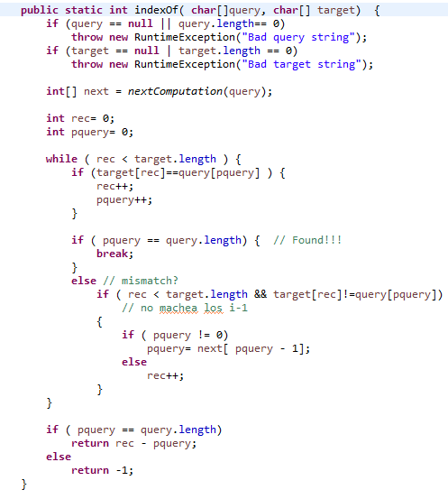

# Estructura de Datos y Algoritmos

# ITBA     2025-2

En la clase KPM implementar el método de clase indexOf que aprovecha la tabla de Next \(algoritmo Knuth\-Morris\-Pratt\)

# TP 2B- Ejer 3.1

En la clase KPM implementar el método de clase

ArrayList<Integer> findAll\(char\[\] query\, char\[\] target\)

que aprovecha la tabla de Next \(algoritmo Knuth\-MorrisPratt\) para calcular todas las posiciones donde ocurre query dentro de target

Escribir testeos correspondiente\!\!\!

# TP 2B- Ejer 4.1 y 4.2

Caso de Uso:

KPM\.findAll\(“no”\, “si no  se los digo  no  se si es  no civo”\)  debería devolver una instancia de arraylist  con las posiciones  2\, 17\, 29

KPM\.findAll\(“ni”\, “sino se los digo no se si es nocivo”\)  debería devolver un empty arraylist

¿Probaron qué pasa cuando se solapa?

Si no lo consideraron\, agregar un testeo para

Caso de Uso

System\. _out\.println_  _\( _  _KPM\.findAll_  _\(“_  _aaa_  _"\._  _toCharArray_  _\(\)\, "_  _aaabaaaaab_  _"\._  _toCharArray_  _\(\)\) \);_

// aunque se solapen debe devolver

// \[0\, 4\, 5\, 6\]

