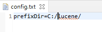

# Estructura de Datos y Algoritmos

# ITBA     2025-Q2

# TP 2-C Ejer 2

__Crear un nuevo proyecto Maven para incorporar ambos procesos\.__

# Agregar dependencias de Lucene al pom.xml

__<__  __dependency__  __>__

__            <__  __groupId__  __>__  __org\.apache\.lucene__  __</__  __groupId__  __>__

__            <__  __artifactId__  __>__   __lucene\-core__   __</__  __artifactId__  __>__

__            <__  __version__  __>7\.4\.0</__  __version__  __>__

__</__  __dependency__  __>__

__<__  __dependency__  __>__

__            <__  __groupId__  __>__  __org\.apache\.lucene__  __</__  __groupId__  __>__

__            <__  __artifactId__  __>__   __lucene\-analyzers\-common__   __</__  __artifactId__  __>__

__            <__  __version__  __>7\.4\.0</__  __version__  __>__

__</__  __dependency__  __>__

# Crear directorio lucene

Crear directorio docs dentro de lucene

Bajar de campus los archivos
                a.txt
                b.txt
                c.txt
                d.txt 
y dejarlos en el directorio docs

Para no tener sueltos en el file system a los documentos a indexar \(docs\) y a los archivos que genera el índice\, se ha decidido mantener a ambos en un directorio prefijo común\. En “docs” guardaríamos los documentos \(txt\, pdf\, a indexar\)\. En “index” los archivos del índice\.

Ej Windows:    c:/lucene/ docs  y   c:/lucene/ index

Ej: Linux/Mac

/var/lucene/ docs  y   /var/lucene/ index

# Crear archivo config.txt en resources

Además\, para no “cablear” dicho prefijo en el código Java\, vamos a utilizar un archivo de configuración donde vamos a setear en la propiedad  prefixDir  el valor prefijo que deseemos\. El archivo de configuración que estará en resources se llamará  config\.txt

Agregar al proyecto mvn el archivo   __config\.txt__   __ y setear  __   __prefixDir__   __ con el valor deseado__

Bajar de Campus   Utils\.java  y agregarla en el proyecto

Probar que la clase con alguna de las 3 opciones está OK\.  Configurar el archivo config\.txt en resources\.

Aclaración de la API

String Utils\. _getPrefixDir\(\)_

List\<String>  Utils\. _listFilesAbsolutePath\("c:/tmp"\, Arrays\.asList\("txt"\, "pdf"\)_

List\<String>  Utils\. _listFilesRelativePath\("docs"\, Arrays\.asList\("txt"\, "pdf"\)_

Nuestro primeros documentos Lucene van a estar formados por 2 campos:

TextField  => “ content ” que contiene el contenido de los archivos txt que le digamos\.

FieldType  => “ path ” que contiene el lugar físico  donde están los archivos txt\. No se busca en ellos\, solo se lo quiere almacenar en Lucene\. Idea: si consulto y Lucene me da matching quiero saber no solo que hubo X cant de documentos que matchearon sino cuáles son\. Si conozco su path\, podría desarrollar un front end que los muestre\.

Bajar de Campus el archivo  IndexBuilder \.java

Importarlo\, ejecutarlo y verificar que se genera el índice\.

No olvidar el package

# Lucene

*  _Concepto de documento\, campos\._ 
*  _Almacenamiento en Lucene: en el índice y fuera del índice_ 
*  _Aplicaciones_ 
  *  _IndexBuilder  \(creación de los documentos\)_ 
  *  _TheSearcher \(búsqueda de documentos\)_ 
* Query:
  * API
  * QueryBuilder
* Formas de separar en tokens
* Ranking de documentos

Ya estaríamos en condiciones de escribir consultas al índice\. Un término es la unidad básica que puede buscarse en un índice\.

El lenguaje para escribir consultas en Lucene tiene 2 formatos:

API Query

Query builder \(menos programática\)

__Un __  _Término Lucene _  __es una secuencia de bytes  \(podrían interpretarse como String\, números\, etc\) asociada a cierto campo\. __

*  _Concepto de documento\, campos\._ 
*  _Almacenamiento en Lucene: en el índice y fuera del índice_ 
*  _Aplicaciones_ 
  *  _IndexBuilder  \(creación de los documentos\)_ 
  *  _TheSearcher \(búsqueda de documentos\)_ 
*  _Query:_ 
  * API
  * QueryBuilder
* Formas de separar en tokens
* Ranking de documentos

_API para las queries_

1\.1 	TermQuery: busca un solo término

1\.2 	PrefixQuery: busca por prefijo

1\.3 	TermRangeQuery: busca por rangos

1\.4 	PhraseQuery

1\.5 	 WildcardQuery

1\.6 	FuzzyQuery // Damerau\-Levenshtein con MaxEdit 2

1\.7 	BooleanQuery

_Etc\.\, etc\.\,  etc\._

_API para las queries_

 _1\.1 	TermQuery: busca un solo término_ 

1\.2 	PrefixQuery: busca por prefijo

1\.3 	TermRangeQuery: busca por rangos

1\.4 	PhraseQuery

1\.5 	 WildcardQuery

1\.6 	FuzzyQuery // Damerau\-Levenshtein con MaxEdit 2

1\.7 	BooleanQuery

_Etc\.\, etc\.\,  etc\._

Haremos un búsqueda por  TermQuer y en la colección indizada\.

Lo buscamos en el field indexado\,  o sea Content\.

Bajar de Campus al archivo  TheSearcher\.java  e incorporarlo al proyecto\. Ejecutarlo\.

Explicar el resultado\.

# TP 2-C Ejer 3.1

__Term myTerm = __  __new Term\(fieldName\, queryStr\);__

# =>TermQuery

Realizar los siguiente cambios\, re ejecutar  y explicar el resultado

Cambiar   queryStr= “Game";

Cambiar   queryStr= “ga";

Volver a colocar   queryStr= “game";   y cambiar por el otro campo:  fieldName = “path";

Al terminar asegurarse que queryStr= “game";  y fieldName = “content";

Como se observa en el código\, se obtiene los docIDs relevantes y ordenados por un ranking\.

Iterando por dichos docID se puede mostrar al usuario los “stored fields” que se guardaron en Lucene \(aunque no formen parte del índice\) para indicarle qué documentos matchearon la consulta\.

__for \(ScoreDoc aD : orderedDocs\) \{__

…

// print info about finding

__	int docID= aD\.doc;__

// obtain the stored fields

Document aDoc = searcher\.doc\(docID\);

System\. _out\.println\("stored fields: " \+ aDoc\);_

_…_

_Pero también puedo invocar un método para obtener los stored fields de interés\. _

__for \(ScoreDoc aD : orderedDocs\) \{__

…

// print info about finding

__	int docID= aD\.doc;__

// obtain the stored fields

Document aDoc = searcher\.doc\(docID\);

System\. _out\.println\(aDoc\.get\("path"\)\);_

System\. _out\.println\(aDoc\.get\("content"\)\);_

_…_

__C:\\dropbox\\2021Q1\\Unidad02\\lucene\\docs\\b\.txt__

null

__¿por qué null en el segundo?__

_API para las queries_

_1\.1 	TermQuery: busca un solo término_

_1\.2 	_   _PrefixQuery: busca por prefijo_ 

1\.3 	TermRangeQuery: busca por rangos

1\.4 	PhraseQuery: busca secuencia

1\.5 	 WildcardQuery

1\.6 	FuzzyQuery // Damerau\-Levenshtein con MaxEdit 2

1\.7 	BooleanQuery

_Etc\.\, etc\.\,  etc\._

# TP 2-C Ejer 3.2

__Query query= __  __new PrefixQuery\(myTerm \);__

# =>PrefixQuery

Realizar los siguiente cambios\, re ejecutar  y explicar el resultado

Query query=  __new TermQuery\(myTerm \);__

__Por__

Query query=  __new PrefixQuery\(myTerm \);__

__Donde los casos a probar son:__

String queryStr= "game";

String queryStr= "ga";

String queryStr= “Ga";

String queryStr= "me";

