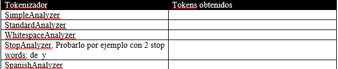

# Estructura de Datos y Algoritmos

# ITBA     2025-Q2

_API para las queries_

_1\.1 	TermQuery: busca un solo término_

_1\.2 	PrefixQuery: busca por prefijo_

 _1\.3 	TermRangeQuery: busca por rangos_ 

1\.4 	PhraseQuery: busca secuencia

1\.5 	 WildcardQuery

1\.6 	FuzzyQuery // Damerau\-Levenshtein con MaxEdit 2

1\.7 	BooleanQuery

_Etc\.\, etc\.\,  etc\._

TermRangeQuery  buscar si el “término” se encuentra en el intervalo especificado\. El mismo puede ser abierto/cerrado a izq\, abierto/cerrado a derecha:

\[ BytesRefIzq\, BytesRefDer \] :

fieldName\,  BytesRefIzq\, BytesRefDer\,  true \,  true

\( BytesRefIzq\, BytesRefDer \) :

fieldName\,  BytesRefIzq\, BytesRefDer\,  false \,  false

\[ BytesRefIzq\, BytesRefDer \) :

fieldName\,  BytesRefIzq\, BytesRefDer\,  true \,  false

\( BytesRefIzq\, BytesRefDer \] :

fieldName\,  BytesRefIzq\, BytesRefDer\,  false \,  true

# TP 2-C Ejer 3.3

__Query__  __ __  __query__  __= __

__new __  __TermRangeQuery__  __\(__  __fieldName__  __\, __  __BytesRefIzq__  __\, __  __BytesRefDer__  __\, __  __boolean__  __\, __  __boolean__  __ __  __\);__

__Or__

__Query__  __ __  __query__  __ = __  __TermRangeQuery\.newStringRange__  __\( __  __fieldName__  __\, __

__String__  __\, __  __String__  __\, __  __boolean__  __\, __  __booleab__  __ __  __\);__

# =>TermRangeQuery

Realizar los siguiente cambios\, re ejecutar  y explicar el resultado

Query query=  __new __  __TermRan;geQuery__  __\(__  __fieldName__  __\, __ BytesRefIzq\, BytesRefDer\,  boolean \,  boolean  \);

donde los  BytesRef     __se obtienen __  con new   BytesRef  \(“  string  "\)  del campo  __content__

Como alternativa:

Query q = TermRangeQuery\.newStringRange\( fieldName\, stringFrom\, stringTo\,  boolean  \,   boolean  \);

\[“gam”\, “gum”\]

\[“game”\, “game” \]   // equivalente a ????

\[“game”\, “game”\)

\[“gum”\, “gam”\]

\(“game”\, “gum”\]

\(“gaming”\, “gum”\)

_API para las queries_

_1\.1 	TermQuery: busca un solo término_

_1\.2 	PrefixQuery: busca por prefijo_

_1\.3 	TermRangeQuery: busca por rangos_

 _1\.4 	PhraseQuery: busca secuencia_ 

1\.5 	 WildcardQuery

1\.6 	FuzzyQuery // Damerau\-Levenshtein con MaxEdit 2

1\.7 	BooleanQuery

_Etc\.\, etc\.\,  etc\._

# TP 2-C Ejer 3.4

__Query query= __  __new PhraseQuery\(fieldName\, word1\, word2\, … wordN \);__

# =>PhraseQuery

Realizar los siguiente cambios\, re ejecutar  y explicar el resultado

Query query=  __new PhraseQuery\(fieldName\, word1\, word2\, … wordN \);  __

__si busco la frase: word1  word2   wordN__

Donde los casos a probar son:

Frase:  “store”  “game”

Frase:  “store\,\,”  “game”

Frase: “game” “store”

Frase: “store game”

Frase: “store\,\, game”

Frase: “game”  “review”

Frase: “game”  “video”  “game”

Frase: “game”  “video”  “review”

Pregunta:

Qué información del índice le permite a Lucene responder a las consultas por PhraseQuery?

API para las queries

1\.1 	 _TermQuery: busca un solo término_

_1\.2 	PrefixQuery: busca por prefijo_

_1\.3 	TermRangeQuery: busca por rangos_

_1\.4 _   _	_   _PhraseQuery: busca secuencia_

 _1\.5 	 WildcardQuery: busca por matching de \* o bien ?_ 

1\.6 	FuzzyQuery: Damerau\-Levenshtein con MaxEdit 2

1\.7 	BooleanQuery

Etc\.\, etc\.\,  etc\.

# TP 2-C Ejer 3.5

__Query query= __  __new WildcardQuery\(myTerm\);__

# =>WildcardQuery

Realizar los siguiente cambios\, re ejecutar  y explicar el resultado

Query query=  __new WildcardQuery\(myTerm\) __

Donde los casos a probar son:

queryStr= “g\*e”

queryStr= “g?me”

queryStr= “g?m”

queryStr= “G??e”

queryStr= “\*”

__\*__  __ representa cualquier secuencia de caracteres inclusive vacío__

__?__  __ representa un caracter cualquiera__

API para las queries

_1\.1 	TermQuery: busca un solo término_

_1\.2 	PrefixQuery: busca por prefijo_

_1\.3 	TermRangeQuery: busca por rangos_

_1\.4 _   _	_   _PhraseQuery: busca secuencia_

_1\.5 	 WildcardQuery_

 _1\.6 	FuzzyQuery: Damerau\-Levenshtein con MaxEdit 2_ 

1\.7 	BooleanQuery

Etc\.\, etc\.\,  etc\.

# TP 2-C Ejer 3.6

__Query query= __  __new FuzzyQuery\(myTerm \);  __

# =>FuzzyQuery

Pregunta:

MaxEdit es operaciones\, no similitud \(no está normalizado\)\.

¿Qué información del índice le permite a Lucene responder a las consultas por FuzzyQuery?

Realizar los siguiente cambios\, re ejecutar  y explicar el resultado\.

Query query=  __new FuzzyQuery\(myTerm \);  __

Donde los casos a probar son:

queryStr= “gno”

queryStr= “gem”

queryStr= “agem”

queryStr= “hm”

queryStr= “ham”

API para las queries

_1\.1 	TermQuery: busca un solo término_

_1\.2 	PrefixQuery: busca por prefijo_

_1\.3 	TermRangeQuery: busca por rangos_

_1\.4 _   _	_   _PhraseQuery: busca secuencia_

_1\.5 	 WildcardQuery_

_1\.6 	_  __FuzzyQuery: Damerau\-Levenshtein con MaxEdit 2__

1\.7 	BooleanQuery

Etc\.\, etc\.\,  etc\.

Las consultas no siempre son tan puntuales…

Muchas veces se necesita combinar esas características\. Inclusive entre varios campos…

Ej:  que cierta frase aparezca en el campo “content” pero que no aparezca tal término\.

Ej:  que cierta frase aparezca en el campo “content” y también tal término parezca en otro campo\.

Ej:  que empiece con tal prefijo en el campo “content” o bien se parezca en otro campo indexado\.

Sin duda\,   _BooleanQuery_   parece resolver este problema\.

Pero con API es tedioso usarlo porque hay que combinar varios constructores \(para el AND\, para el OR\, para el NOT\)\.

En vez de analizar BooleanQuery vamos a conocer la otra forma que tiene Lucene de realizar consultas sin API: QueryBuilder\!

# Lucene

*  _Concepto de documento\, campos\._ 
*  _Almacenamiento en Lucene: en el índice y fuera del índice_ 
*  _Aplicaciones_ 
  *  _IndexBuilder  \(creación de los documentos\)_ 
  *  _TheSearcher \(búsqueda de documentos\)_ 
*  _Query:_ 
  *  _API_ 
  * QueryBuilder
* Formas de separar en tokens
* Ranking de documentos

2\.	QueryBuilder para las queries

Lucene  __define un lenguaje de consulta y __ él se encarga de parsearlo y transformarlo en varias invocaciones de APIs \(las mismas que vimos antes\)\.

Resulta muy práctico\, pero para poder usarlo debemos conocer dicho lenguaje\. Si no lo respetamos\, obtenemos error en tiempo de ejecución en el parser\.

Mostraremos cada una de las invocaciones anteriores como sería con el QueryParser\.

| API | QueryBuilder |
| :-: | :-: |
| 1\.1TermQuery | fieldName:termino |
| 1\.2 PrefixQuery | fieldName:term \* |
| 1\.3 TermRangeQuery | fieldName: \{\[ start   TO   end \]\} |
| 1\.4 PhraseQuery | fieldName: “ term1 \.\.\. termN ” |
| 1\.5 WildcardQuery | fieldName: \* subterm ? |
| 1\.6 FuzzyQuery | fieldName:termino ~2 |
| 1\.7 BooleanQuery | AND  OR    NOT |

Pregunta:

Cuando con API preguntamos por TermQuery por “Game”\, ¿lo encontró? ¿Por qué?

Rta

Porque para ingresar al índice le hemos aplicado un StandardAnalizer\(\) que detectó tokens por espacios y símbolos de puntuación y además los insertó en minúsculas\.

Si la query no es igual\, no lo va a encontrar\.

Y mejor aún si usamos algún Analyzer \(como usamos en la construcción del índice\) para que pase a minúsculas\, elimine stopwords en la propia query

QueryParser qp = new QueryParser\(null\,  __new StandardAnalyzer\(\)__ \);

Antes de comenzar a usar el QueryParser\, veamos con los tipos de separación en tokens que pueden usarse…

*  _Concepto de documento\, campos\._ 
*  _Almacenamiento en Lucene: en el índice y fuera del índice_ 
*  _Aplicaciones_ 
  *  _IndexBuilder  \(creación de los documentos\)_ 
  *  _TheSearcher \(búsqueda de documentos\)_ 
*  _Query:_ 
  *  _API_ 
  *  _QueryBuilder_ 
* Formas de separar en tokens
* Ranking de documentos

Hemos usado StandardAnalyzer en la creación del índice\.

¿Qué otro analyzer podríamos usar?

¿Cómo afecta el índice y la búsqueda?

* Lucene viene con diferentes clases para separar en tokens:
* SimpleAnalyzer\(\)
* StandardAnalyzer\(\)
* WhitespaceAnalyzer\(\)
* StopAnalyzer\(\)=>
  * CharArraySet sw = StopFilter\. _makeStopSet\("de"\, "y"\);_
  * new StopAnalyzer\(sw\)\);
* EnglishAnalyzer\(\)  // opcional stop words
* SpanishAnalyzer\(\)  // opcional stop words\.
* CustomAnalyzer\(\)
* etc

__Bajar de Campus el código TestAnalyzer\.java __

__Explicamos a continuación cómo se usa\.__

# TP 2C- Ejer 4

El código sirve para ver cómo hace Lucene por dentro \(para inspeccionar la separación en tokens\)\. Como verán\, no estamos creando documentos\, solo usando un Low Level API para ver qué tokens genera\.

Probar cuáles son lo tokens que genera en cada caso\.

Pregunta:

Qué hizo SpanishAnalyzer?

Rta: busco la raíz de las palabras “stemmer algorithm”\.

C\.J\. van Rijsbergen\, S\.E\. Robertson and M\.F\. Porter\, 1980 en “ _New models in probabilistic information retrieval” propusieron un algortimo para encontrar la raíz de las palabras en idioma ingles\._

_Así los IR engine guardan menos letras y matchean más\._

_Si tienen curiosidad por el algoritmo en diferentes idiomas_

_[https://snowballstem\.org/algorithms/](https://snowballstem.org/algorithms/)_

Para usar el

CustomAnalyzer:

Analyzer analyzer = CustomAnalyzer\.builder\(\)

\.withTokenizer\("standard"\)

\.addTokenFilter\("lowercase"\)

\.addTokenFilter\("stop"\)

\.addTokenFilter\("porterstem"\)

\.build\(\);

__Vamos resolver las consultas con un __

__StandardAnalyer__  __ __  __\(para __  __tokenizar__  __ el __  __query__  __\)__

__Y un __

__QueryParser__  __ __

__Así\, ya no tenemos que invocar diferentes subclases…__

Para rehacer las queries hechas previamente con   __QueryParser__   \,  incorporar \(desde Campus\)   __TheSearcherQueryParser\.java__   __\.__

En QueryString hay que colocar la query en el Lenguaje Explicado\.

__\<dependency>__

__    \<groupId>org\.apache\.lucene\</groupId>__

__    \<artifactId>lucene\-queryparser\</artifactId>__

__    \<version>7\.4\.0\</version>__

__\</dependency>__

_Rehacer las queries realizadas con API por medio de QueryParser_

 _1\.1 	TermQuery: busca un solo término_ 

1\.2 	PrefixQuery: busca por prefijo

1\.3 	TermRangeQuery: busca por rangos

1\.4 	PhraseQuery

1\.5 	 WildcardQuery

1\.6 	FuzzyQuery // Damerau\-Levenshtein con MaxEdit 2

1\.7 	BooleanQuery

_Etc\.\, etc\.\,  etc\._

| API | QueryParser |
| :-: | :-: |
| __queryStr=__  __“game”__  __;__  __Term myTerm = new Term\(__  __“content”__  __\, queryStr\);__  __ Query query= new TermQuery\(myTerm \)__ | queryStr=" __content:__  game "; __Query__  __ __  __query__  __= __  __queryparser\.parse__  __\(__  __queryStr__  __\);__ |

Ejercicio 5\.1

Realizar los siguiente cambios\, re ejecutar  y explicar el resultado\, __ __  __donde los casos a probar son __  __los términos:__

| Valor | FieldName | El query se escribe así |
| :-: | :-: | :-: |
|  __game__  | content |  |
|  __Game__  | content |  |
|  __ga__  | content |  |
|  __game__    __\,\,__  | content |  |

_API para las queries_

_1\.1 	TermQuery: busca un solo término_

_1\.2 	_   _PrefixQuery: busca por prefijo_ 

1\.3 	TermRangeQuery: busca por rangos

1\.4 	PhraseQuery: busca secuencia

1\.5 	 WildcardQuery

1\.6 	FuzzyQuery // Damerau\-Levenshtein con MaxEdit 2

1\.7 	BooleanQuery

_Etc\.\, etc\.\,  etc\._

| API | QueryParser |
| :-: | :-: |
| __queryStr__  __=__  __“__  __ga__  __”__  __;__  __Term__  __ __  __myTerm__  __ = new __  __Term__  __\(__  __“__  __content__  __”__  __\, __ queryStr __\);__  __ __  __Query__  __ __  __query__  __= new __  __PrefixQuery__  __\(__  __myTerm__  __ \)__ | queryStr=" __content:__  ga  \* "; __Query__  __ __  __query__  __= __  __queryparser\.parse__  __\(__  __queryStr__  __\);__ |

Ejercicio 5\.2

Realizar los siguiente cambios\, re ejecutar  y explicar el resultado\,  __donde __  __los casos a probar __  __son los prefijos:__

| Valor | FieldName | El query se escribe así |
| :-: | :-: | :-: |
|  __game__    __ __  | content |  |
|  __ga__  | content |  |
|  __Ga__  | content |  |
|  __me__  | content |  |

_API para las queries_

_1\.1 	TermQuery: busca un solo término_

_1\.2 	PrefixQuery: busca por prefijo_

 _1\.3 	TermRangeQuery: busca por rangos_ 

1\.4 	PhraseQuery: busca secuencia

1\.5 	 WildcardQuery

1\.6 	FuzzyQuery // Damerau\-Levenshtein con MaxEdit 2

1\.7 	BooleanQuery

_Etc\.\, etc\.\,  etc\._

| API | QueryParser |
| :-: | :-: |
| __Query__  __ __  __query__  __ = __  __TermRangeQuery\.newStringRange__  __\(__  __"__  __content__  __"\, "__  __gaming__  __"\, "__  __gum__  __"\, false\, true \);__ | queryStr=" __content__  __:__  \{  gaming   TO   gum  \] "; __Query__  __ __  __query__  __= __  __queryparser\.parse__  __\(__  __queryStr__  __\);__ |

Ejercicio 5\.3

Realizar los siguiente cambios\, re ejecutar  y explicar el resultado\, si se busca los siguientes intervalos:

Intervalo cerrado   gam       gum

Intervalo cerrado   game      game

Intervalo cerrado izq  y abierto der   game      game

Intervalo cerrado   gum          gam

Intervalo abierto izq  y cerrado der   game      gum   

Intervalo abierto   gaming     gum

_API para las queries_

_1\.1 	TermQuery: busca un solo término_

_1\.2 	PrefixQuery: busca por prefijo_

_1\.3 	TermRangeQuery: busca por rangos_

 _1\.4 	PhraseQuery: busca secuencia_ 

1\.5 	 WildcardQuery

1\.6 	FuzzyQuery // Damerau\-Levenshtein con MaxEdit 2

1\.7 	BooleanQuery

_Etc\.\, etc\.\,  etc\._

| API | QueryParser |
| :-: | :-: |
| __Query__  __ __  __query__  __= __  __new __  __PhraseQuery__  __\(“__  __content__  __”\, __  __“store”\, “__  __game__  __”__  __\)__ | queryStr=" __content__  __:__  \\”   __store __    __game__   \\" "; __Query__  __ __  __query__  __= __  __queryparser\.parse__  __\(__  __queryStr__  __\);__ |

Ejercicio 5\.4

Realizar los siguiente cambios\, re ejecutar  y explicar el resultado

| Valor \(cada token en ese orden\) |  |  |  | FieldName | El query se esribe así |
| :-: | :-: | :-: | :-: | :-: | :-: |
|  __store__  |  |  __game__  |  | content |  |
|  __store\,\,__  |  |  __game__  |  | content |  |
|  __game__  |  |  __store__  |  | content |  |
|  __game__  |  |  __review__  |  | content |  |
|  __game__  |  __video__  |  |  __game__  | content |  |
|  __game__  |  __video__  |  |  __review__  | content |  |

API para las queries

1\.1 	 _TermQuery: busca un solo término_

_1\.2 	PrefixQuery: busca por prefijo_

_1\.3 	TermRangeQuery: busca por rangos_

_1\.4 _   _	_   _PhraseQuery: busca secuencia_

 _1\.5 	 WildcardQuery: busca por matching de \* o bien ?_ 

1\.6 	FuzzyQuery: Damerau\-Levenshtein con MaxEdit 2

1\.7 	BooleanQuery

Etc\.\, etc\.\,  etc\.

| API | QueryParser |
| :-: | :-: |
| __queryStr__  __=__  __“g__  __??e__  __”__  __;__  __Term__  __ __  __myTerm__  __ = new __  __Term__  __\(__  __“__  __content__  __”__  __\, __ queryStr __\);__  __Query__  __ __  __query__  __= new __  __WildcardQuery__  __\(__  __myTerm__  __\);__ | queryStr=" __content:__   __g__    __??__    __e__  "; __Query__  __ __  __query__  __= __  __queryparser\.parse__  __\(__  __queryStr__  __\);__ |

Ejercicio 5\.5

Realizar los siguiente cambios\, re ejecutar  y explicar el resultado

Donde los casos a probar son:

| Valor | FieldName | El query se esribe así |
| :-: | :-: | :-: |
|  __g\*e__  | content |  |
|  __g?me__  | content |  |
|  __g?m__  | content |  |
|  __G??e__  | content |  |
|  __\*__  | content |  |

API para las queries

_1\.1 	TermQuery: busca un solo término_

_1\.2 	PrefixQuery: busca por prefijo_

_1\.3 	TermRangeQuery: busca por rangos_

_1\.4 _   _	_   _PhraseQuery: busca secuencia_

_1\.5 	 WildcardQuery_

 _1\.6 	FuzzyQuery: Damerau\-Levenshtein con MaxEdit 2_ 

1\.7 	BooleanQuery

Etc\.\, etc\.\,  etc\.

| API | QueryParser |
| :-: | :-: |
| __queryStr=__  __“g__  __no__  __”__  __;__  __Term myTerm = new Term\(__  __“content”__  __\, __ queryStr __\);__  __Query query= new FuzzyQuery\(myTerm\);__ | queryStr=" __content:__   __gno~2__  "; __Query__  __ __  __query__  __= __  __queryparser\.parse__  __\(__  __queryStr__  __\);__ |

Ejercicio 5\.6

Realizar los siguiente cambios\, re ejecutar  y explicar el resultado\.

__Y con distancia 1:__

| Valor | FieldName | El query se esribe así |
| :-: | :-: | :-: |
|  __gno__  | content |  |
|  __agen__  | content |  |
|  __agem__  | content |  |
|  __hm__  | content |  |
|  __ham__  | content |  |

| Valor | FieldName | El query se esribe así |
| :-: | :-: | :-: |
|  __ham__  | content |  |

API para las queries

_1\.1 	TermQuery: busca un solo término_

_1\.2 	PrefixQuery: busca por prefijo_

_1\.3 	TermRangeQuery: busca por rangos_

_1\.4 _   _	_   _PhraseQuery: busca secuencia_

_1\.5 	 WildcardQuery_

_1\.6 	_  __FuzzyQuery: Damerau\-Levenshtein con MaxEdit 2__

1\.7 	BooleanQuery

Etc\.\, etc\.\,  etc\.

Ejercicio 5\.7  \(tarea para el hogar\)

Buscar por cualquiera de estas 2 palabras:

Buscar por ambas palabras:

content:s  tore  content:game

content:store OR content: game

content:store || content:game

content:store   &&   content: game

content:store AND content: game

Ejercicio 5\.8

Son equivalentes estas expresiones?:

content:review OR \(content:game AND NOT content:yo\)

\(content:review OR content:game\) AND NOT content:yo

Explicar resultados

__Aclaración__

Si todas las query se hacen sobre el mismo fieldName puede especificarse una sola vez \(un default\)

En vez de :

__String__  __ __  __queryStr__  __= "__   __content__   __:game__  __ AND __   __content__   __:store__  __";__

__QueryParser__  __ __  __queryparser__  __ = new __  __QueryParser__  __\(__  __null__  __\, new __  __StandardAnalyzer__  __\(\) \);__

__Query__  __ __  __query__  __= __  __queryparser\.parse__  __\(__  __queryStr__  __\);__

Escribimos:

__String__  __ __  __queryStr__  __= "__  __game__  __ AND store";__

__QueryParser__  __ __  __queryparser__  __ = new __  __QueryParser__  __\("__   __content__   __"\, new __  __StandardAnalyzer__  __\(\) \);__

__Query__  __ __  __query__  __= __  __queryparser\.parse__  __\(__  __queryStr__  __\);__

