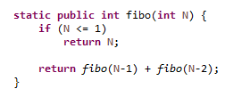
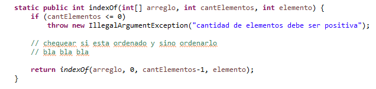
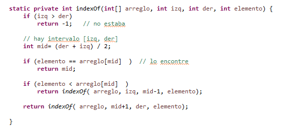
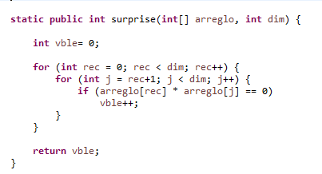
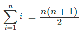
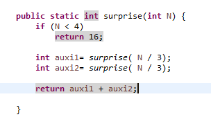
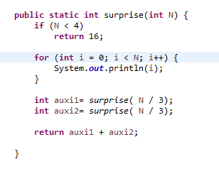

# Estructura de Datos y Algoritmos

# ITBA     2025-Q2

# Buscando apariciones…

Cuando se busca una/múltiples apariciones de un elemento en un conjunto\, se puede proceder de diferentes formas:

Dejar la colección como está e ingeniárselas para navegar en ella\. Ese fue el caso de los algoritmos Naïve y de KMP\. En ese caso\, el “texto” es una colección de caracteres y no se modifica para que no se pierda su semántica\.

Generar una estructura auxiliar\, llamada  _índice_ \,  que facilite la búsqueda\. Ese fue el caso del  _archivo_  _ _  _invertido_ \. Los documentos no se modifican para que no pierda su semántica\, pero se crea un  _índice_  _\. S_ e busca sobre dicho  _índice_  _\. _ Si la búsqueda resulta exitosa en él\, entonces se llega al documento\.

# Algoritmos sobre índices

Siendo el índice la estructura auxiliar que se utiliza para encontrar un elemento\, entonces la  __búsqueda__  __ __  __sobre__  __ la __  __mismo__  __ __  __debe__  __ __  __ser__  __ __  __muy__  __ __  __eficiente__ \.

Índice \(definición\)

Estructura de datos que facilita la búsqueda \(lookup\)\.

Un índice está compuesto por elementos que representan la información que indizan\.

Caso de uso 1: documentos para search engine\. La colección de documentos contiene

¿Qué tiene el índice \(archivo invertido\)?

 __MapReduce__    __ es una técnica distribuida__ 

 __Divide y Triunfarás es una técnica__ 

 __EDA es una materia importante__ 

Caso de uso 1: documentos para search engine\. La colección de documentos contiene

 __MapReduce__    __ es una técnica distribuida__ 

 __Divide y Triunfarás es una técnica__ 

 __EDA es una materia importante__ 

__una__

__técnica__

…

__EDA__

Clave de búsqueda \(key\)

_<doc1\.txt_  _\, doc2\.txt\, doc3\.txt_ >

_<doc1\.txt_  _\, doc2\.txt_ >

…

_<doc3\.txt_ >

Información asociada\. Puede estar en RAM o \(si es mucha\) indicará cómo llegar a la información en disco

Caso de uso 2: La colección contiene “alumnos” \(opaco\)

¿Qué tiene el índice si quiero buscar por “l __egajo__ ”?

 __58622__ 

 __Ana Garcia__ 

 __20__ 

 __agarcia@gmail\.com__ 

 __58333__ 

 __Pablo __    __Conte__ 

 __19__ 

 __pconte@gmail\.com__ 

 __45382__ 

 __Leo Nilo__ 

 __20__ 

 __lnilo@gmail\.com__ 

Caso de uso 2: La colección contiene “alumnos”

 __58622__ 

 __Ana Garcia__ 

 __20__ 

 __agarcia@gmail\.com__ 

 __58333__ 

 __Pablo __    __Conte__ 

 __19__ 

 __pconte@gmail\.com__ 

 __45382__ 

 __Leo Nilo__ 

 __20__ 

 __lnilo@gmail\.com__ 

58622

58333

…

45382

Clave de búsqueda \(key\)

<58622\, Ana Garcia\, 20\, [agarcia@gmail\.com](mailto:agarcia@gmail.com)>

<58333\, Pablo Conte\, 19\, [pconte@gmail\.com](mailto:pconte@gmail.com)>

…

<45382\, Leo Nilo\, 20\, [lnilo@gmail\.com](mailto:lnilo@gmail.com)>

Información asociada\. Puede estar en RAM o \(si es mucha\) indicará cómo llegar a la información en disco

Caso de uso 2: La colección contiene “alumnos” \(opaco\)

¿Qué tiene el índice si quiero buscar por “ __edad__ ”?

 __58622__ 

 __Ana Garcia__ 

 __20__ 

 __agarcia@gmail\.com__ 

 __58333__ 

 __Pablo __    __Conte__ 

 __19__ 

 __pconte@gmail\.com__ 

 __45382__ 

 __Leo Nilo__ 

 __20__ 

 __lnilo@gmail\.com__ 

Clave repetida manejada sin compactar

Caso de uso 2: La colección contiene “alumnos” \(opaco\)

 __58622__ 

 __Ana Garcia__ 

 __20__ 

 __agarcia@gmail\.com__ 

 __58333__ 

 __Pablo __    __Conte__ 

 __19__ 

 __pconte@gmail\.com__ 

 __45382__ 

 __Leo Nilo__ 

 __20__ 

 __lnilo@gmail\.com__ 

20

19

…

20

Clave de búsqueda \(key\)

<58622\, Ana Garcia\, 20\, [agarcia@gmail\.com](mailto:agarcia@gmail.com)>

<58333\, Pablo Conte\, 19\, [pconte@gmail\.com](mailto:pconte@gmail.com)>

…

<45382\, Leo Nilo\, 20\, [lnilo@gmail\.com](mailto:lnilo@gmail.com)>

Información asociada\. Puede estar en RAM o \(si es mucha\) indicará cómo llegar a la información en disco

Clave repetida manejada con compactación

Caso de uso 2: La colección contiene “alumnos” \(opaco\)

 __58622__ 

 __Ana Garcia__ 

 __20__ 

 __agarcia@gmail\.com__ 

 __58333__ 

 __Pablo __    __Conte__ 

 __19__ 

 __pconte@gmail\.com__ 

 __45382__ 

 __Leo Nilo__ 

 __20__ 

 __lnilo@gmail\.com__ 

20

19

…

Clave de búsqueda \(key\)

<58622\, Ana Garcia\, 20\, [agarcia@gmail\.com](mailto:agarcia@gmail.com)>\,…\,<45382\, Leo Nilo\, 20\, [lnilo@gmail\.com](mailto:lnilo@gmail.com)>

<58333\, Pablo Conte\, 19\, [pconte@gmail\.com](mailto:pconte@gmail.com)>\,\.\.\.

…

Información asociada\. Puede estar en RAM o \(si es mucha\) indicará cómo llegar a la información en disco

# Características de Indices

La clave de búsqueda puede o no tener repetidos\. Si es única no tiene sentido hablar de compactación\. Si puede repetirse\,  podremos tener la info asociada compactada o no\.

La clave de búsqueda debe permitir  buscar rápidamente la info adicional\.

Ahora bien\, el índice no sólo se utiliza para “buscar puntualmente”\. Hay otras operaciones  __necesarias__  __ __ sobre él\. ¿Cúales?

Búsqueda =>obvio\, para ello se lo construye\.

Inserción=>el índice debe reflejar los datos de la colección\. O sea\, si inserto un documento en la colección\, preciso que el índice lo refleje\.

Borrado=> el índice debe reflejar los datos de la colección\. O sea\, si borro un documento en la colección\, preciso que el índice lo refleje

Y más también\.

¿Qué estructura de las que conocen podría ser buena para representar un índice?   __Supongamos__  __ que __  __los__  __ __  __repetidos__  __ no se __  __compactan__  __ __  __y que hay __  __espacio__  __ __  __prealocado__  __ __  __suficiente__  __ __  __para las __  __inserciones__  __\.__

Rta

|  | Búsqueda | Inserción | Borrado |
| :-: | :-: | :-: | :-: |
| Arreglo \(cualquiera\, desordenado\) |  | __  _ \(los agrego al final\)_ |  |
| Arreglo ordenado por clave de búsqueda | __ |  |  |
| Hashing | _?_ | _?_ | _?_ |

Formalicemos esa clasificación… Calculemos compejidad temporal en cada caso \(asumimos  __que __  __hay __  __espacio__  __ __  __prealocado__  __ __  __suficiente__  __ para las __  __inserciones__  __\)__

El problema del arreglo es que tiene que garantizar contiguidad de sus elementos\.

El problema del hashing es si tiene que resolver colisiones\. Si no tiene colisiones es O\(1\)\, pero es ideal…

Los 3 casos se penalizan si “se acaba el espacio prealocado”

Pareciera que hashing es un escenario propicio para un índice\.

Pero\, ¿Cómo se comportaría si también precisamos las siguientes típicas operaciones de un índice:

Búsqueda     por     rangos \.

Devolver   el   máximo  /  mínimo     elemento

Ej: buscar los alumnos que tienen legajos entre 1000 y 2000\.

Ej: cuál es la máxima edad?

No hay estructuras de datos perfectas\. Dependen de los casos de uso necesarios…

En general los objetivos se contraponen y hay que buscar un trade\-off\.

Como nada es perfecto\, vamos a comenzar analizando el comportamiento de los  __arreglos__  __ __  __ordenados__  __ __  __por__  __ clave de __  __búsqueda__ …

# Arreglos ordenados

Busco el 34

| 2 | 8 | 10 | 15 | 17 | 21 | 28 |
| :-: | :-: | :-: | :-: | :-: | :-: | :-: |

| 30 | 34 | 42 | 50 | 60 | 62 | 70 |
| :-: | :-: | :-: | :-: | :-: | :-: | :-: |

| 30 | 34 | 42 | 50 | 60 | 62 | 70 |
| :-: | :-: | :-: | :-: | :-: | :-: | :-: |

| 30 | 34 | 42 |
| :-: | :-: | :-: |

¿Cómo calcular complejidades en algoritmos recursivos?

En Pgm imperativa y POO han usado la técnica de programación  __Divide y Triunfarás \(Divide and __  __Conquer__  __\)__ :

La solución de un problema de tamaño de entrada N se  __divide en problemas de tamaño menor __ hasta que la solución es trivial\. Finalmente\,  __se combinan los resultados parciales __ para dar solución al problema original\.

Típicamente\, puede plantearse con un algoritmo recursivo\.

¿Ejemplos?

Los números de Fibonacci para  N >= 0

N 				si  N <= 1

Fibo\(N\) =

Fibo\(N\-1\) \+ Fibo\(N\-2\) 	si N > 1

# Teorema Maestro

Invocación recursiva que divide en subproblemas

Combinación de soluciones parciales

El Teorema Maestro es una herramienta muy útil para resolver recurrencias\.

Ejemplo 1: ¿Se podrá aplicar a Fibonacci?

N 				si  N <= 1

Fibo\(N\) =

Fibo\(N\-1\) \+ Fibo\(N\-2\) 	si N >= 1

Rta\. Times\(N\) = Times\(N\-1\) \+ Times\(N\-2\) \+ 4

Times\(N\)= Times\(N\-1\) \+ Times\(N\-2\) \+ 4

¿Cuáles son las constantes a\, b\, c\, y d? ¿Qué caso aplica? ¿Cuál es la complejidad O grande?

No\.  No hay  b>= 1 que divida N/b\. Tenemos que buscar otra forma de calcular su complejidad temporal

En general\, la  __Técnica Divide y Triunfarás __ procede de la siguiente forma:

Divide el problema en subproblemas de un  __mismo tamaño__ \.

Resuelve cada subproblema en forma independiente\, por recursión

Combina los resultados parciales para dar solución final\.

Cuando esto ocurre\, puede aplicarse el  __Teorema Maestro__ \.

Ejemplo 2: ¿Se podrá aplicar a  __búsqueda binaria__  en arreglo ordenado?

Podríamos comenzar garantizando que todo llega bien al algoritmo de búsqueda binaria\, pero el cálculo lo tenemos que aplicar al algoritmo recurrente	 \(no acá\):

La parte recurrente podría programarse así:

O sea\, Times\(N\)=  Times\(N/2\)   \+  6

2 recursiones excluyentes\.

El tamaño se divide a la mitad

¿Cuáles son las constantes a\, b\, c\, y d? ¿Qué caso aplica? ¿Cuál es la complejidad O grande?

Rta: a= 1 \(parte recursiva son invocaciones excluyentes\)\, b= 2 \(divido por la mitad\)\,  c \(no cuenta\) y d = 0 \(no depende de N afuera de la recursión\)

O sea\, Times\(N\)=  Times\(N/2\)   \+  6

Hay otra alternativa al Master Theorem: el Algoritmo de Expansión recursiva\.

Otra forma de encontrar la complejidad del algoritmo recursivo para búsqueda binaria:

Otra forma de encontrar la complejidad del algoritmo recursivo para búsqueda binaria:

Otra forma de encontrar la complejidad del algoritmo recursivo para búsqueda binaria:

Times\(N/2\)            \+ 6

Otra forma de encontrar la complejidad del algoritmo recursivo para búsqueda binaria:

Times\(N/2\)            \+ 6

Times\(N/4\)            \+  6

Otra forma de encontrar la complejidad del algoritmo recursivo para búsqueda binaria:

Times\(N/2\)            \+ 6

Times\(N/4\)            \+  6

Times\(N/8\)            \+ 6

………

Otra forma de encontrar la complejidad del algoritmo recursivo para búsqueda binaria:

Times\(N/2\)            \+ 6

Times\(N/4\)            \+  6

Times\(N/8\)            \+ 6

Otra forma de encontrar la complejidad del algoritmo recursivo para búsqueda binaria:

Times\(N/2\)            \+ 6

Times\(N/4\)            \+  6

Times\(N/8\)            \+ 6

Ahora bien\, ese cálculo lo hemos realizado partiendo de Times\(N\)\.

O sea\, que lo importante es saber calcular Times\(N\) a partir de código\.

__Para __  __el cálculo __  __de Times\(N\):__

Cuando el código es  __no\-recursivo__  miramos las invocaciones\, ciclos  \(paralelos vs anidados\)\, etc\.

Si el código es  __recursivo__  hay que considerar la cantidad de invocaciones realizadas también\.

Ejemplo de un código no recursivo \(aca a N lo llamé dim\)

Ejercicio

Sea el siguiente código

Times\(N\) =	 2 \* Times\(N/3\) \+ 4       si N >= 4

1   		           si  N < 4

Times\(N\) =	 2 \* Times\(N/3\) \+ 4          si N >= 4

1   		           si  N < 4

Ejercicio \(variante\)

Sea el siguiente código

Times\(N\) =	 2 \* Times\(N/3\) \+ O\(N\)            si N >= 4

1   		               si  N < 4

Times\(N\) =	 2 \* Times\(N/3\) \+ O\(N\)          si N >= 4

1   		           si  N < 4

Resumiendo

Existen diferentes formas de calcular complejidad\.

Hay que calcular correctamente Times\(N\)\.

Para el caso concreto de las recurrentes:

Si aplican las condiciones\, podemos aplicar Teorema Maestro

Se puede expandir el árbol de invocaciones\.

Etc\.

