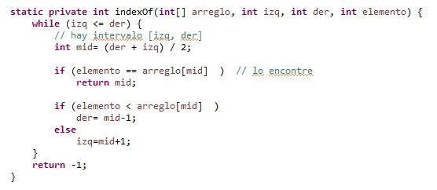
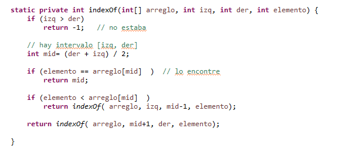
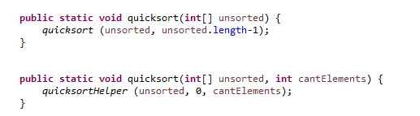
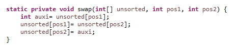
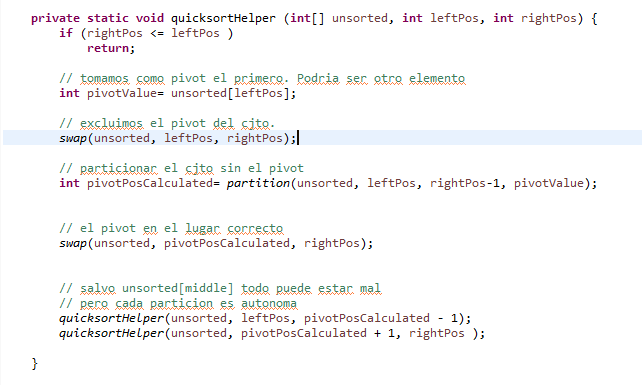
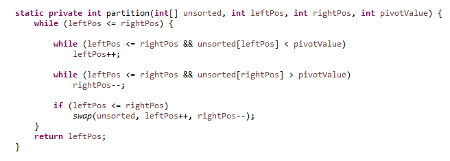

# Estructura de Datos y Algoritmos

# ITBA     2025-Q2

En búsqueda binaria hablamos del cálculo de complejidad temporal para algoritmos recurrentes\.

Ahora bien\, la búsqueda binaria puede implementarse en forma recursiva \(la que vimos\) o iterativa\.

Es decir\, indexOf\(\) de 4 parámetros puede ser recursiva o iterativa

Versión recursiva

Versión iterativa

Versión recursiva

Versión iterativa

¿Cuál es la complejidad temporal de la versión iterativa de búsqueda binaria?

Rta: ???

Si la versión iterativa y la recursiva tiene la misma complejidad temporal\, habrá alguna ventaja de una frente a otra?

Rta\.

???

Si la versión iterativa y la recursiva tiene la misma complejidad temporal\, habrá alguna ventaja de una frente a otra?

Rta\.

Sí\. En la complejidad espacial\.

Calculemos\.

¿Cuál es la complejidad espacial de la versión iterativa de búsqueda binaria?

Rta: ???

¿Cuál es la complejidad espacial de la versión iterativa de búsqueda binaria?

Rta: O\(1\)

¿Cuál es la complejidad espacial de la versión recursiva de búsqueda binaria? ¿Cuántos stack frames se generan? ¿Cuánto espacio se reserva dentro?

Rta: ???

Discusión

En nuestra implementación del índice precisamos de un arreglo ordenado\. Invocamos el Arrays\.sort\(\) de java\.

Analicemos qué métodos hay para ordenar arreglos\.

# Ordenación de Arreglos

__Método__  __ “__  __Quicksort__  __”__

Opera  _in\-place\._

Aplica la técnica Divide & Conquer\.

Puede implementarse recursivamente o iterativamente\.

Particiona en sub arreglos\.

En cada sub\-arreglo elige un pivot y ordena para que todos los elementos a la izquierda del pivot sean menores que él y los de la derecha sean mayores que él => el pivot está en la posición correcta\.

Si un sub\-arreglo tiene  0 o 1 elemento\, está ya ordenado \(no continua\) => fin de la recurrencia

Ejemplo: tomando como pivote primer elemento

Pivot “34”

| 34 | 10 | 8 | 60 | 21 | 17 | 28 |
| :-: | :-: | :-: | :-: | :-: | :-: | :-: |

| 30 | 2 | 70 | 50 | 15 | 62 | 42 |
| :-: | :-: | :-: | :-: | :-: | :-: | :-: |

Ejemplo: tomando como pivote primer elemento

Pivot “34”

Particiona la lista \<= 34 y >34  \(o bien \<34 y >=34\)

| 34 | 10 | 8 | 60 | 21 | 17 | 28 |
| :-: | :-: | :-: | :-: | :-: | :-: | :-: |

| 30 | 2 | 70 | 50 | 15 | 62 | 42 |
| :-: | :-: | :-: | :-: | :-: | :-: | :-: |

Ejemplo: tomando como pivote primer elemento

Pivot “34”

Particiona la lista \<= 34 y >34  \(o bien \<34 y >=34\)

El único que está seguro en el lugar es el 34\!

Ahora hacer lo mismo con las 2 sub\-arreglos por separado

| 34 | 10 | 8 | 60 | 21 | 17 | 28 |
| :-: | :-: | :-: | :-: | :-: | :-: | :-: |

| 30 | 2 | 70 | 50 | 15 | 62 | 42 |
| :-: | :-: | :-: | :-: | :-: | :-: | :-: |

| 10 | 8 | 21 | 17 | 28 | 30 | 2 |
| :-: | :-: | :-: | :-: | :-: | :-: | :-: |

| 15 | 34 | 60 | 70 | 50 | 62 | 42 |
| :-: | :-: | :-: | :-: | :-: | :-: | :-: |

Para la lista derecha: pivot 60

Particiona la lista derecha\<= 60 y >60  \(o bien \<60 y >=60\)

| 10 | 8 | 21 | 17 | 28 | 30 | 2 |
| :-: | :-: | :-: | :-: | :-: | :-: | :-: |

| 15 | 34 | 60 | 70 | 50 | 62 | 40 |
| :-: | :-: | :-: | :-: | :-: | :-: | :-: |

Para la lista derecha: pivot 60

Particiona la lista derecha\<= 60 y >60  \(o bien \<60 y >=60\)

Ahora también el 60 está en su lugar\.

Ahora hacer lo mismo con las 2 sub\-arreglos por separado\.

| 10 | 8 | 21 | 17 | 28 | 30 | 2 |
| :-: | :-: | :-: | :-: | :-: | :-: | :-: |

| 15 | 34 | 60 | 70 | 50 | 62 | 40 |
| :-: | :-: | :-: | :-: | :-: | :-: | :-: |

| 10 | 8 | 21 | 17 | 28 | 30 | 2 |
| :-: | :-: | :-: | :-: | :-: | :-: | :-: |

| 15 | 34 | 50 | 40 | 60 | 62 | 70 |
| :-: | :-: | :-: | :-: | :-: | :-: | :-: |

| 10 | 8 | 21 | 17 | 28 | 30 | 2 |
| :-: | :-: | :-: | :-: | :-: | :-: | :-: |

| 15 | 34 | 50 | 40 | 60 | 62 | 70 |
| :-: | :-: | :-: | :-: | :-: | :-: | :-: |

| 10 | 8 | 21 | 17 | 28 | 30 | 2 |
| :-: | :-: | :-: | :-: | :-: | :-: | :-: |

| 15 | 34 | 50 | 40 | 60 | 62 | 70 |
| :-: | :-: | :-: | :-: | :-: | :-: | :-: |

| 10 | 8 | 21 | 17 | 28 | 30 | 2 |
| :-: | :-: | :-: | :-: | :-: | :-: | :-: |

| 15 | 34 | 40 | 50 | 60 | 62 | 70 |
| :-: | :-: | :-: | :-: | :-: | :-: | :-: |

| 10 | 8 | 21 | 17 | 28 | 30 | 2 |
| :-: | :-: | :-: | :-: | :-: | :-: | :-: |

| 15 | 34 | 40 | 50 | 60 | 62 | 70 |
| :-: | :-: | :-: | :-: | :-: | :-: | :-: |

| 10 | 8 | 21 | 17 | 28 | 30 | 2 |
| :-: | :-: | :-: | :-: | :-: | :-: | :-: |

| 15 | 34 | 40 | 50 | 60 | 62 | 70 |
| :-: | :-: | :-: | :-: | :-: | :-: | :-: |

| 10 | 8 | 21 | 17 | 28 | 30 | 2 |
| :-: | :-: | :-: | :-: | :-: | :-: | :-: |

| 15 | 34 | 40 | 50 | 60 | 62 | 70 |
| :-: | :-: | :-: | :-: | :-: | :-: | :-: |

| 10 | 8 | 21 | 17 | 28 | 30 | 2 |
| :-: | :-: | :-: | :-: | :-: | :-: | :-: |

| 15 | 34 | 40 | 50 | 60 | 62 | 70 |
| :-: | :-: | :-: | :-: | :-: | :-: | :-: |

Así siguiendo\. Finalmente todos quedan ordenados\.

Implementar  __version __  __recursiva__  __ __ “quicksort”\, para la version int\[\]\.

Chequear su correctitud\.

Calcular la complejidad espacial y temporal para el peor y mejor caso\.

Posible implementación\.

Implementar método Partition\. Tiene que resolverse con complejidad espacial O\(1\)

Es decir\, en ese arreglo el pivot 34\.

Lo mandamos al fondo y lo excluimos hasta saber a dónde va\. Invocamos a Partition sin el último\.

Al volver de la invocación del 0\.\.7 los \<=34\, del 8\.\.12 los >34

| 34 | 10 | 8 | 60 | 21 | 17 | 28 |
| :-: | :-: | :-: | :-: | :-: | :-: | :-: |

| 30 | 2 | 70 | 50 | 15 | 62 | 42 |
| :-: | :-: | :-: | :-: | :-: | :-: | :-: |

| 42 | 10 | 8 | 60 | 21 | 17 | 28 |
| :-: | :-: | :-: | :-: | :-: | :-: | :-: |

| 30 | 2 | 70 | 50 | 15 | 62 | 34 |
| :-: | :-: | :-: | :-: | :-: | :-: | :-: |

|  |  |  |  |  |  |  |
| :-: | :-: | :-: | :-: | :-: | :-: | :-: |

|  |  |  |  |  |  | 34 |
| :-: | :-: | :-: | :-: | :-: | :-: | :-: |

Implementar método Partition\. Tiene que resolverse con complejidad espacial O\(1\)

Es decir\, en ese arreglo el pivot 34\.

Lo mandamos al fondo y lo excluimos hasta saber a dónde va\. Invocamos a Partition sin el último\.

Al volver de la invocación del 0\.\.7 los \<=34\, del 8\.\.12 los >34

| 34 | 10 | 8 | 60 | 21 | 17 | 28 |
| :-: | :-: | :-: | :-: | :-: | :-: | :-: |

| 30 | 2 | 70 | 50 | 15 | 62 | 42 |
| :-: | :-: | :-: | :-: | :-: | :-: | :-: |

| 42 | 10 | 8 | 60 | 21 | 17 | 28 |
| :-: | :-: | :-: | :-: | :-: | :-: | :-: |

| 30 | 2 | 70 | 50 | 15 | 62 | 34 |
| :-: | :-: | :-: | :-: | :-: | :-: | :-: |

|  |  |  |  |  |  |  |
| :-: | :-: | :-: | :-: | :-: | :-: | :-: |

|  |  |  |  |  |  | 34 |
| :-: | :-: | :-: | :-: | :-: | :-: | :-: |

En pos=8 tendría que estar el 34

Posible solución

Calculando Complejidad Temporal de Quicksort

¿Cuál es el peor caso?

Rta ???

¿Se puede aplicar el Master Theorem para el peor caso?

Rta ???

Calculando Complejidad Temporal de Quicksort

¿Cuál es el peor caso?

Rta Que esté todo ordenado\!\!\!

¿Se puede aplicar el Master Theorem para el peor caso?

Rta

No\. Hay 2 invocaciones recursivas pero no en partes iguales\.

Quicksort está diseñado para\,  _en_  _ el _  _mejor_  _ de _  _los_  _ _  _casos_ \, tener listas de tamaño mitad en cada iteración\. Si eso se lograra\, entonces

La complejidad del algoritmo recursivo para mejor caso :

Times\(N/2\) \+    N/2

Times\(N/2\) \+    N/2

Times\(N/2\) \+    N/2

Times\(N/2\) \+    N/2

Times\(N/4\)\+N/4

Times\(N/4\)\+N/4

Times\(N/4\)\+N/4

Times\(N/4\)\+N/4

Times\(N/2\) \+    N/2

Times\(N/2\) \+    N/2

Times\(N/4\)\+N/4

Times\(N/4\)\+N/4

Times\(N/4\)\+N/4

Times\(N/4\)\+N/4

Times\(N/8\)

\+N/8

Times\(N/8\)

\+N/8

Times\(N/8\)

\+N/8

Times\(N/8\)

\+N/8

Times\(N/8\)

\+N/8

Times\(N/8\)

\+N/8

Times\(N/8\)

\+N/8

Times\(N/8\)

\+N/8

………    …………… …………\. ………\. ………\. …………\. ………\. ……\.  ………\.\.

Times\(1\) Times\(1\)  ……………\. Times\(1\) Times\(1\)  ………\.   …………\. …\.       …  Times\(1\) Times\(1\)

Times\(N/2\) \+    N/2

Times\(N/2\) \+    N/2

Times\(N/4\)\+N/4

Times\(N/4\)\+N/4

Times\(N/4\)\+N/4

Times\(N/4\)\+N/4

Times\(N/8\)

\+N/8

Times\(N/8\)

\+N/8

Times\(N/8\)

\+N/8

Times\(N/8\)

\+N/8

Times\(N/8\)

\+N/8

Times\(N/8\)

\+N/8

Times\(N/8\)

\+N/8

Times\(N/8\)

\+N/8

………    …………… …………\. ………\. ………\. …………\. ………\. ……\.  ………\.\.

Times\(1\) Times\(1\)  ……………\. Times\(1\) Times\(1\)  ………\.   …………\. …\.       …  Times\(1\) Times\(1\)

¿Qué pinta tiene lo que se hace en cada paso?

Times\(N/2\) \+    N/2

Times\(N/2\) \+    N/2

Times\(N/4\)\+N/4

Times\(N/4\)\+N/4

Times\(N/4\)\+N/4

Times\(N/4\)\+N/4

Times\(N/8\)

\+N/8

Times\(N/8\)

\+N/8

Times\(N/8\)

\+N/8

Times\(N/8\)

\+N/8

Times\(N/8\)

\+N/8

Times\(N/8\)

\+N/8

Times\(N/8\)

\+N/8

Times\(N/8\)

\+N/8

………    …………… …………\. ………\. ………\. …………\. ………\. ……\.  ………\.\.

Times\(1\) Times\(1\)  ……………\. Times\(1\) Times\(1\)  ………\.   …………\. …\.       …  Times\(1\) Times\(1\)

¿Qué pinta tiene lo que se hace en cada paso?

Times\(N/2\) \+    N/2

Times\(N/2\) \+    N/2

Times\(N/4\)\+N/4

Times\(N/4\)\+N/4

Times\(N/4\)\+N/4

Times\(N/4\)\+N/4

Times\(N/8\)

\+N/8

Times\(N/8\)

\+N/8

Times\(N/8\)

\+N/8

Times\(N/8\)

\+N/8

Times\(N/8\)

\+N/8

Times\(N/8\)

\+N/8

Times\(N/8\)

\+N/8

Times\(N/8\)

\+N/8

………    …………… …………\. ………\. ………\. …………\. ………\. ……\.  ………\.\.

Times\(1\) Times\(1\)  ……………\. Times\(1\) Times\(1\)  ………\.   …………\. …\.       …  Times\(1\) Times\(1\)

¿Cómo mejorar a quicksort para que cuando venga casi ordenado no de tan mal?

Rta

????

¿Cómo mejorar a quicksort para que cuando venga casi ordenado no de tan mal?

Rta

Cambiar el Pivot\. Ej: tomar el elemento del medio\, un elemento random\, tomar la mediana de 3 elementos candidatos predeterminados\, etc\.

Complejidad espacial?

Rta

???

Complejidad espacial?

Rta

En el peor caso\, debido a los stackframes tenemos

O\(N\)

En el mejor caso\, debido a los stackframes tenemos

O\(log2 N\)

Complejidad espacial?

Rta

En el peor caso\, debido a los stackframes tenemos

O\(N\)

En el mejor caso\, debido a los stackframes tenemos

O\(log2 N\)

Tarea:

Buscar algoritmo Mergesort\, estudiarlo por cuenta de uds\.  e implementarlo \(puede ser el que no opera in situ\)

Analizar complejidad espacial y temporal\.

Tarea:

Usa Java alguno de esos métodos?

¿Qué complejidad tiene?

Por cuenta de Uds\, terminar el ejer 3\.

# TP 3A- Ejer 3

