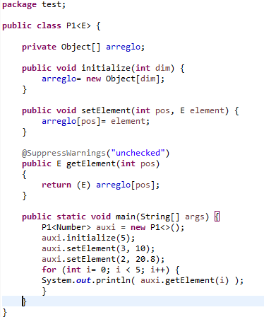
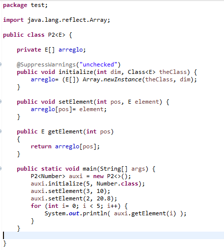
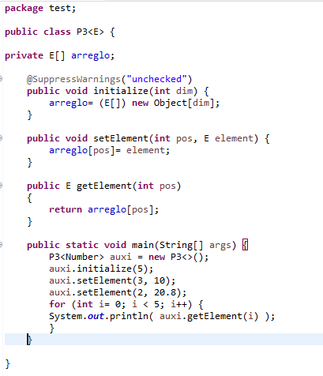
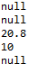

# Estructura de Datos y Algoritmos

# ITBA     2025-Q2

Java es un lenguaje estáticamente tipado => 	hay que declarar el tipo de una variable antes de usarla\.

Sin Generics\, los casteos son una posibilidad de errores que se detectan en tiempo de ejecución\.

Ej:

List v =  __new __  __ArrayList__  __\(\);__

v\.add\("test"\);

Integer i = \(Integer\)v\.get\(0\);  //   Runtime     Exception  \!

Ej: sin casteos\, también podemos tener RuntimeException\. Los arreglos en Java sin Generics son covariantes => puedo poner elementos de  un subitpo\.

Object\[\] elems =  __new __  __String__  __\[2\];__

elems\[0\] = "hi";

elems\[1\] = 100;     //   RuntimeException  \!

En Java hay que declarar el tipo de una variable antes de usarla\.

Con la introducción de Java Generics ese “tipo” puede parametrizarse\. Generics esta pensado para parametrizar y minimizar errores\.

Técnicamente hablando\,  __Generics__  __ fue implementado usando la Técnica de __  __Erasure__  __\.__

La técnica consiste en reemplazar todo tipo de parámetro con su “bound/restricción” y si no lo hay lo reemplaza por Object\.

De ser necesario realiza casteos\.

Ej:

public class P\<T> \{

public void method\(T p\) \{

…

\}

\}

Ej:

public class P<T extends Comparable\<T>> \{

public void method\(T   p\)

\{

…

\}

\}

\<T> is unbound => Object

\<T> is bound => Comparable

En Java los Generics son invariantes => no se puede asignar un subtipo generics a un supertipo generics

__Ej__  __: ni compila__

ArrayList<Integer> ints =  __new __  __ArrayList__  __<__  __Integer__  __>\(\); __

List<Number> numbers  =    _ints_    _; _ 

__Ej__  __: ni __  __compila__

__public__  __ __  __class__  __ P\<T> \{__

\.\.\}

__public static void main\(String\[\] __  __args__  __\) \{__

P<Integer> myi =  __new P<__  __Integer__  __>\(\);__

P<Number> myp  =    _myi_   _;_

\}

Hay muchas restricciones que se establecieron al diseñar en Java Generics y Erasure\. Leer

[https](https://docs.oracle.com/javase/tutorial/java/generics/restrictions.html)[://](https://docs.oracle.com/javase/tutorial/java/generics/restrictions.html)[docs\.oracle\.com/javase/tutorial/java/generics/restrictions\.html](https://docs.oracle.com/javase/tutorial/java/generics/restrictions.html)

Ej: no puede un built\-in sustituir un tipo paramétrico

Ej: NO puedo crear dinámicamente un arreglo de tipo paramétrico \(en tiempo de ejecución\) porque su tipo no se conoce ya que en compilación se hizo erasure\.

Ej: Probar

__public__  __ __  __class__  __ P\<T> \{__

__	__  __private__  __ __  __T\[\] arreglo= new T\[10__  __\];__

_\}_

__Ej__  __: Probar__

__public__  __ __  __class__  __ P\<T> \{__

__	__  __private__  __ __  __T\[\] arreglo;__

__	__  __public__  __ __  __void__  __ __  __initialize__  __\(__  __int__  __ __  __dim__  __\) \{__

arreglo=  __new T\[__  __dim__  __\];__

__	\}__

\}

* __Solución opción 1:  guardar un arreglo de __  __Objects__  __ \(no T\)\. Castear cuando sea necesario\.__
* __Escribamos entre todos la clase P\<E>__
* public class  P\<E>  \{
* private     Object  \[\] arreglo ;
* public void initialize\(int dim\) \{
  * …
* \}
* public void setElement\(int pos\,  Eelement \) \{
  * …
* \}
* public  E  getElement\(int pos\)
* \{
* …
* \}
* \}

Caso de Uso:

P<Number> auxi =  __new P<>\(\);__

auxi\.initialize\(5\);

auxi\.setElement\(3\, 10\);

auxi\.setElement\(2\, 20\.8\);

__for \(int i= 0; i < 5; i\+\+\) \{__

System\. _out\.println_  _\( _  _auxi\.getElement_  _\(i\) \);_

\}

* __Solución opción 2:  Usar __  __reflection__
* __Escribamos entre todos la clase P\<T>__
* public class  P\<T>  \{
* private     T\[\]   arreglo ;
* public void initialize\(int dim\,  Class  \<T>   theClass \) \{
  * …
* \}
* public void setElement\(int pos\,  T element \) \{
  * …
* \}
* public  T  getElement\(int pos\)
* \{
* …
* \}
* \}

Caso de Uso:

P<Number> auxi =  __new P<>\(\);__

auxi\.initialize\(5\,  Number\.class \);

auxi\.setElement\(3\, 10\);

auxi\.setElement\(2\, 20\.8\);

__for \(int i= 0; i < 5; i\+\+\) \{__

System\. _out\.println_  _\( _  _auxi\.getElement_  _\(i\) \);_

\}

Solución 3\. Crear un arreglo de un tipo conocido \(que soporte todos\) y castear

__public__  __ __  __class__  __ __  __PObjectToT__  __\<E> __  __\{__

__ __  __   __  __private__  __ __   __E\[\]__   __ __  __arreglo;__

@SuppressWarnings\("unchecked"\)

__   __  __public__  __ __  __void__  __ __  __initialize__  __\(__  __int__  __ __  __dim__  __\) \{__

…

\}

__public void setElement\(int pos\, __  __E __  __element\) \{__

__…__

\}

__public__  __ __  __E __  __getElement__  __\(__  __int__  __ pos\) \{__

…

\}

\}

Caso de Uso:

P<Number> auxi =  __new P<>\(\);__

auxi\.initialize\(5\);

auxi\.setElement\(3\, 10\);

auxi\.setElement\(2\, 20\.8\);

__for \(int i= 0; i < 5; i\+\+\) \{__

System\. _out\.println_  _\( _  _auxi\.getElement_  _\(i\) \);_

\}

Qué pasa si en esas 3 opciones cambiamos

__public__  __ __  __class__  __ __  __PCasoN__  __\<E> \{__

__Por__

__public__  __ __  __class__  __ __  __PCasoN__  __<E __  __extends__  __ Comparable\<E> \{__

__Explicar…__

Implementarlo el  Indice con Generics:

Sin reflection:

__IndexWithParametricArray\_Case1\.zip__

Con reflection:

__IndexWithParametricArray\_Case2\.zip__

# TP 3A- Ejer 4

Cambiar int por generics\. Implementar el índice con esta versión de interface:

__package__  eda;

__public__   __interface__  IndexParametricService <T  __extends__  Comparable<?  __super__  T>>\{

// elements serán los valores del índice\, los anteriores se descartan

// lanza excepction si elements is null o si alguno de los elementos del

// arreglo proporcionado son null

__      __  __void__  initialize\(T \[\] elements\);

// busca una key en el índice\, O\(log2 N\)

__     __  __boolean__  search\(T key\);

// inserta el key en pos correcta\. Crece automáticamente de a chunks\.

// si el valor proporcionado es null\, ignora el pedido\.

__      __  __void__  insert\(T key\);

// borra el key si lo hay\, sino lo ignora\.

// decrece automáticamente de a chunks

__ __  __     __  __void__  delete\(T key\);

// devuelve la cantidad de apariciones de la clave especificada\.

__int__  occurrences\(T key\);

// devuelve un nuevo arreglo ordenado con los elementos que pertenecen

// al intervalo dado por leftkey y rightkey\.  Si el mismo es abierto/cerrado depende

// de las variables leftIncluded  y rightIncluded\. True indica que es cerrado\. El valor

// devuelto será un arrego de length 0 si no hay elementos que satisfagan al condicion

T\[\] range\(T leftKey\, T rightKey\,  __boolean__  leftIncluded\,  __boolean__  rightIncluded\);

// imprime el contenido del índice ordenado por su key

__ __  __void__  sortedPrint\(\);

// devuelve el máximo elemento del índice o null si no hay elementos

T getMax\(\);

// devuelve el mínimo elemento del índice o null si no hay elementos

T getMin\(\);

\}

Caso de Uso con Reflection:

IndexParametricService<Integer>  myIndex=  __new __  __IndexWithDuplicates__  __<>\(__  __Integer\.class__  __\);__

Integer\[\] rta = myIndex\.range\(10\, 50\,  __true\, true\);__

myIndex\.initialize\(  __new Integer\[\] \{100\, 50\, 30\, 50\, 80\}\);__

rta = myIndex\.range\(10\, 50\,  __true\, true\);__

IndexParametricService<String>  anIndex=   __new  __  __IndexWithDuplicates__  __<>\(__  __String\.class__  __\);__

String\[\] rta2 = anIndex\.range\("hola"\, "tal"\,  __true\, true\);__

anIndex\.initialize\(  __new String\[\] \{"__  __hola__  __"\, "ha"\, "__  __sii__  __" \}\);__

rta2 = anIndex\.range\("a"\, "b"\,  __true\, true\);__

rta2 = anIndex\.range\("a"\, "quizas"\,  __true\, true__  __\);__

