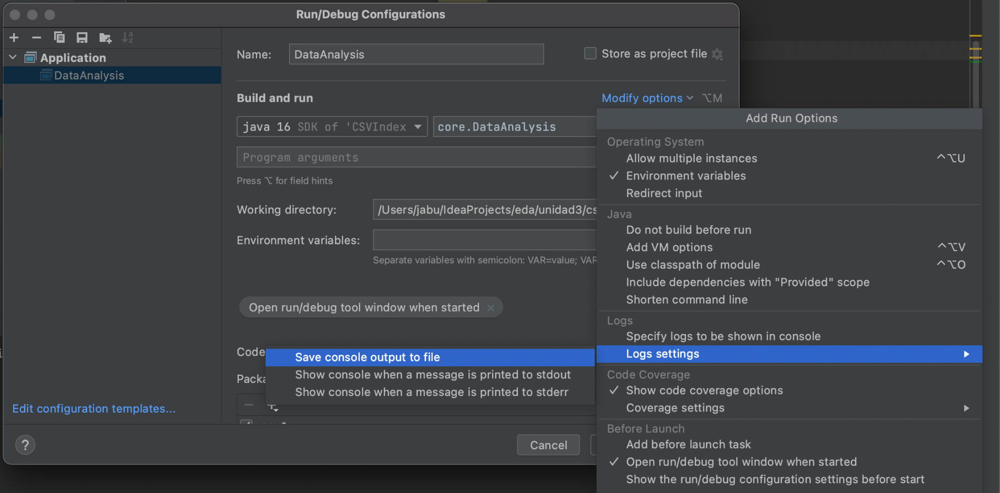
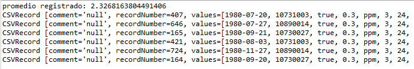

# Estructura de Datos y Algoritmos

# ITBA     2025-2

El código para leer un csv con header\, a través de esta biblioteca podría ser así\. Bajar de campus   __DataAnalyis\.java__  y verificar que se obtiene el dump correcto\.

__public class DataAnalysis \{__

__public static void main\(String\[\] args\) throws IOException \{__

//  _leemos el archivo_

//    URL resource = DataAnalysis\.class\.getClassLoader\(\)\.getResource\("co\_1980\_alabama\.csv"\);

URL resource= DataAnalysis\. __class\.getResource\("/co\_1980\_alabama\.csv"\);__

Reader in =  __new FileReader\(resource\.getFile\(\)\);__

Iterable\<CSVRecord> records = CSVFormat\. _DEFAULT_

\.withFirstRecordAsHeader\(\)

\.parse\(in\);

//  _imprimimos los registros con todos sus valores_

__for \(CSVRecord record : records\) \{__

String value = record\.get\("daily\_max\_8\_hour\_co\_concentration"\);

System\. _out\.println\(String\.format\("%s\, %s"\, value\, record\.toString\(\)\)\);_

\}

in\.close\(\);

\}

Qué sucede si colocamos otro iterador a continuación?

La variable “records” es una colección accesible?

Si lo que queremos realizar frecuentemente es:

Buscar el promedio de la polución registrada\.

Imprimir ascendentemente la info disponible\, pero ordenada por polución\.

Averiguar si existió una polución cuyo valor fuera 2\.8

Buscar el valor numérico de la mínima polución registrada\.

Buscar la info disponible en que se dio la mínima polución registrada

Conocer qué valores numéricos de polución se registraron entre \[3\.65\, 3\.84\]

Conocer la info disponible en la que la polución registrada fue entre \[3\.65\, 3\.84\)

Conocer la info disponible en la que la polución registrada fue \[10\.5\, 12\]

En cuál/cuáles de esas operaciones conviene hacerlo por medio del Index y no analizando los datos tal cual vienen?

Sobre cuál de los campos definiríamos el orden del índice?

RTA:

Sobre el campo: "daily\_max\_8\_hour\_co\_concentration"

Como funcionan los índices en colecciones de datos?

Consideraciones

La  __colección de datos __ \(en este caso la línea del csv\) tienen muchísimas componentes\, pero sólo sobre unas pocas de ellas se quiere realizar búsquedas por rango\, etc\.

Algunas operaciones son favorecidas por búsqueda binaria \(imprimir ordenado\, rango\, etc\)\. La  __colección de datos__  no puede ordenarse simultáneamente por diferentes campos\. O está ordenada por polución o está ordenada por fecha\, etc\. Como la colección tiene muchísimas componentes “duplicar”\, “triplicar”\, la información es costoso\.

Pero si creamos una estructura auxiliar con la mínima información necesaria para llegar a ella? Esa información  __tiene que favorecer las operaciones __ que esperamos y puede permitir resolver sólo con ella algunas consultas o llevarnos sólo hacia los elementos esperados \(los que satisfacen la consulta\) en la colección de datos grande => INDICE

Un índice favorece las operaciones solo sobre la CLAVE DE BUSQUEDA\.

__Colección de datos desordenada__

__Rowid \+ registro__

__Índice sobre Polución__

__valorPolucion \+ rowid__

__Índice sobre Fecha__

__mes \+ rowid__

# Caso de uso

__Índice sobre Polución__

__2  __   __   __   55555

__3  __   __    __   99999

__100 __   __ 1__ 

__350  __  2

__Colección de datos desordenada__

1  __        100\,   Oct 2020\,……………\.__

2   __ __   __       350\,   May 2020\, …………\.\.__

__……………………………………\.__

55555  __    2\,   May 2020\,…………\.\.__

__……………………………………__

99999  __    3\,  Feb 2021\,……………__

__Índice sobre Mes__

__Feb  __   __   __   99999

__May  __   __  __   2

__May   __  55555  __ __

__Oct     __   __1__ 

La colección de datos\, según lo que estamos pretendiendo hacer con ella\, ¿En qué tipo de colección Java la podríamos guardar?

Rta

Solo quiero hacer búsqueda puntual\!

Si estuviéramos seguros que los rowid son consecutivos podría ser un arreglo

De no estar seguros\, podría ser un Hashing\.

Para implementar esos requerimientos\, modificaremos DataAnalysis:

Bajar de campus la clase  __IdxRecord\.java__   que nos permite representar un Registro\<T1\, T2> donde T1 es el key de ordenamiento\. Lo demás es la info que queremos asociar\. Pueden agregarle métodos\.

Resolver cada una de los requerimientos\.

Cada ítem del índice va a guardar dos valores:

la key por la que ordenamos y un valor adicional asociado\.

Preparar los datos para las consultas

// coleccion de valores

HashMap<Long\, CSVRecord> datos=  __new __  __HashMap__  __<>\(\);__

// indice sobre polucion o los que deseemos

IndexParametricService<IdxRecord<Double\, Long>> indexPolucion=

__new __  __IndexWithDuplicates__  __<>\(__  _IdxRecord\.class_  __\);__

// coleccion de datos

__for__  __ \(__  __CSVRecord__  __ record : records\) \{__

// insertamos en la colección y en indice

COMPLETAR\!\!\!\!

\}

CONSULTAS\!\!\!\!

Detalles de implementación

__CSVRecord__  provee el método  __getRecordNumber\(\)__

Recordar que en el HashMap van los datos completos asociados a un id

mientras que en el índice va el valor por el que quiero buscar asociado al id\.

Recordar insertar en el  __Hashmap__  y en el  __índice__

Si los datos son muchos\, puede que la consola nos muestre solo los últimos valores\. Si quieren\, redireccionen la salida\, por ejemplo en un archivo dentro de resources:

Caso de Uso: Averiguar si existió una polución cuyo valor fuera 2\.8

…

Se puede usar solo el índice?

Preciso también de datos?

…

__Debería dar True__

Caso de Uso: Buscar el valor numérico de la mínima polución registrada

…

Se puede usar solo el índice?

Preciso también de datos?

…

Caso de Uso: Buscar el valor numérico de la mínima polución registrada e imprimir de ese mínimo TODA la información asociada

…

Se puede usar solo el índice?

Preciso también de datos?

…

__Deberían obtener 6 registros con ese valor__

Caso de Uso: Imprimir los valores de polución ordenados ascendentemente\.

Se puede usar solo el índice?

Preciso también de datos?

…\.

__Deberían aparecer los valores numéricos almacenados desde 0\.3 hasta el 9\.5__

Caso de Uso: Imprimir TODA la info pero ascendentemente ordenada por polución

Se puede usar solo el índice?

Preciso también de datos?

…\.

__Deberían aparecer los registros ordenados por los valoers de polucion __

__ desde 0\.3 hasta el 9\.5__

Caso de Uso: Conocer qué valores numéricos de polución se registraron entre \[3\.65\, 3\.84\]

…

Se puede usar solo el índice?

Preciso también de datos?

…

__Deberían obtener 3\.7__

__3\.7__

__3\.8__

__3\.8__

__3\.8__

Si las consultas que queremos realizar frecuentemente son:

Si en la Latitud  34\.68776113  hay sensores instalados;

Imprimir los valores de latitudes donde hay sensores instaladas\, ordenadas ascendentemente;

Imprimir la info donde los valores de las latitudes es mínima;

etc\.

En qué campo habría que crear el index?

__Rta: en el campo “site\_latitude”__

