# Estructura de Datos y Algoritmos

# ITBA     2025-Q2

# Solución a otros problemas

Más allá de la problemática de los “índices”\, existen otros problemas que requieren de estructuras de datos sencillas \(que podrían implementarse con un arreglo o una lista\)\.

Analicemos algunos de esos problemas\.

# Orden de llegada…

El concepto de búsqueda de un elemento nos llevó a la idea de precisar un índice para facilitar la búsqueda\.

Pero si no precisamos “buscar” elementos? Es más\, si ni siquiera precisamos compararlos entre sí?

Existe otro “orden” de elementos que tienen que ver con el momento en que se generan los datos o su orden de llegada\.

# Problemas

__Ejemplo__  __ 1:  __  __Editores__

Los editores de texto permiten realizar operaciones: copy\, paste\, move\, etc\.  y afortunadamente los avanzados permiten “deshacer” las últimas acciones realizadas\. Permiten “arrepentirse” e inspeccionar la herramienta\.

¿Qué estructura auxiliar

nos permite implementar

esta característica?

Rta:   Pila \(Stack o LIFO\)

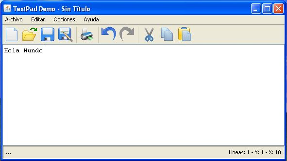

__Ejemplo__  __ 2: Runtime execution__

Cuando en tiempo de ejecución de invoca a un método se utiliza el stack del runtime para almacenar: parámetros\, variables locales y dirección de retorno\.   Esto también pasa en recursión\.

Existen algoritmos que son ideales para programar en forma recursiva\.

Si un lenguaje de programación no dispone de recursión\, y el algoritmo es de naturaleza recursiva\. ¿Qué podemos hacer?

__Rta__  __:  __ usar un Stack para solucionar esa dificultad\.

__Ejemplo__  __: __  __Chequeos__  __ de __  __compilación__

Los lenguajes precisan de ciertos chequeos sintácticos\. Tal es el caso de las expresiones matemáticas\. En ellas\, los operadores que utilizamos presentan diferente “precedencia” la cual puede cambiarse con tal de usar “paréntesis”\.

Si bien los paréntesis pueden anidarse todo lo que querramos\, deben aparearse correctamente\.

¿Cómo pueden resolverse los chequeos sintácticos de ese tipo?

Rta: Con una PILA

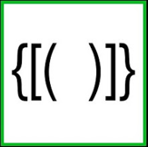

# Stack

Definición Stack/LIFO/Pila

Colección de datos ordenada por orden de llegada\. La única forma de acceso es por medio  de un elemento distinguido: TOPE que es el ultimo elemento que llegó\.

Las operaciones que debe ofrecer son:

__push__ : agrega un elemento a la colección y se convierte en el nuevo tope\.

__pop__ : quita un elemento de la colección y cambia el tope de la pila\. Es una operación destructiva y solo puede usarse si la colección no está vacía\.

__isEmpty__ : devuelve true/false segun la colección tenga o no elementos

__peek__ : devuelve el elemento tope pero sin removerlo\. Es una operación de lectura y solo puede usarse si la colección no está vacía\.

# Stack: su implementación

¿Puede implementarse con un arreglo? ¿Con una lista lineal simplemente encadenada? ¿Tiene sentido usar una lista lineal doblemente encadenada?

# Stack

Si se lo implementara con un arreglo\. ¿Tenemos el problema de “movimiento de datos”?

Rta: la contiguedad está garantizada\. Nunca quedarían huecos internos y no haría falta mover elementos para garantizar contigüidad ya que las operaciones solo se acceden por el TOPE\.

Sin embargo\, si se acaba el espacio sí debemos buscar espacio contiguo en otro lugar y copiar componentes\.

Es decir\, nos conviene hacer crecer/decrecer la estructura de a “chunks”\.

|  |  |  |  |  |  |  |
| :-: | :-: | :-: | :-: | :-: | :-: | :-: |

Si se lo implementara con una lista lineal simplemente encadenada\. ¿Tenemos el problema de navegación?

Rta: No\. Los elementos en el Stack solo se acceden por el tope\. Es solo cuestión de “apuntar“ el tope al elemento conveniente\. Es decir\, el primer elemento de la lista\. Así\, jamás tenemos que recorrer para push/pop\.

|  |
| :-: |

|  |
| :-: |

|  |
| :-: |

|  |
| :-: |

Java viene equipada con una clase para el Stack\.

[https://](https://github.com/AdoptOpenJDK/openjdk-jdk14u/blob/master/src/java.base/share/classes/java/util/Stack.java)[github\.com/AdoptOpenJDK/openjdk\-jdk14u/blob/master/src/java\.base/share/classes/java/util/Stack\.java](https://github.com/AdoptOpenJDK/openjdk-jdk14u/blob/master/src/java.base/share/classes/java/util/Stack.java)

Analizar el código y discutir:

Cómo está implementada internamente

Desde el punto de vista de OOP\, ¿es correcto de dónde extiende comportamiento? ¿Por qué?

Este código\, según Java\, compilaría y ejecutaría\. ¿Tiene sentido?

public static void main\(String\[\] args\) \{

__Stack__ \<String> myStack =  __new Stack__ <>\(\) __;__

myStack\. __push__ \("copy 1"\);

myStack\. __push__ \("paste 1"\);

myStack\. __push__ \("move 1"\);

myStack\. __push__ \("move 2"\);

myStack\. __push__ \("move 3"\);

myStack\. __add__ \(3\, "copy 2"\);

myStack\. __forEach__ \(System\. __out::println\);__

\}

Realmente en Java se cometió un importante error de diseño\.

La implementación correcta de la clase Stack es encapsulando una  __LinkedList__  \(o arreglo\)\. No especializando alguno de ellos…

public class  __Stack__ \<T> \{

private  __LinkedList__ \<T> data =  __new__   __LinkedList__ <>\(\);

public void  __push__ \(T v\) \{ data\. __addFirst__ \(v\); \}

public T  __peek__ \(\) \{ return data\. __getFirst__ \(\); \}

public T  __pop__ \(\) \{ return data\. __removeFirst__ \(\); \}

public boolean  __isEmpty__ \(\) \{ return data\. __isEmpty__ \(\); \}

\}

Faltaría mejorar el manejo de excepciones… \(que no aparezcan excepciones de LinkedList\)\.

Caso de Uso: Evaluador de expresiones

Una expresión es una combinación de operadores y operandos\. En esta discusión vamos a considerar un subconjunto de operadores:  solo binarios\.

Las expresiones se pueden clasificar según la notación que utilizan:

__prefija__ : el operador se encuentra  _antes_  de los operandos sobre los que aplica

__infija__ : el operador se encuentra  _entre_  los operandos sobre los que aplica

__postfija__ : el operador se encuentra  _detrás_  de los operandos sobre los que aplica\.

Ej:  ¿Cómo es la notación que usamos en general en expresiones aritméticas?

__Rta__  __:__  Infija

10 \+ 3 \- 100

Dados 2 operandos A y B\, el operador binario \* puede tener las siguientes posibilidades:

| Prefija | Infija | Postfija | Prefija Inversa | Infija Inversa | Postfija Inversa |
| :-: | :-: | :-: | :-: | :-: | :-: |
| \* A B | A \* B | A B \* | \* B A | B \* A | B A \* |

El problema con la evaluación de una expresión infija es que existen ambigüedades cuando dos operadores tienen la misma precedencia\. ¿ Por ejemplo?

Rta  10  \-  2  \-  3  ¿Cómo se evalúa?

Algo así debe resolverse con asociatividad\. Pero se complica más aún cuando aparecen paréntesis que cambian las prioridades\.

En las notaciones prefija y postfija el uso de paréntesis es innecesario debido a que el orden de los operadores determina el orden  real de las operaciones en la evaluación de expresiones\.

Algoritmo para evaluar una expression que ya esté en notación postfija:

Cada operador en una expresión postfija se refiere a los operandos previos en la misma\.

Cuando aparece un operando hay que postergarlo porque no se puede hacer nada con él hasta que no llegue el operador\, y como la notación es postfija el operador va a llegar después\. Por lo tanto cada vez que se encuentre un operando la acción a tomar es “ __pushearlo” en una pila__

Cuando aparezca un operador en la expresión implica que llegó el momento de aplicárselo a los operandos que lo preceden\, por lo tanto se deben “ __popear” los dos elementos más recientes de la pila__  \, aplicarles el operador y volver a dejar el resultado en la pila porque dicho valor puede ser operando para otra subexpresión \(al resultado habrá que aplicársele el próximo operador que aparezca\)\.

Cuando se termine de analizar al expresión de entrada el resultado de su evaluación es el único valor que quedó en la  __pila__ \.

¿Es un buen diseño elegir una pila para implementar este algoritmo?

Rta

Obviamente    sí\,  porque como se observó la única forma de acceso a la estructura de datos fue a través de su tope\.

Jamás se necesitó navegar por dentro de la estructura en busca de otras componentes\. Siempre se respetó el orden de llegada de los elementos a la estructura\. Nada mejor que una pila para esto\.

_Ejemplo:_

Supongamos que tenemos la expresión postfija   __ __

__3  10  \+   2  \- 5  4 \*  \-__

\(que corresponde a la infija: \(3 \+ 10\) \- 2 \- 5 \* 4  \)

El algoritmo funciona así:

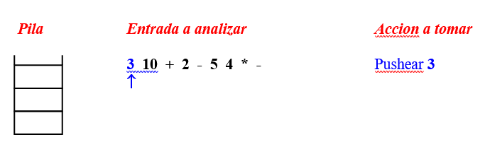

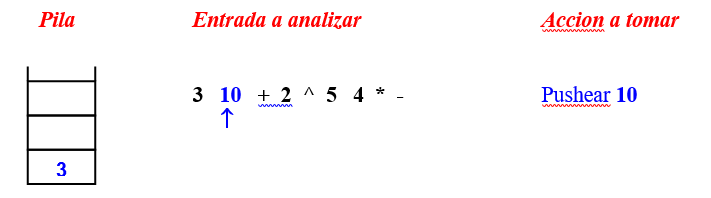

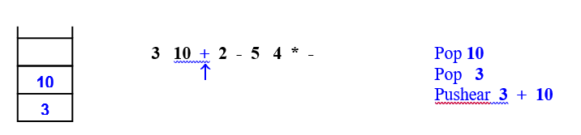

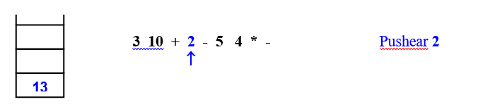

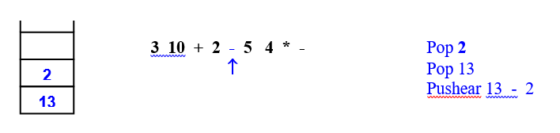

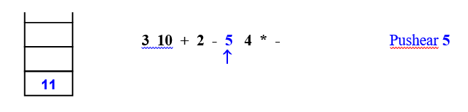

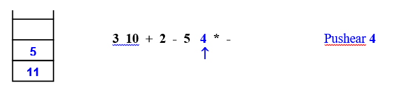

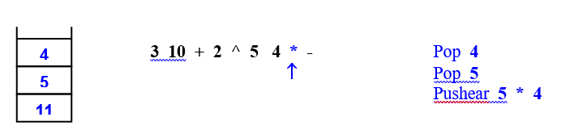

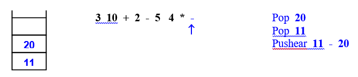

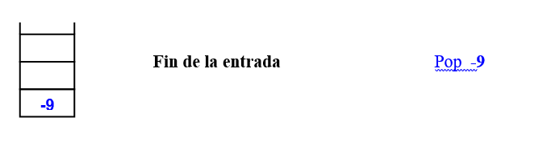

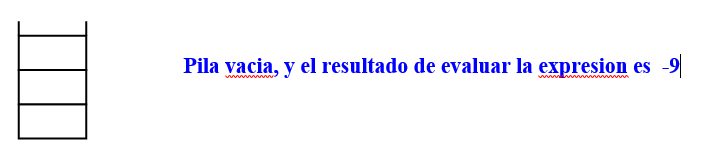

Como funciona el algoritmo para evaluar en postfija?

Seguimiento gráfico en papel \(snapshot instante a instante de qué hace el algoritmo\)

# TP 3B- Ejer 2(2.2  y  2.3)

2\.2\) Mostrar paso a paso como se analiza el input\, se utiliza la pila y se evalúa la siguiente expresión postfija:

2    \-0\.1   \+   10    2  \*  /

Rta dibujito en pizarrón y valor devuelto 0\.095

_Ejercicio_

¿A qué expresión infija correspondía?

Rta    \(2  \+  \-0\.1\)   /  \(10  \*  2 \)

# |

2\.3\) Mostrar paso a paso como se analiza el input\, se utiliza la pila y se evalúa la siguiente expresión postfija:

\-9   \-1   \-   10    2  \*  /   1    5   \-   2    \-3    /    /    \*

Rta dibujito en pizarrón y valor devuelto \-2\.4

_Ejercicio_

¿A qué expresión infija correspondía?

Rta    \(\(\-9  \-  \-1\)   /  \(10  \*  2 \)\) \*  \( \(1  \-  5\)   /  \(2  /    \-3\) \)

Acá tenemos 2 subproblemas:

Cómo parsear un string de entrada para separarlo en tokens válidos \(dónde terminan los números y los operadores\)

La evaluación en sí de la expresión postfija\. Eso incluye el manejo de errores\.

Si nuestros operadores admitidos son \+  \-   \*   /

Proponer cuáles serían expresiones inválidas y explicar qué tipo de excepción debería lanzarse en cada caso\.

Rta:   3   \-  4      es inválida porque el – espera un operando previo

Rta:   0\.2   3   ?  Es inválida porque el ? No es operador válido

Rta:   4   3  1  \-  4  Es inválida porque faltan operadores

Empecemos analizando qué clase Java me simplifica el análisis de tokens…

La clase  __Scanner __ permite leer de estandar input/archive/string  información\,  indicarle cuáles son los separadores y navegar por sus tokens \(iterador\)\.

Probar el siguiente código que toma una línea de la  __entrada __  __estándard__  __ __ que termina con \\n\. A ese primer scanner lo llamamos   inputScanner \.

Luego usa otro scanner sobre la línea previamente leida y la tokeniza separando en espacios \(blancos\, tabulador\, etc\)\. Ese segundo scanner lo llamamos  lineScanner

__public static void main\(String\[\] __  __args__  __\) \{ __

__ __  __    // primer scanner: __  __separador__  __ enter__

Scanner  inputScanner  =   __new Scanner\(System\.in\)\.__    __useDelimiter__    __\("\\\\n"\);__ 

System\. __out\.print__  __\("Introduzca la expresión en notación postfija: "\);__

String line =  inputScanner\.next  ;  //  _si_   _usan_  nextLine\(\) no  _poner_  \\\\r

// segundo scanner: separador espacios sobre el anterior

Scanner   __lineScanner__    __ __   =    __new Scanner\(line\)\.__    __useDelimiter__    __\("\\\\s\+"\);__ 

__    __  __while__  __\(__   __lineScanner__   __\.hasNext__  __\(\)\)__

System\. __out\.println__  __\(__   __lineScanner\.next__    __\(\)__   __\);__

\}

Podemos chequearlo con una expresión regular\. En este caso\, la enumeración de opciones válidas se escriben separadas por un pipe\.

String token =  lineScanner\.next\(\);

System\.out\.println\(token\);

if \(token\.matches\(" ¡\! | \, | ; | \#\# "\) \)

System\.out\.println\("OK:“: token \);

else

System\.out\.println\("invalid: " \+ token\);

__Agregar__  __ __  __este__  __ __  __chequeo__  __ al __  __código__  __ anterior y __  __ver__  __ que __  __valida__  __ __  __correctamente__

Ejercicio

Modificar el código anterior para que acepte un token más:   ¿?

Chequearlo con expresiones válidas e inválidas\. ¿Funciona correctamente?

Rta:

Así funciona mal if \(token\.matches\("¿?|¡\!|\,|;|\#\#"\) \) porque el símbolo “?” es metasímbolo y significa opcionalidad

La forma correcta es escaparlo:

if \(token\.matches\("¿\\\\?|¡\!|\,|;|\#\#"\) \)

