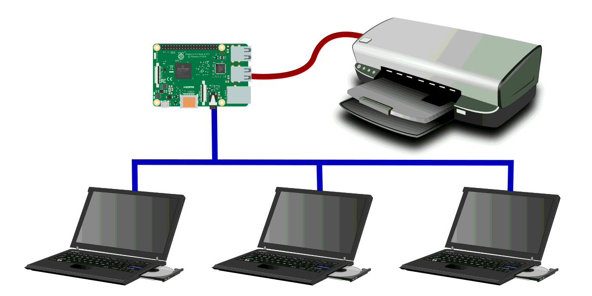
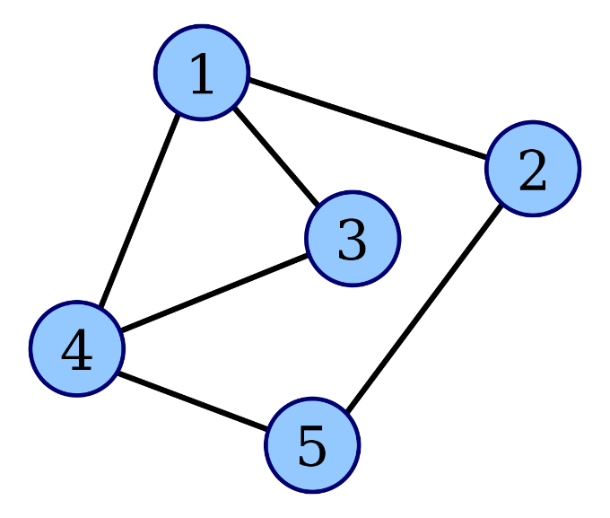

# Estructura de Datos y Algoritmos

# ITBA     2025-Q2

# Problemas

__Ejemplo 1:  Recursos compartidos__

Hay un único recurso \(impresora\) y múltiples clientes que llegan asincrónicamente y precisan usarlo \. A medida que el único recurso se libera\, puede tomar otro pedido\.

¿Qué estructura auxiliar

nos permite implementar

esta característica?

__Cola de impresión__

__Pista de aterrizaje/pista de despegue__

__Ejemplo 2: Múltiples Recursos compartidos__

Similar al anterior\, pero con múltiples recursos compartidos  __administrados centralizadamente__ \. Ej: una solo lugar para acceder a las múltiples cajas para cobrar\.

¿Qué estructura auxiliar

nos permite implementar

esta característica?

__Ejemplo: Algoritmos en Grafos__

Algoritmos como BFS precisan estructuras auxiliares para posponer  los momentos de procesamiento mientras se visitan los elementos del grafos\.

¿Qué estructura auxiliar

nos permite implementar

esta característica?

__Ejemplo: Pipes__

Un Pipe es un mecanismo para comunicar 2 procesos donde un proceso escribe en el pipe y otro proceso lee la información en el orden en que fue escrita\, en forma secuencial\. Ambos procesos abren su canal de comunicación en ambos extremos simultáneamente\. Son procesos independientes \(asincrónicos\) con su propia velocidad \(de producción o lectura\) por eso se precisa de una estructura auxiliar\.

¿Qué estructura auxiliar

nos permite implementar

esta característica?

# Ejemplo

En Linux\, si tengo 2 archivos a\.txt y b\.txt

__hola que tal__

__adios__

En Linux\, si tengo 2 archivos a\.txt y b\.txt

$  cat  \*\.txt

__hola que tal__

__adios__

__hola que tal__

__adios__

__No se__

En Linux\, si tengo 2 archivos a\.txt y b\.txt

$  cat  \*\.txt | wc \-l

__hola que tal__

__adios__

En Linux\, si tengo 2 archivos a\.txt y b\.txt

$  cat  \*\.txt | grep "hola"

__hola que tal__

__adios__

En Linux\, si tengo 2 archivos a\.txt y b\.txt

$  cat  \*\.txt | grep "hola" | wc \-c

__hola__  __ que __  __tal__

__adios__

# Queue

__Definición__

__Colección de datos ordenada por orden de llegada\. La única forma de acceso es por medio  de dos elementos distinguidos: FIRST indica cuál es el más antiguo de los elementos de la colección y tiene prioridad para salir\, y LAST marca el elemento más reciente que ha llegado a la colección__

Las operaciones que debe ofrecer son:

__queue\(element\)__ : agrega un elemento a la colección conviertiéndolo en el más reciente o sea\, se convierte en el nuevo LAST\.

__deque\(\)__ : quita el elemento más antiguo de la colección \(FIRST\) y cambia el FIRST\. Es una operación destructiva y solo puede usarse si la colección no está vacía\.

__peek\(\)__ : devuelve el element más antiguo de la colección \(FIRST\) sin removerlo \(sin cambiar el FIRST\)\. No es destructiva\. Solo puede usarse si la colección no está vacía\.

__isEmpty\(\)__ : devuelve true/false según la colección tenga o no elementos\.

__size\(\):__  \(opcional\) devuelve la cantidad de elementos de la colección y es ideal para estimar cuánto hay que esperar por ser atendido\.

myQueue\.queue\(A\)

myQueue\.queue\(B\)

myQueue\.queue\(C\)

myQueue\.dequeue\(\) → A

myQueue\.peek\(\) → B

# Queue: su implementación

¿Puede implementarse con una lista simplemente encadenada? ¿ Con un arreglo?

# Lista

Opción 1: Si la estructura subyacente fuera una lista lineal simplemente encadenada\, ¿Dónde conviene hacer que se encuentre el First y el Last para que las operaciones encolar y desencolar sean O\(1\)?

1\-A\)

1\-B\)

¿Tenemos el problema de navegación?

__No\. Los elementos en la lista solo se acceden por el FIRST o LAST\. Es solo cuestión de “apuntarlos“ convenientemente\. Ojo\!__

# Arreglo

Opción 2: Si la estructura subyacente fuera una Arreglo\, ¿Dónde conviene hacer que se encuentre el First y el Last para que las operaciones encolar y desencolar sean O\(1\)? ¿Observan algún problema?

O bien

| Copy1 | Paste | Move1 | Move2 | Move3 |  |
| :-: | :-: | :-: | :-: | :-: | :-: |

| Copy1 | Paste | Move1 | Move2 | Move3 |  |
| :-: | :-: | :-: | :-: | :-: | :-: |

¿Tenemos el problema de “movimiento de datos”?

__En un arreglo es un problema tener espacio  libre y no usarlo\. __

__Si se le acaba espacio\, hay que realocar \(se vuelve O\(N\) \)__

__Eso ocurre en __  unbounded Queue  __\. __

__No ocurre en__  _ bounded Queue_  __\.__

# Observaciones

__Si se tiene una __  unbounded Queue  __ \(no hay límite en la cantidad de elementos que puede manejar\)\, LinkedList es superior a ArrayList\.__

__Pero… si se trata de un __  bounded Queue   __\(hay límite y podría arrancar con ese tamaño pre alocado porque nunca crecerá\) se puede realizar una implementación de las operaciones de encolar y desencolar en O\(1\) también\. __

__Hay que hacer un __  tratamiento “circular” de un arreglo  __ para aprovechar al máximo ese espacio pre alocado\. __

__Agregar el método private isFull\(\) para chequear si se puede o no seguir encolando\.__

# Queue

¿Cuál de las 2 implementaciones garantizar O\(1\) en las operaciones y por lo tanto\, resulta más conveniente?

__Para unbounded queue: lista lineal simplemente encadenada\.__

__Para bounded queue es indistinto\.__

# Ejercicio

Implementar un bounded queue con un arreglo estático\.

Implementar un bounded queue con un arreglo estático\.

| Copy1 | Paste | Move1 | Move2 | Move3 |  |
| :-: | :-: | :-: | :-: | :-: | :-: |

Implementar un bounded queue con un arreglo estático\.

| Copy1 | Paste | Move1 | Move2 | Move3 |  |
| :-: | :-: | :-: | :-: | :-: | :-: |

|  | Paste | Move1 | Move2 | Move3 |  |
| :-: | :-: | :-: | :-: | :-: | :-: |

Implementar un bounded queue con un arreglo estático\.

| Copy1 | Paste | Move1 | Move2 | Move3 |  |
| :-: | :-: | :-: | :-: | :-: | :-: |

|  | Paste | Move1 | Move2 | Move3 |  |
| :-: | :-: | :-: | :-: | :-: | :-: |

|  | Paste | Move1 | Move2 | Move3 | Move4 |
| :-: | :-: | :-: | :-: | :-: | :-: |

# Caso de uso

BoundedQueue\<Integer> myQueue =  __new BoundedQueue<>\(10\);__

myQueue\.enqueue\(10\);

myQueue\.enqueue\(20\);

myQueue\.enqueue\(30\);

myQueue\.enqueue\(40\);

System\. _out\.println\(myQueue\.dequeue\(\) \);_

System\. _out\.println\(myQueue\.dequeue\(\) \);_

myQueue\.enqueue\(50\);

myQueue\.enqueue\(60\);

myQueue\.enqueue\(70\);

System\. _out\.println\("\\nquedaron 5 elementos"\);_

myQueue\.dump\(\);

public class   BoundedQueue  <  T  > \{        private   T  \[\]     __elements__   ;        private   int      __first__   ;        private   int      __last__   ;        private   int      __qty__   =   0  ;        public   BoundedQueue  \(  int     limit  \)   \{    //    _TODO_    _    _   \}        public   boolean     isEmpty  \(\)   \{           return    __qty__   ==  0  ;        \}        public   boolean     isFull  \(\)   \{           return    __qty__   ==   __elements__   \.   __length__   ;        \}        public void   enqueue  \(  T   element  \)   \{          //    _TODO_    _    _   \}        public   T   dequeue  \(\)    \{             //    _TODO_    _    _   \}        private void   dump  \(\)   \{    //    _TODO_    _    _   \}  \}

# Queue

Java no viene equipada con una clase Queue sino que es una interface que limita las operaciones de la clase LinkedList

_[http://hg\.openjdk\.java\.net/jdk8/jdk8/jdk/file/687fd7c7986d/src/share/classes/java/util/Queue\.java](http://hg.openjdk.java.net/jdk8/jdk8/jdk/file/687fd7c7986d/src/share/classes/java/util/Queue.java)_

Las operaciones ofrecidas son similares a las discutidas y son las esperadas para una Queue\.

Típico uso en Java

public static void   main  \(  String  \[\]   args  \) \{  //   Queu     es   interface  //   LinkedList     es     clase        Queue  <  String  >   myQueue     =   new   LinkedList  <>\(\)  ;        // add\(\) instead of queue\(\)        myQueue  \.add  \(  "copy 1"  \)  ;        myQueue  \.add  \(  "paste 1"  \)  ;        myQueue  \.add  \(  "move 1"  \)  ;        myQueue  \.add  \(  "move 2"  \)  ;        myQueue  \.add  \(  "move 3"  \)  ;        // remove\(\) o   bien   poll\(\)      insetad   of   dequeue  \(\);        myQueue  \.remove  \(\)  ;        myQueue  \.forEach  \(  System  \.   _out_   ::  println  \)  ;  \}

