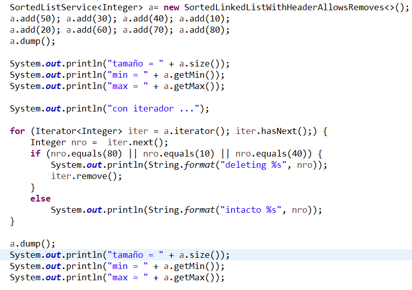
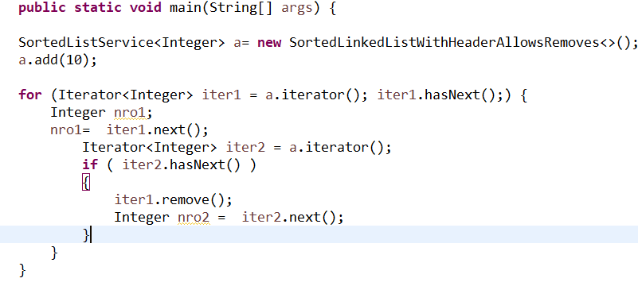
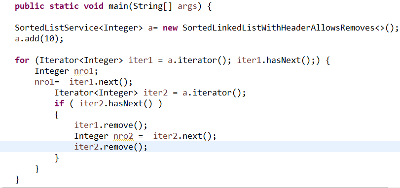

# Estructura de Datos y Algoritmos

# ITBA     2025-Q2

Análisis de posibilidades para “lista lineal simplemente encadenada con header para dar soporte a un índice”  \(análisis del peor caso\, complejidad temporal\)

|  | Búsqueda | Inserción | Borrado |
| :-: | :-: | :-: | :-: |
| Arreglo ordenado por clave de búsqueda | _O\(log n\)_ | O\(n\) | O\(n\) |
| Lista Lineal Simplemente Encadenada Ordenada con Header |         O\(n\) |         O\(n\) |         O\(n\) |

Ninguna ventaja????

Parecía que mejoraba en inserción/borrado…

Para borrar/insertar un elemento hay 2 situaciones que se dan:

a\) borrar/insertar un elemento recorriendo desde el header

b\) borrar/insertar un elemento sin buscarlo \(estamos apuntando al elemento que queremos borrar\, por ejemplo\, haciendo uso del iterador\)

En el  arreglo     ordenado \, esa operación es  O\(n\) \, porque:

En el “caso a” tenemos que la búsqueda se hace en O\(log n\)\, pero todo empeora debido al movimiento de datos para garantizar contigüidad lo que se hace en O\(n\)

Análogamente\, en el “caso b” accederlo es O\(1\)\, pero debido al movimiento de datos para garantizar contigüidad\, termina siendo  O\(n\)

O sea: siempre es  O\(n\) \!\!\!\!

En la  lista   lineal   simplemente     encadenada     ordenada \, la operacion dependen si es “caso a” o “caso b”\.

En el “caso a” tenemos que la búsqueda se hace en O\(n\)\. Aunque no hay movimiento de datos porque no se precisa contigüidad\, la operación es   O\(n\) \.

En cambio\, en el “caso b” estamos parados en el elemento y y como no hay movimiento de datos para garantizar contigüidad\, entonces sería O\(1\)\. Para estar “apuntando al elemento a borrar” vamos a colocar el remove\(\) en el iterador\.

Por eso Java tiene como “opcional” el método remove\(\) en la interface “Iterator”\. Si en vez de remove\(\) de lista se usa remove\(\) de operador\, la complejidad es O\(1\)\.

_Sigamos la especificación de Java:_

Remove de iterador tiene que invocarse luego de un next\(\)

No se pueden invocar 2 remove\(\) seguidos \(tiene que haber un next\(\) en el medio\)

Si no se satisfacen esas condiciones se lanzar excepción “IllegalStateException”

Implementar la clase  __SortedLinkedListWithHeader__  __ el nuevo __  __iterador__  __ que permite __  __remove__  __\(\)\.__

# TP 3C- Ejer 6.2

# Caso de Uso

10

20

30

40

50

60

70

80

tamaño = 8

min = 10

max = 80

con iterador \.\.\.

deleting 10

intacto 20

intacto 30

deleting 40

intacto 50

intacto 60

intacto 70

deleting 80

20

30

50

60

70

tamaño = 5

min = 20

max = 70

Otro detalle más\. Si el iterador es con “remove” hay cosas que no pueden chequearse y pueden producir un problema en tiempo de ejecución: uso de cursores anidados\, donde uno de ellos elimina un elemento \(el otro que había chequeado que había elementos obtiene un error porque el elemento ya no está\)

# Posible Problema!

# O bien, este otro problema

Importante

No invocar en el remove del cursor:

delete\(current\.value\);

Con el objetivo de reusar código porque en ese caso se pierde O\(1\)\!\!\!

Estaría recorriendo desde el header\. Atención\!

__Aclaraciones__

La implementación de  _iterador_  _ con _  _remove_  _\(\) en O\(1\) no es algo trivial_ \. Es mucho más complicado que con iterador readonly\.  Implícitamente hay muchos casos que resolver\. Es un autómata con estados por los que se va pasando frente a las operaciones invocadas sobre el iterador\.

Típicamente se resuelve:

Tres variables: prev\, current\, forward que se van moviendo “casi siempre” paralelamente y a un elemento de distancia\.

También se puede hacer con dos variables: prev y current

En cualquier caso: NO COPIAR A UNA ESTRUCTURA \(colección \) PARALELA\.

|  | Búsqueda | Inserción desde el header | Inserción desde iterador | Borrado desde el header | Borrado desde iterador |
| :-: | :-: | :-: | :-: | :-: | :-: |
| Arreglo ordenado por clave de búsqueda | _O\(log n\)_ | O\(n\) | O\(n\) | O\(n\) | O\(n\) |
| Lista lineal simplemente encadenada ordenada por clave de búsqueda | O\(n\) | O\(n\) | _O\(1\)_ | O\(n\) | _O\(1\)_ |

Como se observa\, la complejidad del código del Nuevo iterador reside en que hay que tener varios punteros\.

Si el almacenamiento no es un problema\, se puede trabajar con una lista lineal doblemente encadenada ordenada que soluciona este problema\!

Ventaja adicional: permitiría ofrecer iterar sobre la estructura ordenada en forma asc/desc fácilmente\!\!\!

# Analizando otras alternativas

Alternativa: “  __Lista__    __ lineal __    __doblemente__    __ __    __encadenada__    __ con header__  ”

Header: $2222”

Definición     Lista   Lineal   Doblemente     Encadenada   con Header

Es una estructura de datos compuesta por:

un elemento distinguido llamado “header” que tiene la referencia del primer elemento   __y __    __además__    __  __    __información__    __ global de la __    __lista__    __\.__ 

Cada nodo/elemento \(común\) almacena 3 cosas: su info y la referencia a los elementos  previo y siguiente\.

Variante   para   Índice

Definición     Lista   Lineal   Doblemente     Encadenada     Ordenada   con Header

Es una lista lineal doblemente encadenada con header que además mantiene los  __elementos__  __ __  __ordenados__  con algún criterio de ordenación\.

Es decir\,

Hay 2 tipos de nodos: header y comunes\.

El nodo header no tiene que ser comparable\. Hay uno solo de ese tipo de nodo\!

Los nodos comunes tienen que poder compararse entre sí\.

Precisamente Java implementa  __[LinkedList\.java ](https://gist.github.com/savulchik/3410480)__  __ con  una__  lista “doblemente encadenada” a través de

Buscar el código\!\!

Otras variantes de listas?

Circulares simplemente encadenadas\, Circulares doblemente encadenadas\.

Posibles aplicaciones?

Consideraciones en las implementaciones de listas circulares?

